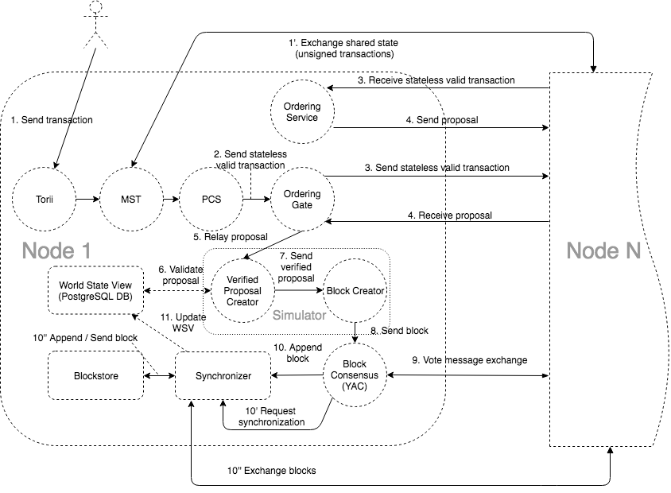

# Overview
Iroha is a straightforward distributed ledger technology (DLT), inspired by Japanese Kaizen principle — eliminate excessiveness (muri). Iroha has essential functionality for your asset, information and identity management needs, at the same time being an efficient and trustworthy crash fault-tolerant tool for your enterprise needs.

# System requirements
No specific information, requirements depend on the amount and configuration of the nodes.

# Build, test & run
Please check out our documentation for that: https://iroha.readthedocs.io/en/latest/build/index.html

# Integration

# Configuration parameters
https://iroha.readthedocs.io/en/latest/configure/index.html

# Endpoints
1. User-facing endpoints (described [here](https://github.com/hyperledger/iroha/blob/master/shared_model/schema/endpoint.proto),
 use `torii_port` from configuration file):
Torii is the component the users connect to:
`service CommandService_v1 {
  rpc Torii (Transaction) returns (google.protobuf.Empty);
  rpc ListTorii (TxList) returns (google.protobuf.Empty);
  rpc Status (TxStatusRequest) returns (ToriiResponse);
  rpc StatusStream(TxStatusRequest) returns (stream ToriiResponse);
}
service QueryService_v1 {
  rpc Find (Query) returns (QueryResponse);
  rpc FetchCommits (BlocksQuery) returns (stream BlockQueryResponse);
}`
`Torii` receives a single transaction
`ListTorii` receives numerous transactions at the same time
`Status` requests transaction status
`StatusStream` subscribes to transaction statuses
`Find` sends a query
`FetchCommits` let's you subscribe to new blocks

2. Internal endpoints (described in [schema folder](https://github.com/hyperledger/iroha/tree/master/schema), use `internal_port` from configuration file):
`retrieveBlock` requests block of the set hight, returns the requested block
`retrieveBlocks` subscribes to block stream starting with the set height
Both of the methods are used for synchronization among nodes.

`SendState` (inside schema/yac.proto) sends votes among nodes

`SendState` (inside schema/mst.proto) endpoint for MST distribution

`onProposal` sends a proposal to another node
`onBatch` sends a batch to another node
`SendBatches` sends batches to the Ordering Service
`RequestProposal` requests a proposal based on the round number

# Logging
https://iroha.readthedocs.io/en/latest/configure/index.html?highlight=log#logging
Please note that logging levels cannot be changed during runtime.

# Monitoring
HL Iroha does not have a monitoring system yet.

# Storage
Persistent storage is defined in configuration file in block_store_path parameter. If it is not defined, then in PostgreSQL, in 'blocks' table.
Data is critical but if there are other nodes, the data will synchronize - the time it would take depends on the amount of blocks missed.

# Scaling
It is possible to add new nodes of Iroha by adding manually generated keys for them and sending commands to the ledger. Service seems to be stateful. 
Iroha is scalable linearly or better than linearly.

# Queue (optional)
N/A