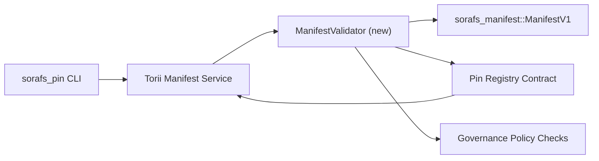

::: ማስታወሻ ቀኖናዊ ምንጭ
::

# የፒን መዝገብ ቤት መግለጫ ማረጋገጫ እቅድ (SF-4 መሰናዶ)

ይህ እቅድ `sorafs_manifest::ManifestV1` ክር ለመስራት የሚያስፈልጉትን ደረጃዎች ይዘረዝራል።
የ SF-4 ሥራ እንዲሠራ በሚመጣው የፒን መዝገብ ቤት ውል ውስጥ ማረጋገጥ
ኢንኮድ/አመክንዮ ሳይገለብጡ አሁን ባለው መሳሪያ ላይ ይገንቡ።

# ግቦች

1. የአስተናጋጅ-ጎን የማስረከቢያ ዱካዎች አንጸባራቂ አወቃቀሩን ያረጋግጣሉ፣ መገለጫን መቆራረጥ እና
   ሀሳቦችን ከመቀበልዎ በፊት የአስተዳደር ፖስታዎች ።
2. Torii እና የጌትዌይ አገልግሎቶችን ለማረጋገጥ ተመሳሳይ የማረጋገጫ ስልቶችን በድጋሚ ይጠቀማሉ።
   በመላ አስተናጋጆች ላይ የሚወሰን ባህሪ።
3. የውህደት ሙከራዎች በግልጽ ተቀባይነት ለማግኘት አወንታዊ/አሉታዊ ጉዳዮችን ይሸፍናሉ።
   የፖሊሲ አፈፃፀም እና የቴሌሜትሪ ስህተት።

## አርክቴክቸር

### አካላት

- `ManifestValidator` (አዲስ ሞጁል በ I18NI0000015X ወይም I18NI0000016X crate)
  መዋቅራዊ ቼኮችን እና የፖሊሲ በሮችን ያጠቃልላል።
- Torii ወደ ውስጥ የሚጠራውን የ gRPC የመጨረሻ ነጥብ `SubmitManifest` ያጋልጣል
  ወደ ውሉ ከማስተላለፉ በፊት `ManifestValidator`።
- የጌትዌይ ዱካ እንደ አማራጭ አዲስ ሲሸጎጥ ተመሳሳዩን አረጋጋጭ ይበላል
  ከመዝገቡ ውስጥ ይገለጣል.

## የተግባር ዝርዝር መግለጫ

| ተግባር | መግለጫ | ባለቤት | ሁኔታ |
|-------------|-------|--------|
| V1 API አጽም | `validate_manifest(manifest: &ManifestV1, policy: &PinPolicyInputs) -> Result<(), ValidationError>` ወደ I18NI0000020X ያክሉ። BLAKE3 ዳይጀስት ማረጋገጫ እና chunker መዝገብ ፍለጋን ያካትቱ። | ኮር ኢንፍራ | ✅ ተፈጸመ | የተጋሩ ረዳቶች (I18NI0000021X፣ `validate_pin_policy`፣ I18NI0000023X) አሁን በ`sorafs_manifest::validation` ይኖራሉ። |
| ፖሊሲ ሽቦ | የካርታ መዝገብ ፖሊሲ ​​ውቅረት (`min_replicas`፣ ጊዜው ያለፈበት ዊንዶውስ፣ የተፈቀደ ቻንከር እጀታ) ወደ የማረጋገጫ ግብዓቶች። | አስተዳደር / ኮር ኢንፍራ | በመጠባበቅ ላይ - በ SORAFS-215 |
| Torii ውህደት | በI18NT0000007X አንጸባራቂ የማስረከቢያ መንገድ ውስጥ አረጋጋጭ ይደውሉ; በብልሽት ላይ የተዋቀሩ I18NT0000000X ስህተቶችን መመለስ። | Torii ቡድን | የታቀደ - በ SORAFS-216 |
| አስተናጋጅ ውል stub | የኮንትራት መግቢያ ነጥብ ውድቅ ማድረጉን ማረጋገጥ ያልተሳካ የማረጋገጫ ሃሽ; መለኪያዎች ቆጣሪዎችን ያጋልጡ። | ብልጥ የኮንትራት ቡድን | ✅ ተፈጸመ | `RegisterPinManifest` አሁን የተጋራውን አረጋጋጭ (`ensure_chunker_handle`/`ensure_pin_policy`) የግዛት እና የዩኒት ሙከራዎች የውድቀት ጉዳዮችን ይሸፍናሉ። |
| ፈተናዎች | ልክ ላልሆኑ አንጸባራቂዎች የክፍል ሙከራዎችን ለአረጋጋጭ + trybuild ጉዳዮችን ያክሉ። በ I18NI0000029X ውስጥ የውህደት ሙከራዎች። | QA Guild | 🟠 በሂደት ላይ | የማረጋገጫ ክፍል ሙከራዎች በሰንሰለት ላይ ካለመቀበል ሙከራዎች ጎን ለጎን አርፈዋል። ሙሉ ውህደት ስብስብ አሁንም በመጠባበቅ ላይ። |
| ሰነዶች | `docs/source/sorafs_architecture_rfc.md` እና `migration_roadmap.md` አንዴ የተረጋገጠ መሬቶችን አዘምን; የሰነድ CLI አጠቃቀም በ I18NI0000032X. | ሰነዶች ቡድን | በመጠባበቅ ላይ - በ DOCS-489 |

## ጥገኛዎች

- የፒን መዝገብ ቤት I18NT0000001X እቅድ ማጠናቀቅ (ማጣቀሻ፡ SF-4 በፍኖተ ካርታ)።
- በካውንስሉ የተፈረመ የ chunker መዝገብ ቤት ፖስታዎች (አረጋጋጭ የካርታ ስራ መሆኑን ያረጋግጣል
  ቆራጥ)።
- ለአንጸባራቂ ግቤት Torii የማረጋገጫ ውሳኔዎች።

## አደጋዎች እና ቅነሳዎች

| ስጋት | ተጽዕኖ | ቅነሳ |
|-------|--------|-----------|
| በ Torii እና በኮንትራት መካከል ያለው ልዩነት የፖሊሲ ትርጓሜ | የማይወሰን ተቀባይነት. | የማረጋገጫ ሳጥን ያጋሩ + አስተናጋጁ በሰንሰለት ላይ ካሉ ውሳኔዎች ጋር የሚያወዳድሩ የውህደት ሙከራዎችን ያክሉ። |
| ለትልልቅ መገለጫዎች የአፈጻጸም መመለሻ | ቀስ ብሎ ማስረከብ | ቤንችማርክ በጭነት መስፈርት; አንጸባራቂ የምግብ መፈጨት ውጤቶችን መሸጎጥ ያስቡበት። |
| ስህተት የመልእክት መንሸራተት | ኦፕሬተር ግራ መጋባት | Norito የስህተት ኮዶችን ይግለጹ; በ `manifest_pipeline.md` ሰነዳቸው። |

## የጊዜ መስመር ኢላማዎች

- 1ኛው ሳምንት፡ የመሬት I18NI0000034X አጽም + የክፍል ሙከራዎች።
- 2ኛው ሳምንት፡ Wire Torii የማስረከቢያ መንገድ እና CLIን ወደ የማረጋገጫ ስህተቶች ያዘምኑ።
- 3ኛው ሳምንት፡ የኮንትራት መንጠቆዎችን ይተግብሩ፣ የውህደት ሙከራዎችን ያክሉ፣ ሰነዶችን ያዘምኑ።
- 4ኛው ሳምንት፡ ከጫፍ እስከ ጫፍ ልምምዱን ከስደት ደብተር መግቢያ ጋር ያካሂዱ፣ የምክር ቤት ማቋረጥ።

የማረጋገጫው ሥራ ከጀመረ በኋላ ይህ እቅድ በፍኖተ ካርታው ውስጥ ይጠቀሳል።