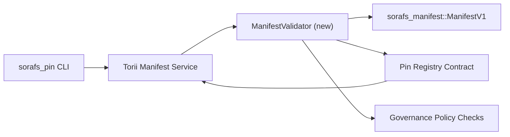

:::Qeyd Kanonik Mənbə
:::

# Pin Registry Manifest Validation Plan (SF-4 Prep)

Bu plan `sorafs_manifest::ManifestV1` ipi üçün tələb olunan addımları təsvir edir
SF-4 işləyə bilməsi üçün qarşıdakı Pin Registry müqaviləsinə doğrulama
kodlaşdırma/deşifrə məntiqini təkrarlamadan mövcud alətlər üzərində qurun.

## Məqsədlər

1. Host tərəfi təqdimetmə yolları manifest strukturunu, parçalanma profilini və
   təklifləri qəbul etməzdən əvvəl idarəetmə zərfləri.
2. Torii və şlüz xidmətləri təmin etmək üçün eyni doğrulama prosedurlarını təkrar istifadə edir.
   hostlar arasında deterministik davranış.
3. İnteqrasiya testləri aşkar qəbul üçün müsbət/mənfi halları əhatə edir,
   siyasətin tətbiqi və xəta telemetriyası.

## Memarlıq

### Komponentlər

- `ManifestValidator` (`sorafs_manifest` və ya `sorafs_pin` qutusunda yeni modul)
  struktur yoxlamaları və siyasət qapılarını əhatə edir.
- Torii gRPC son nöqtəsini ifşa edir `SubmitManifest`
  Müqaviləyə yönləndirmədən əvvəl `ManifestValidator`.
- Gateway gətirmə yolu isteğe bağlı olaraq yeni keşləmə zamanı eyni validatoru istehlak edir
  reyestrdən təzahür edir.

## Tapşırıqların Dağılımı

| Tapşırıq | Təsvir | Sahibi | Status |
|------|-------------|-------|--------|
| V1 API skeleti | `validate_manifest(manifest: &ManifestV1, policy: &PinPolicyInputs) -> Result<(), ValidationError>`-i `sorafs_manifest`-ə əlavə edin. BLAKE3 həzm yoxlamasını və chunker reyestrinin axtarışını daxil edin. | Əsas İnfra | ✅ Tamamlandı | Paylaşılan köməkçilər (`validate_chunker_handle`, `validate_pin_policy`, `validate_manifest`) indi `sorafs_manifest::validation`-də yaşayır. |
| Siyasət naqilləri | Xəritə reyestrinin siyasəti konfiqurasiyası (`min_replicas`, istifadə müddəti bitən pəncərələr, icazə verilən chunker tutacaqları) təsdiqləmə daxiletmələrinə. | İdarəetmə / Əsas İnfra | Gözlənir — SORAFS-215 |-də izlənir
| Torii inteqrasiya | Torii manifest təqdim yolu daxilində validatora zəng edin; uğursuzluqda strukturlaşdırılmış Norito səhvlərini qaytarın. | Torii Komandası | Planlaşdırılmış — SORAFS-216 |-də izlənilir
| Əsas müqavilə stub | Müqavilə giriş nöqtəsinin təsdiqləmə hash-i uğursuz olan manifestləri rədd etməsini təmin edin; metrik sayğacları ifşa edin. | Ağıllı Müqavilə Komandası | ✅ Tamamlandı | `RegisterPinManifest` indi mutasiya vəziyyəti və vahid testləri uğursuzluq hallarını əhatə etməzdən əvvəl paylaşılan validatoru (`ensure_chunker_handle`/`ensure_pin_policy`) işə salır. |
| Testlər | Validator üçün vahid testləri əlavə edin + etibarsız manifestlər üçün sınaq quruluşu; `crates/iroha_core/tests/pin_registry.rs`-də inteqrasiya testləri. | QA Gildiyası | 🟠 Davam edir | Təsdiqləyici vahid testləri zəncir üzərindən imtina testləri ilə yanaşı endirildi; tam inteqrasiya paketi hələ də gözləmədədir. |
| Sənədlər | Validator işə düşdükdən sonra `docs/source/sorafs_architecture_rfc.md` və `migration_roadmap.md`-i yeniləyin; `docs/source/sorafs/manifest_pipeline.md`-də CLI istifadəsini sənədləşdirin. | Sənəd Komandası | Gözlənir — DOCS-489 |-da izlənir

## Asılılıqlar

- Pin Registry Norito sxeminin yekunlaşdırılması (istin: yol xəritəsindəki SF-4 bəndi).
- Şura tərəfindən imzalanmış chunker reyestr zərfləri (validator xəritələşdirilməsini təmin edir
  deterministik).
- Manifest təqdim etmək üçün Torii autentifikasiya qərarları.

## Risklər və azaldılması

| Risk | Təsir | Azaldılması |
|------|--------|------------|
| Torii və müqavilə arasında fərqli siyasət şərhi | Qeyri-deterministik qəbul. | Doğrulama qutusunu paylaşın + host və zəncirdəki qərarları müqayisə edən inteqrasiya testləri əlavə edin. |
| Böyük manifestlər üçün performans reqresiyası | Daha yavaş təqdim | Yük meyarı ilə müqayisə; manifest həzm nəticələrinin keşləşdirilməsini nəzərdən keçirin. |
| Xəta mesajlaşma sürüşməsi | Operator qarışıqlığı | Norito xəta kodlarını müəyyənləşdirin; onları `manifest_pipeline.md`-də sənədləşdirin. |

## Zaman Qrafiki Hədəfləri

- 1-ci həftə: Torpaq `ManifestValidator` skeleti + vahid testləri.
- 2-ci həftə: Torii təqdimetmə yolunu bağlayın və CLI-ni təsdiqləmə xətalarını aradan qaldırmaq üçün yeniləyin.
- 3-cü həftə: Müqavilə qarmaqlarını tətbiq edin, inteqrasiya testləri əlavə edin, sənədləri yeniləyin.
- 4-cü həftə: Miqrasiya dəftərinə giriş, şuranın imzalanması ilə başdan sona məşq edin.

Validator işi başlayan kimi bu plana yol xəritəsində istinad ediləcək.