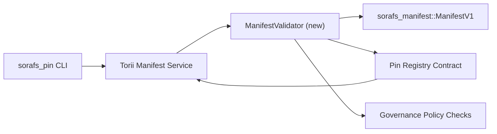

:::དྲན་ཐོའི་འབྱུང་ཁུངས།
:::

# པིན་ཐོ་བཀོད་མཚོན་རྟགས་བདེན་དཔྱད་འཆར་གཞི།(SF-4 Prep)

འཆར་གཞི་འདི་གིས་ `sorafs_manifest::ManifestV1` ལུ་དགོ་པའི་ གོ་རིམ་ཚུ་ གསལ་བཀོད་འབདཝ་ཨིན།
འོས་འཚམ་གྱི་ པིན་ཐོ་བཀོད་གན་རྒྱ་ནང་ བདེན་དཔྱད་འབད་ཞིནམ་ལས་ ཨེསི་ཨེཕ་-༤ ལཱ་འབད་ཚུགས།
ཨིན་ཀོ་ཌི་/ཌི་ཀོཌི་ཚད་མ་འདྲ་བཤུས་མ་འབད་བར་ ད་ལྟོ་ཡོད་པའི་ལག་ཆས་ཚུ་གུ་བཟོ་བསྐྲུན་འབད།

## རིལ་ཚང

1. ཧོསཊ་ཕྱོགས་ཕུལ་བའི་འགྲུལ་ལམ་ཚུ་གིས་ གསལ་སྟོན་གཞི་བཀོད་ ཆ་ཤས་གསལ་སྡུད་བདེན་དཔྱད་འབདཝ་ཨིན།
   གྲོས་འཆར་ཚུ་ངོས་ལེན་མ་འབད་བའི་ཧེ་མ་ གཞུང་སྐྱོང་ཡིག་ཆ་ཚུ།
2. Torii དང་ སྒོ་སྒྲིག་ཞབས་ཏོག་ཚུ་གིས་ བདེན་དཔྱད་རྒྱུན་ལམ་ཚུ་ ངེས་གཏན་བཟོ་ནི་ལུ་ ལོག་སྟེ་ལག་ལེན་འཐབ།
   གཙོ་བོ་ཚུ་ནང་ལུ་ གཏན་འབེབས་གི་སྤྱོད་ལམ།
༣ མཉམ་བསྡོམས་བརྟག་དཔྱད་ཚུ་གིས་ གསལ་སྟོན་ངོས་ལེན་འབད་ནིའི་དོན་ལུ་ ངེས་གཏན་/ལོག་པའི་གནད་དོན་ཚུ་ ཁྱབ་ཚུགསཔ་ཨིན།
   སྲིད་བྱུས་བསྟར་སྤྱོད་དང་འཛོལ་བ་བརྡ་འཕྲིན་རྒྱང་བསྒྲགས།

## བཟོ༌བཀོད༌རིག༌པ

### ཆ་ཤས།

- I18NI000000014X (`sorafs_manifest` ནང་ མཐུད་ལམ་གསརཔ་ ཡང་ན་ `sorafs_pin` crete)
  བཟོ་བཀོད་ཀྱི་ཞིབ་དཔྱད་དང་ སྲིད་བྱུས་ཀྱི་སྒོ་ཚུ་ བསྡུ་སྒྲིག་འབདཝ་ཨིན།
- Torii གིས་ ཇི་ཨར་པི་སི་ མཇུག་སྣོད་ `SubmitManifest` ཅིག་ ནང་འབོད་བརྡ་འབདཝ་ཨིན།
  I18NI000000018X གན་ཡིག་ནང་ མདུན་སྐྱོད་མ་འབད་བའི་ཧེ་མ།
- གསརཔ་ འདྲ་མཛོད་འབད་བའི་སྐབས་ གདམ་ཁ་ཅན་སྦེ་ བདེན་དཔྱད་འབད་མི་ འགྲུལ་ལམ་འདི་གིས་ གེ་ཊི་ཝེ་གིས་ བདེན་དཔྱད་འབད་མི་གཅིག་སྤྱོད་འབདཝ་ཨིན།
  །མངོན་པར་སྒོ་ནས་མངོན་པར་བརྗོད་པ་ནི།

## ལས་ཀའི་བརྡ་ཐོ།

| ལས་ཀ་ | འགྲེལ་བཤད་ | ཇོ་བདག་ | གནས་ཚད་ |
|--|--|------------------------------------------------- |
| V1 API རུས་སྒྲོམ་ | `validate_manifest(manifest: &ManifestV1, policy: &PinPolicyInputs) -> Result<(), ValidationError>` `sorafs_manifest` ལུ་ཁ་སྐོང་འབད། BLAKE3 ཟས་བཅུད་བདེན་དཔྱད་དང་ ཆར་ཀར་ཐོ་བཀོད་བལྟ་ཞིབ་ཚུ་ བཙུགས། | ཀོར་ཨིན་ཕ་ར་ | ✅ འབད་ | བརྗེ་སོར་འབད་ཡོད་པའི་གྲོགས་རམ་པ་ (I18NI0000021X, `validate_pin_policy`, I18NI0000000023X) ད་ལྟོ་ I18NI000000024X ནང་སྡོད་དོ་ཡོདཔ་ཨིན། |
| སྲིད་བྱུས་གློག་ཐག་འདི་ | སབ་ཁྲ་ཐོ་བཀོད་སྲིད་བྱུས་རིམ་སྒྲིག་ (`min_replicas` གིས་ དུས་ཡུན་ཚང་མི་ སྒོ་སྒྲིག་ཚུ་ ཆ་རྐྱེན་གྱི་ ལག་ཆས་ཚུ་ འབད་བཅུག་མི་) བདེན་བཤད་ཀྱི་ཨིན་པུཊི་ཚུ་ནང་། | གཞུང་སྐྱོང་ / Core Infra | Pending — SORAFS-215 ནང་ བརྟག་ཞིབ་འབད་ཡོདཔ། |
| Torii མཉམ་བསྡོམས་ | I18NT000000007X གསལ་སྟོན་ཕུལ་ལམ་ནང་ལུ་ བདེན་དཔྱད་འབད་མི་ལུ་ ཁ་པར་གཏོང་། return གཞི་བཀོད་བཟོ་ཡོད་པའི་ I18NT000000000X འཐུས་ཤོར་གྱི་འཛོལ་བ་ཚུ། | I18NT0000008X སྡེ་ཚན་ | འཆར་གཞི་བརྩམ་ཡོད་པའི་ — SORAFS-216 ནང་ བརྟག་ཞིབ་འབད་ཡོདཔ། |
| ཧོསཊ་གན་རྒྱ་ | བདེན་དཔྱད་འབད་མ་ཚུགས་པའི་ ཧེཤ་ལུ་ གན་འཛིན་འཛུལ་སྒོ་ཚུ་ ངོས་ལེན་མ་འབད་བའི་ གསལ་སྟོན་ཚུ་ ངེས་གཏན་བཟོ། exty མེཊིག་ ཀའུན་ཊར་ཚུ། | གན་ཡིག་གན་ཡིག་སྡེ་ཚན། | ✅ འབད་ | I18NI00000000026X གིས་ ད་ལྟོ་ བརྗེ་སོར་འབད་ཡོད་པའི་ བདེན་དཔྱད་པ་ (`ensure_chunker_handle`/`ensure_pin_policy`) གིས་ གནས་སྟངས་དང་ ཡུ་ནིཊ་བརྟག་དཔྱད་ཚུ་གིས་ འཐུས་ཤོར་གྱི་གནད་དོན་ཚུ་ ཁྱབ་མ་བཅུག་པའི་ཧེ་མ་ འབོད་བརྡ་འབདཝ་ཨིན། |
| བརྟག་དཔྱད་ཚུ་ | ནུས་མེད་མངོན་གསལ་ཚུ་གི་དོན་ལུ་ བདེན་དཔྱད་+ trybuild case གི་དོན་ལུ་ ཡུ་ནིཊི་བརྟག་དཔྱད་ཚུ་ཁ་སྐོང་འབད། `crates/iroha_core/tests/pin_registry.rs` ནང་ མཉམ་བསྡོམས་བརྟག་དཔྱད་ཚུ། | QA guild | 🟠 ཡར་རྒྱས་ནང་ | བདེན་དཔྱད་སྡེ་ཚན་གྱི་བརྟག་དཔྱད་ཚུ་ རིམ་ཐེངས་བཀག་ཆ་བརྟག་དཔྱད་ཚུ་གི་མཉམ་ལས་ ལྷོད་ཡོདཔ་ཨིན། མཉམ་བསྡོམས་སྡེ་ཚན་ཆ་ཚང་ ད་ལྟོ་ཡང་ མཇུག་བསྡུ་ཡོདཔ་ཨིན། |
| ཡིག་ཆ་ | བདེན་དཔྱད་ས་གཞི་ཚུ་ཚར་གཅིག་ I18NI000000030X དང་ I18NI0000000031X དུས་མཐུན་བཟོ། ཡིག་ཆ་ `docs/source/sorafs/manifest_pipeline.md` ནང་ CLI ལག་ལེན་འཐབ། | ཡིག་ཆ་སྡེ་ཚན། | Pending — DOCS-489 ནང་ བརྟག་ཞིབ་འབད་ཡོདཔ། |

## བརྟེན་པ།

- པིན་ཐོ་བཀོད་ Norito ལས་རིམ་མཇུག་བསྡུ་ (ref: SF-4 རྣམ་གྲངས་ནང་ ལམ་སྟོན་ནང་)།
- ཚོགས་སྡེ་གིས་ མཚན་རྟགས་བཀོད་མི་ ཅར་ཀར་ཐོ་བཀོད་ཡིག་ཆ་ (བདེན་དཔྱད་ཀྱི་ས་ཁྲ་བཟོ་ནིའི་ ཡིག་ཆ་ཚུ་ ༡༠ ཨིན།
  ཆོསཔ་
- Torii གསལ་སྟོན་ཕུལ་ནིའི་དོན་ལུ་ བདེན་བཤད་གྲོས་ཐག་ཚུ།

## ཉེན་དང་ ཉུང་འཕྲིན།

| ཉེན་ཁ། ཕན་གནོད་ | མར་ཕབ་ |
|-------------------------------------- |
| Torii དང་ གན་རྒྱ་གི་བར་ན་ སྲིད་བྱུས་ཁ་སྟོར་གྱི་དོན་འགྲེལ། | གཏན་ཚིགས་མེད་པའི་ངོས་ལེན་ནི། | བདེན་དཔྱད་ཀྲེག་ + ཧོསཊི་དང་ རིམ་ཐེངས་གྲོས་ཐག་ཚུ་ ག་བསྡུར་རྐྱབ་མི་ མཉམ་བསྡོམ་བརྟག་དཔྱད་ཚུ་ ཁ་སྐོང་རྐྱབས། |
| གསལ་སྟོན་སྦོམ་གྱི་དོན་ལུ་ ལཱ་འགན་འགྱུར་ལྡོག་ཚུ་ | མགྱོགས་འཕྲིན་ཕུལ་ནི། | དངོས་རྫས་ཚད་གཞི་བརྒྱུད་དེ་ བེན་ཀ་མཱན། འདྲ་མཛོད་ཀྱི་གསལ་སྟོན་གྲུབ་འབྲས་འདི་བརྩི་འཇོག་འབད། |
| འཛོལ་བའི་འཕྲིན་དོན་གྱི་ འདྲེན་བཀོལ། | བཀོལ་སྤྱོད་པ་མགོ་རྙོག་དྲགས། | Norito འཛོལ་བ་ཨང་རྟགས་ཚུ་ངེས་འཛིན་འབད། དེ་ཚུ་ I18NI000000033X ནང་ལུ་ ཡིག་ཆ་བཟོ། |

## དུས་ཚོད་ཀྱི་དབྱེ་ཞིབ།

- བདུན་ཕྲག་༡: ས་ཆ་ `ManifestValidator` ཀེང་རུས་ + ཡུ་ནིཊ་བརྟག་དཔྱད།
- བདུན་ཕྲག་༢ པ་: བདེན་དཔྱད་འཛོལ་བ་ཚུ་ བརྒལ་ནིའི་དོན་ལུ་ ཝའིར་ I18NT0000011X ཕུལ་སྤྲོད་ལམ་དང་ དུས་མཐུན་བཟོས།
- བདུན་ཕྲག་༣ པ་ གན་རྒྱ་ཧུཀ་ཚུ་ལག་ལེན་འཐབ་ མཉམ་བསྡོམས་བརྟག་དཔྱད་ཁ་སྐོང་རྐྱབས་ དུས་མཐུན་བཟོ་ནི།
- བདུན་ཕྲག་༤ པ་ གནས་སྤོ་བའི་ ལག་དེབ་ཐོ་བཀོད་དང་གཅིག་ཁར་ མཇུག་ལས་མཇུག་བསྡུའི་སྦྱོང་བརྡར་ནང་ ཚོགས་སྡེའི་མིང་རྟགས་བཀོད་ནི།

འཆར་གཞི་འདི་ བདེན་དཔྱད་ཀྱི་ལཱ་འགོ་བཙུགས་ཞིནམ་ལས་ ལམ་སྟོན་ནང་ གཞི་བསྟུན་འབད་འོང་།