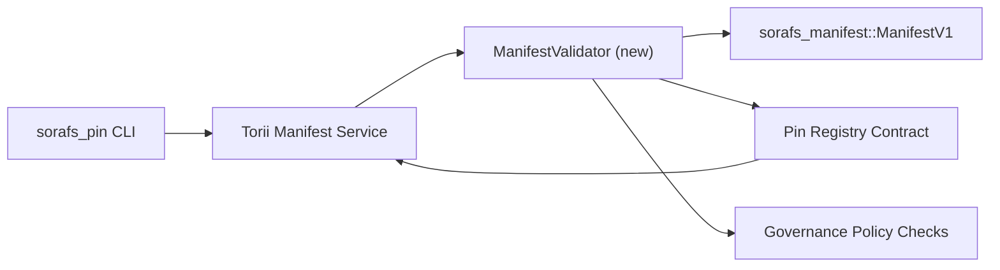

:::note Canonical Source
:::

# Pin Registry Manifest Validation Plan (SF-4 Prep)

This plan outlines the steps required to thread `sorafs_manifest::ManifestV1`
validation into the forthcoming Pin Registry contract so that SF-4 work can
build on the existing tooling without duplicating encode/decode logic.

## Goals

1. Host-side submission paths verify manifest structure, chunking profile, and
   governance envelopes before accepting proposals.
2. Torii and gateway services reuse the same validation routines to ensure
   deterministic behaviour across hosts.
3. Integration tests cover positive/negative cases for manifest acceptance,
   policy enforcement, and error telemetry.

## Architecture

### Components

- `ManifestValidator` (new module in `sorafs_manifest` or `sorafs_pin` crate)
  encapsulates structural checks and policy gates.
- Torii exposes a gRPC endpoint `SubmitManifest` that calls into
  `ManifestValidator` before forwarding to the contract.
- Gateway fetch path optionally consumes the same validator when caching new
  manifests from the registry.

## Task Breakdown

| Task | Description | Owner | Status |
|------|-------------|-------|--------|
| V1 API skeleton | Add `validate_manifest(manifest: &ManifestV1, policy: &PinPolicyInputs) -> Result<(), ValidationError>` to `sorafs_manifest`. Include BLAKE3 digest verification and chunker registry lookup. | Core Infra | ✅ Done | Shared helpers (`validate_chunker_handle`, `validate_pin_policy`, `validate_manifest`) now live in `sorafs_manifest::validation`. |
| Policy wiring | Map registry policy config (`min_replicas`, expiry windows, allowed chunker handles) into validation inputs. | Governance / Core Infra | Pending — tracked in SORAFS-215 |
| Torii integration | Call validator inside Torii manifest submission path; return structured Norito errors on failure. | Torii Team | Planned — tracked in SORAFS-216 |
| Host contract stub | Ensure contract entrypoint rejects manifests that fail validation hash; expose metrics counters. | Smart Contract Team | ✅ Done | `RegisterPinManifest` now invokes the shared validator (`ensure_chunker_handle`/`ensure_pin_policy`) before mutating state and unit tests cover the failure cases. |
| Tests | Add unit tests for validator + trybuild cases for invalid manifests; integration tests in `crates/iroha_core/tests/pin_registry.rs`. | QA Guild | 🟠 In progress | Validator unit tests landed alongside on-chain rejection tests; full integration suite still pending. |
| Docs | Update `docs/source/sorafs_architecture_rfc.md` and `migration_roadmap.md` once validator lands; document CLI usage in `docs/source/sorafs/manifest_pipeline.md`. | Docs Team | Pending — tracked in DOCS-489 |

## Dependencies

- Pin Registry Norito schema finalisation (ref: SF-4 item in roadmap).
- Council-signed chunker registry envelopes (ensures validator mapping is
  deterministic).
- Torii authentication decisions for manifest submission.

## Risks & Mitigations

| Risk | Impact | Mitigation |
|------|--------|------------|
| Divergent policy interpretation between Torii and contract | Non-deterministic acceptance. | Share validation crate + add integration tests that compare host vs on-chain decisions. |
| Performance regression for large manifests | Slower submission | Benchmark via cargo criterion; consider caching manifest digest results. |
| Error messaging drift | Operator confusion | Define Norito error codes; document them in `manifest_pipeline.md`. |

## Timeline Targets

- Week 1: Land `ManifestValidator` skeleton + unit tests.
- Week 2: Wire Torii submission path and update CLI to surfacing validation errors.
- Week 3: Implement contract hooks, add integration tests, update docs.
- Week 4: Run end-to-end rehearsal with migration ledger entry, capture council sign-off.

This plan will be referenced in the roadmap once the validator work begins.
