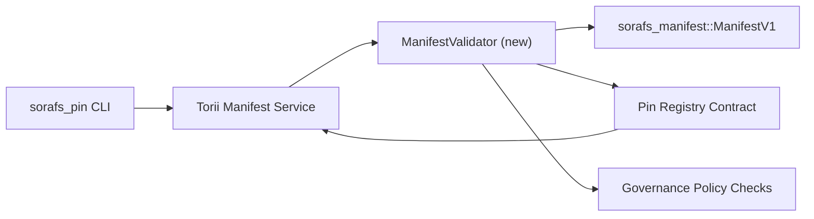

::: Eslatma Kanonik manba
:::

# Pin registrining manifestini tekshirish rejasi (SF-4 tayyorgarlik)

Ushbu reja `sorafs_manifest::ManifestV1` ipini o'tkazish uchun zarur bo'lgan qadamlarni belgilaydi
SF-4 ishlashi uchun yaqinlashib kelayotgan Pin Registry shartnomasini tasdiqlash
kodlash/dekodlash mantiqini takrorlamasdan mavjud asboblarga asoslang.

## Maqsadlar

1. Xost tomonida yuborish yo'llari manifest tuzilmasini, bo'linish profilini va
   takliflarni qabul qilishdan oldin boshqaruv konvertlari.
2. Torii va shlyuz xizmatlari ishonch hosil qilish uchun bir xil tekshirish tartiblaridan foydalanadi.
   xostlar orasida deterministik xatti-harakatlar.
3. Integratsiya testlari aniq qabul qilish uchun ijobiy/salbiy holatlarni qamrab oladi,
   siyosatni amalga oshirish va xatolik telemetriyasi.

## Arxitektura

### Komponentlar

- `ManifestValidator` (`sorafs_manifest` yoki `sorafs_pin` kassasida yangi modul)
  tizimli tekshiruvlar va siyosat eshiklarini qamrab oladi.
- Torii gRPC so'nggi nuqtasini ochadi `SubmitManifest` u
  Shartnomaga yuborishdan oldin `ManifestValidator`.
- Shlyuzni olish yo'li ixtiyoriy ravishda yangisini keshlashda bir xil validatorni iste'mol qiladi
  ro'yxatga olish kitobidan namoyon bo'ladi.

## Vazifalarni taqsimlash

| Vazifa | Tavsif | Egasi | Holati |
|------|-------------|-------|--------|
| V1 API skeleti | `validate_manifest(manifest: &ManifestV1, policy: &PinPolicyInputs) -> Result<(), ValidationError>` ni `sorafs_manifest` ga qo'shing. BLAKE3 dayjestini tekshirish va chunker registrlarini qidirishni qo'shing. | Yadro infra | ✅ Bajarildi | Birgalikda yordamchilar (`validate_chunker_handle`, `validate_pin_policy`, `validate_manifest`) endi `sorafs_manifest::validation` da yashaydi. |
| Siyosat simlari | Roʻyxatga olish kitobi siyosati konfiguratsiyasini (`min_replicas`, amal qilish muddati tugagan oynalar, ruxsat etilgan chunker tutqichlari) tekshirish kirishlariga kiriting. | Boshqaruv / Asosiy Infra | Kutilmoqda — SORAFS-215 | da kuzatilgan
| Torii integratsiyasi | Torii manifest yuborish yo'li ichidagi validatorga qo'ng'iroq qiling; muvaffaqiyatsizlikka uchraganida tuzilgan Norito xatolarini qaytarish. | Torii jamoasi | Rejalashtirilgan — SORAFS-216 | da kuzatilgan
| Asosiy shartnoma stub | Shartnomaga kirish nuqtasi tekshiruv xeshini bajara olmaydigan manifestlarni rad etishiga ishonch hosil qiling; ko'rsatkichlar hisoblagichlarini ko'rsatish. | Smart kontrakt jamoasi | ✅ Bajarildi | `RegisterPinManifest` endi mutatsiyaga uchragan holat va birlik testlari nosozlik holatlarini qamrab olishdan oldin umumiy validatorni (`ensure_chunker_handle`/`ensure_pin_policy`) chaqiradi. |
| Testlar | Yaroqsiz manifestlar uchun validator + trybuild holatlari uchun birlik testlarini qo'shing; `crates/iroha_core/tests/pin_registry.rs` da integratsiya testlari. | QA gildiyasi | 🟠 Davom etmoqda | Validator birligi sinovlari zanjirdagi rad etish sinovlari bilan bir vaqtda amalga oshiriladi; to'liq integratsiya to'plami hali kutilmoqda. |
| Hujjatlar | Validator ishga tushgandan keyin `docs/source/sorafs_architecture_rfc.md` va `migration_roadmap.md` ni yangilang; `docs/source/sorafs/manifest_pipeline.md` da CLI foydalanish hujjati. | Hujjatlar jamoasi | Kutilmoqda — DOCS-489 | da kuzatilgan

## Bog'liqlar

- Pin Registry Norito sxemasini yakunlash (ref: yo'l xaritasidagi SF-4 bandi).
- Kengash tomonidan imzolangan chunker registrlari konvertlari (validator xaritasi mavjudligini ta'minlaydi
  deterministik).
- Manifest topshirish uchun Torii autentifikatsiya qarorlari.

## Xatarlar va kamaytirish choralari

| Xavf | Ta'sir | Yumshatish |
|------|--------|------------|
| Torii va shartnoma | o'rtasidagi farqli siyosat talqini Deterministik bo'lmagan qabul qilish. | Tasdiqlash qutisini baham ko'ring + xost va zanjirdagi qarorlarni taqqoslaydigan integratsiya testlarini qo'shing. |
| Katta manifestlar uchun ishlash regressiyasi | Sekinroq topshirish | Yuk mezoni bo'yicha benchmark; manifest dayjest natijalarini keshlashni ko'rib chiqing. |
| Xato xabari drift | Operatorning chalkashligi | Norito xato kodlarini aniqlang; ularni `manifest_pipeline.md` da hujjatlashtiring. |

## Xronologiya maqsadlari

- 1-hafta: Land `ManifestValidator` skeleti + birlik sinovlari.
- 2-hafta: Torii jo'natma yo'lini ulang va tekshirish xatolarini aniqlash uchun CLI-ni yangilang.
- 3-hafta: Shartnoma ilgaklarini qo'llang, integratsiya testlarini qo'shing, hujjatlarni yangilang.
- 4-hafta: Migratsiya daftariga kirish, qo'lga olish kengashi imzosi bilan uchdan-uchgacha mashqni bajaring.

Validator ishi boshlangandan so'ng ushbu reja yo'l xaritasida havola qilinadi.