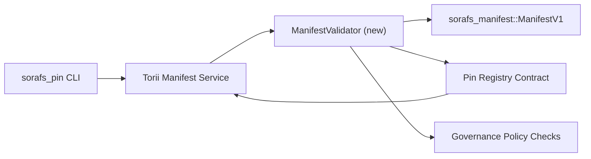

:::注意規範來源
:::

# Pin 註冊表清單驗證計劃 (SF-4 Prep)

該計劃概述了線程 `sorafs_manifest::ManifestV1` 所需的步驟
驗證即將到來的密碼註冊合同，以便 SF-4 工作可以
基於現有工具構建，無需重複編碼/解碼邏輯。

## 目標

1. 主機端提交路徑驗證清單結構、分塊配置文件和
   在接受提案之前先確定治理信封。
2. Torii 和網關服務重用相同的驗證例程以確保
   跨主機的確定性行為。
3. 集成測試涵蓋明顯接受的正面/負面案例，
   策略執行和錯誤遙測。

## 架構

### 組件

- `ManifestValidator`（`sorafs_manifest` 或 `sorafs_pin` 板條箱中的新模塊）
  封裝結構檢查和策略門。
- Torii 暴露了調用的 gRPC 端點 `SubmitManifest`
  `ManifestValidator` 在轉發到合約之前。
- 網關獲取路徑在緩存新內容時可以選擇使用相同的驗證器
  從註冊表中體現出來。

## 任務分解

|任務|描述 |業主|狀態 |
|------|-------------|--------|--------|
| V1 API 骨架 |將 `validate_manifest(manifest: &ManifestV1, policy: &PinPolicyInputs) -> Result<(), ValidationError>` 添加到 `sorafs_manifest`。包括 BLAKE3 摘要驗證和分塊器註冊表查找。 |核心基礎設施| ✅ 完成 |共享助手（`validate_chunker_handle`、`validate_pin_policy`、`validate_manifest`）現在位於 `sorafs_manifest::validation` 中。 |
|政策佈線|將註冊表策略配置（`min_replicas`、到期窗口、允許的分塊句柄）映射到驗證輸入。 |治理/核心基礎設施|待定 — 在 SORAFS-215 中跟踪 |
| Torii 集成 |在 Torii 清單提交路徑內調用驗證器；失敗時返回結構化 Norito 錯誤。 | Torii 團隊 |已計劃 — 在 SORAFS-216 中跟踪 |
|主機合同存根 |確保合約入口點拒絕驗證哈希失敗的清單；公開指標計數器。 |智能合約團隊 | ✅ 完成 | `RegisterPinManifest` 現在在改變狀態之前調用共享驗證器 (`ensure_chunker_handle`/`ensure_pin_policy`)，並且單元測試覆蓋失敗案例。 |
|測試 |為無效清單添加驗證器 + trybuild 案例的單元測試； `crates/iroha_core/tests/pin_registry.rs` 中的集成測試。 |質量保證協會 | 🟠 進行中 |驗證器單元測試與鏈上拒絕測試同時進行；完整的集成套件仍在等待中。 |
|文檔 |驗證器登陸後更新 `docs/source/sorafs_architecture_rfc.md` 和 `migration_roadmap.md`；在 `docs/source/sorafs/manifest_pipeline.md` 中記錄 CLI 用法。 |文檔團隊 |待處理 — 在 DOCS-489 中跟踪 |

## 依賴關係

- Pin 註冊表 Norito 架構最終確定（參考：路線圖中的 SF-4 項目）。
- 理事會簽署的分塊註冊信封（確保驗證器映射是
  確定性）。
- Torii 清單提交的身份驗證決定。

## 風險與緩解措施

|風險|影響 |緩解措施 |
|------|--------|------------|
| Torii與合同政策解讀分歧|非確定性接受。 |共享驗證箱+添加集成測試來比較主機與鏈上決策。 |
|大型清單的性能回歸 |提交速度較慢 |通過貨物標准進行基準；考慮緩存清單摘要結果。 |
|錯誤消息漂移|操作員困惑 |定義Norito錯誤代碼；將它們記錄在 `manifest_pipeline.md` 中。 |

## 時間表目標

- 第 1 週：登陸 `ManifestValidator` 骨架 + 單元測試。
- 第 2 週：連接 Torii 提交路徑並更新 CLI 以顯示驗證錯誤。
- 第 3 週：實施合約掛鉤、添加集成測試、更新文檔。
- 第 4 週：進行端到端排練，包括遷移分類賬錄入、捕獲委員會簽字。

驗證器工作開始後，該計劃將在路線圖中引用。