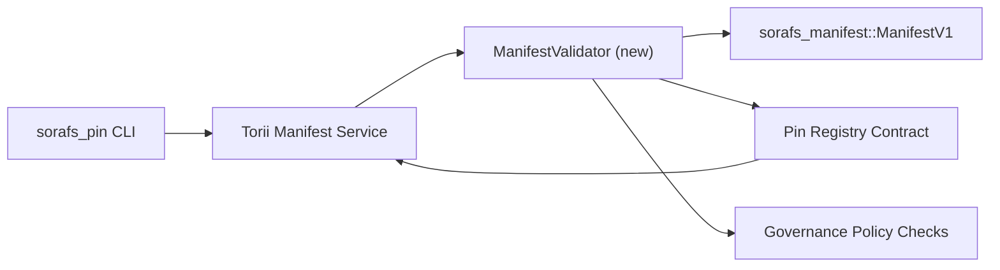

---
المعرف: خطة التحقق من صحة السجل
العنوان: خطة التحقق من البيان في Pin Registry
Sidebar_label: التحقق من رقم التعريف الشخصي
الوصف: خطة تحقق لتقييد ManifestV1 قبل Conno Pin Registry ضمن SF-4.
---

:::ملحوظة المصدر مؤهل
احترام هذه الصفحة `docs/source/sorafs/pin_registry_validation_plan.md`. حافظ على المحاذاة بين الموقعين كما الوثائق القديمة الفعالة.
:::

# خطة التحقق من البيانات في Pin Registry (تحضير SF-4)

لأن هذه الخطوات الأساسية للتمرير تحقق `sorafs_manifest::ManifestV1` داخل
عقد Pin Registry قادم حتى يبني عمل SF-4 على أدوات التسجيل بدون ظهر
ترميز/فك تشفير.

## الاهداف

1. تحقق أهداف الارسال في الهيئة من خلال تشكيل ملف واضح ومغلفات
   بالخاصة قبل الموافقة على المقترحات.
٢.
   ماترين.
3. تشمل العناصر التي تشمل الحالات الايجابية والتنوع لقبول البيانات وتطبيقاتها
   بالتأكيد وتليمتري الاخطاء.

## تنقل

### مقادير

- `ManifestValidator` (وحدة جديدة في الصندوق `sorafs_manifest` او `sorafs_pin`)
  تبسيط الحسابات وبوابات السياسة.
- Torii تم عرض endpoint gRPC باسم `SubmitManifest` يستدعي
  `ManifestValidator` قبل الارسال للعقد.
- مسار الجلب في بوابة سعة الكمية المختار اختياريا عند بيانات الحمولة
  جديدة من التسجيل.

## طبخة| | الوصف | المالك | الحالة |
|------|-------|--------|--------|
| هيكل API V1 | اضافة `validate_manifest(manifest: &ManifestV1, policy: &PinPolicyInputs) -> Result<(), ValidationError>` الى `sorafs_manifest`. تضمين التحقق من BLAKE3 Digest وlookup للـ Chunker Registration. | الأشعة تحت الحمراء الأساسية | ✅ تم | المساعدات المشتركة (`validate_chunker_handle`, `validate_pin_policy`, `validate_manifest`) تعيش الان في `sorafs_manifest::validation`. |
| توصيل السياسة | موامة اعدادات التسجيل (`min_replicas`, نوافذ جسر, Handles لها) مع تأشيرات الدخول. | الحوكمة / البنية التحتية الأساسية | انتظر الانتظار — متابعة في SORAFS-215 |
| تكامل Torii | اتصل بالمقرر في مسار الإرسال Torii؛ إعادة اخطاء Norito منظمة عند البناء. | فريق Torii | مخطط — متابعة في SORAFS-216 |
| كعب لعقدة | ضمان رفض نقطة الدخول للعقد للبيانات التي لم تنجح في التحقق من التجزئة؛ وعريضة عدادات المعايير. | فريق العقد الذكي | ✅ تم | `RegisterPinManifest` يستدعي الان المتبرع الفائض (`ensure_chunker_handle`/`ensure_pin_policy`) قبل تغيير الحالة وتغطي السيولة الحالة الوحيدة. |
| الاختبار | توفير كمية من وحدة للمشرف + حالات Trybuild لـ المنافيس غير صالحة؛ السيولة تكامل في `crates/iroha_core/tests/pin_registry.rs`. | نقابة ضمان الجودة | 🟠 غار العمل | كمية السائل للمتوقف مع الرفض على السلسلة؛ المجموعة جزء من ما تعينها على الانتظار. |
| وثائق | تحديث `docs/source/sorafs_architecture_rfc.md` و `migration_roadmap.md` بعد وصول المتابع؛ توثيق استخدام CLI في `docs/source/sorafs/manifest_pipeline.md`. | فريق المستندات | انتظر الانتظار — متابعة في DOCS-489 |

##الاعتماديات- انهاء مخطط Norito لـ Pin Registry (المرجع: بند SF-4 في خريطة الطريق).
- مغلفات سجل Chunker موقعة من المجلس (بما في ذلك ان في المتابع حتمي).
- مصادقة Torii لارسال البيانات.

## متعددة وخفيفة

| خطر | الاثر | لماذا |
|-------|-------|---------|
| تفسير لتفسير مختلف بين Torii والعقد | قبول غير حتمي. | مشاركة الصندوق التحقق + إضافة السيولة تكامل تقارن المنتجات الموجودة مقابل on-chain. |
| بداية الاداء للـ واضحالجديدة | إرسال ابطا | معيار القياس عبر البضائع؛ النظر في نتائج تخزين الملخص للبيان. |
| أحراف رسائل الخطأ | مفعلين | تعريف الرموز اخطاء Norito؛ توثيقها في `manifest_pipeline.md`. |

## اهداف الجدول الزمني

- الأسبوع 1: انزال هيكل `ManifestValidator` + وحدة السيولة.
- الأسبوع 2: توصيل مسار الإرسال Torii وتحديث CLI لا التجارة اخطاء التحقق.
- الأسبوع 3: تنفيذ الخطافات للعقد، إضافة السيولة تكامل، تحديث الوثائق.
- الأسبوع الرابع: تمرين شامل من خلال إدخال موافقة مجلس الهجرة والقاطع.

قم بالرجوع إلى هذا البناء في خارطة الطريق عند بدء عمل المدقق.