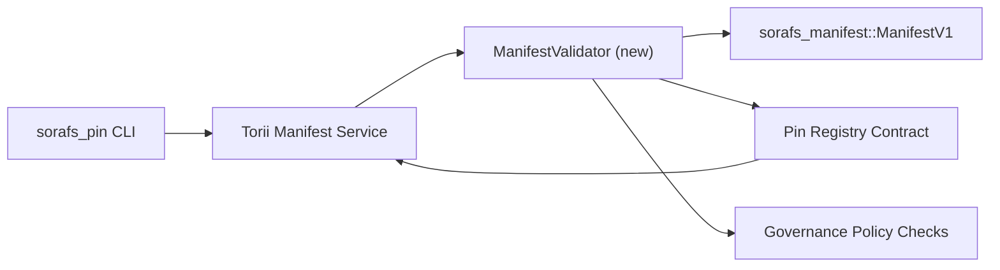

---
المعرف: خطة التحقق من صحة السجل
العنوان: خطة التحقق من صحة بيانات سجل Pin
Sidebar_label: التحقق من صحة السجل Pin
الوصف: خطة التحقق من صحة بوابة ManifestV1 السابقة لبدء تشغيل Pin Registry SF-4.
---

:::ملاحظة فوينتي كانونيكا
هذه الصفحة تعكس `docs/source/sorafs/pin_registry_validation_plan.md`. حافظ على مواقعك المتواجدة أثناء تنشيط المستندات المخزنة.
:::

# خطة التحقق من بيانات السجل السري (الإعداد SF-4)

تصف هذه الخطة الخطوات المطلوبة لتكامل التحقق من الصحة
`sorafs_manifest::ManifestV1` وعقد Pin Registry المستقبلي من أجل ذلك
تعمل SF-4 على مساعدة الأدوات الموجودة دون تكرار المنطق
ترميز/فك تشفير.

##الأهداف

1. تتحقق طرق إرسال المضيف من بنية البيان والملف
   تقطيع المغلفات وإدارتها قبل قبول العرض.
2. Torii وخدمات البوابة تعيد استخدام نفس إجراءات التحقق من الصحة
   لضمان سلوك محدد بين المضيفين.
3. تجارب التكامل تشمل الحالات الإيجابية/السلبية لقبولها
   البيانات، وإنفاذ السياسة وقياس الأخطاء عن بعد.

## الهندسة المعمارية

### المكونات- `ManifestValidator` (وحدة جديدة في الصندوق `sorafs_manifest` أو `sorafs_pin`)
  يغلف الشيكات الهيكلية وبوابات السياسة.
- Torii يعرض نقطة نهاية gRPC `SubmitManifest` التي اتصل بها
  `ManifestValidator` قبل تجديد العقد.
- يمكن لطريق جلب البوابة استهلاك نفس المدقق اختياريًا
  تظهر بيانات ذاكرة التخزين المؤقت الجديدة من السجل.

## قم بإلغاء تحديد الأشياء| تاريا | الوصف | مسؤول | حالة |
|------|-------------------|------------|------|------|------|------|
| Esqueleto de API V1 | إضافة `validate_manifest(manifest: &ManifestV1, policy: &PinPolicyInputs) -> Result<(), ValidationError>` إلى `sorafs_manifest`. قم بتضمين التحقق من ملخص BLAKE3 والبحث عن سجل المقطع. | الأشعة تحت الحمراء الأساسية | ✅هيكو | المساعدون المشاركون (`validate_chunker_handle`، `validate_pin_policy`، `validate_manifest`) يعيشون الآن في `sorafs_manifest::validation`. |
| كابلادو دي بوليتيكا | قم بتعيين التكوين السياسي للسجل (`min_replicas`، ونوافذ انتهاء الصلاحية، ومقابض القطع المسموح بها) ومدخلات التحقق. | الحوكمة / البنية التحتية الأساسية | Pendiente — rastreado en SORAFS-215 |
| التكامل Torii | التحقق من صحة البيانات في Torii; تحويل الأخطاء Norito estructurados ante Fallas. | فريق Torii | التخطيط — rastreado en SORAFS-216 |
| كعب العقد المضيف | تأكد من أن نقطة الدخول الخاصة بعقد إعادة الشراء تظهر سقوط علامة التحقق من الصحة؛ مقاييس المقاييس. | فريق العقد الذكي | ✅هيكو | `RegisterPinManifest` الآن يستدعي المدقق المشترك (`ensure_chunker_handle`/`ensure_pin_policy`) قبل تغيير الحالة واختبارات الوحدة التي تعالج حالات الفشل. || الاختبارات | تجميع الاختبارات الوحدوية للمدقق + حالات محاولة بناء البيانات غير الصالحة؛ اختبارات التكامل في `crates/iroha_core/tests/pin_registry.rs`. | نقابة ضمان الجودة | 🟠 أتقدم | يتم دمج الاختبارات الموحدة للمدقق جنبًا إلى جنب مع عمليات الاسترداد عبر السلسلة؛ لا جناح كامل من التكامل إذا كان متوقعا. |
| مستندات | قم بتحديث `docs/source/sorafs_architecture_rfc.md` و`migration_roadmap.md` مرة واحدة حيث يتم عرض المدقق؛ توثيق باستخدام CLI en `docs/source/sorafs/manifest_pipeline.md`. | فريق المستندات | Pendiente — rastreado en DOCS-489 |

## التبعيات

- الانتهاء من اختبار Norito لـ Pin Registry (المرجع: العنصر SF-4 في خريطة الطريق).
- مغلفات تسجيل الشركات من خلال المشورة (تأكد من رسم الخرائط للمدقق البحري المحدد).
- قرارات التصديق على Torii لإرسال البيانات.

## التخفيضات والتخفيفات

| ريسجو | امباكتو | التخفيف |
|--------|---------|------------|
| تفسير متباين للسياسة بين Torii والعقد | القبول ليس محددا. | مشاركة صندوق التحقق من الصحة + اختبارات التكامل المجمعة لمقارنة قرارات المضيف مقابل ما هو متصل بالسلسلة. |
| تراجع الأداء للبيانات الكبرى | Envios mas lentos | ميدير عبر معيار الشحن؛ ضع في اعتبارك نتائج التخزين المؤقت لملخص البيان. |
| مشتق من رسائل الخطأ | ارتباك المشغلين | تحديد رموز الخطأ Norito؛ Documentarlos en `manifest_pipeline.md`. |

## Objetivos de cronograma- الموسم 1: اختبار المستوى `ManifestValidator` + الاختبارات الموحدة.
- الأسبوع 2: قم بتوصيل البيئة إلى Torii وقم بتحديث CLI لكشف أخطاء التحقق من الصحة.
- الفصل 3: تنفيذ خطافات العقد، وجمع اختبارات التكامل، وتحديث المستندات.
- الفصل 4: قم بالمراسلة من البداية إلى النهاية مع الإدخال في سجل الهجرة والتقاط موافقة النصيحة.

يتم الرجوع إلى هذه الخطة في خريطة الطريق عندما تبدأ وظيفة المدقق.