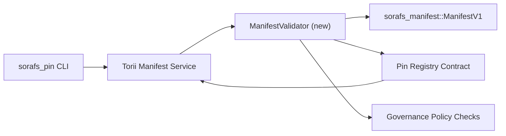

---
المعرف: خطة التحقق من صحة السجل
العنوان: خطة التحقق من صحة بيانات Pin Registry
Sidebar_label: سجل رقم التحقق من الصحة
الوصف: خطة التحقق من صحة بوابة ManifestV1 قبل بدء تشغيل Pin Registry SF-4.
---

:::ملاحظة المصدر الكنسي
هذه الصفحة تعكس `docs/source/sorafs/pin_registry_validation_plan.md`. قم بمحاذاة المواضع المزدوجة حتى تظل الوثائق الموروثة نشطة.
:::

# خطة التحقق من صحة بيانات Pin Registry (الإعداد SF-4)

هذه الخطة توضح الخطوات اللازمة لدمج التحقق من الصحة
`sorafs_manifest::ManifestV1` في عقد Pin Registry لتأتي لتتمكن من ذلك
يعمل SF-4 على الضغط على الأدوات الموجودة بدون تكرار المنطق
ترميز/فك تشفير.

## الأهداف

1. إن طرق التوصيل عالية الجودة تتحقق من بنية البيان،
   ملف تعريف القطع ومغلفات الإدارة قبل قبولها
   المقترحات.
2. Torii وبوابة الخدمات تعيد استخدام إجراءات التحقق من الصحة
   لضمان سلوك محدد بين الفنادق.
3. اختبارات التكامل تشمل الإيجابيات/السلبيات للقبول
   البيانات وتطبيق السياسة وقياس الأخطاء عن بعد.

##الهندسة المعمارية

### المكونات- `ManifestValidator` (وحدة نمطية جديدة في الصندوق `sorafs_manifest` أو `sorafs_pin`)
  تشمل الضوابط الهيكلية وبوابات السياسة.
- يعرض Torii نقطة النهاية gRPC `SubmitManifest` التي اتصلت بها
  `ManifestValidator` قبل عقد الإرسال.
- يمكن لطريق جلب البوابة أن يستهلك نفس المدقق الاختياري
  عندما يتم عرض ذاكرة التخزين المؤقت الجديدة من السجل.

## ديكوباج دي تاتش| تاش | الوصف | المالك | النظام الأساسي |
|------|------------|-------|--------|
| سكوليت API V1 | أضف `validate_manifest(manifest: &ManifestV1, policy: &PinPolicyInputs) -> Result<(), ValidationError>` إلى `sorafs_manifest`. قم بتضمين التحقق من ملخص BLAKE3 والبحث عن سجل القطع. | الأشعة تحت الحمراء الأساسية | ✅ تيرميني | تم تغيير المساعدين المشاركين (`validate_chunker_handle`، `validate_pin_policy`، `validate_manifest`) في `sorafs_manifest::validation`. |
| كابل السياسة | تعيين تكوين سياسة التسجيل (`min_replicas`، نوافذ انتهاء الصلاحية، مقابض القطع المرخصة) مقابل مدخلات التحقق من الصحة. | الحوكمة / البنية التحتية الأساسية | في انتظار — suivi dans SORAFS-215 |
| التكامل Torii | Appeler le validateur dans le chemin de soumission Torii ; معيد الأخطاء Norito منظم في حالة الفحص. | فريق Torii | Planifié — suivi dans SORAFS-216 |
| كعب عقد كونتر كوتيه هوت | التأكد من أن مدخل العقد يعيد البيانات التي تتوافق مع تجزئة التحقق من الصحة؛ فضح حاسبات المقاييس. | فريق العقد الذكي | ✅ تيرميني | `RegisterPinManifest` استدعاء خلل في التحقق من صحة المشاركة (`ensure_chunker_handle`/`ensure_pin_policy`) قبل تغيير الحالة واختبارات الوحدة التي تغطي حالة الفحص. || الاختبارات | إضافة اختبارات وحدوية من أجل التحقق من الصحة + من حالات محاولة البناء من أجل البيانات غير الصالحة؛ اختبارات التكامل في `crates/iroha_core/tests/pin_registry.rs`. | نقابة ضمان الجودة | 🟠 أون كورس | ستؤثر الاختبارات الوحدوية للتحقق من الصحة على الردود الموجودة على السلسلة؛ مجموعة التكامل الكاملة تبقى في حالة انتباه. |
| مستندات | قم بإجراء التحقق من `docs/source/sorafs_architecture_rfc.md` و`migration_roadmap.md` مرة واحدة مرة أخرى بواسطة أداة التحقق من صحة البيانات؛ توثيق استخدام CLI في `docs/source/sorafs/manifest_pipeline.md`. | فريق المستندات | انتبه - تابع في DOCS-489 |

## التبعيات

- الانتهاء من المخطط Norito من Pin Registry (المرجع: العنصر SF-4 في خريطة الطريق).
- مغلفات سجل القطع الموقعة من قبل المجلس (تأكد من تحديد خريطة التحقق من الصحة).
- قرارات المصادقة Torii الخاصة بتسليم البيانات.

## المخاطر والتخفيفات

| محفوف بالمخاطر | التأثير | التخفيف |
|--------|--------|------------|
| تفسير سياسي متباين بين Torii والعقد | القبول غير محدد. | قم بمشاركة صندوق التحقق من الصحة + إضافة اختبارات التكامل مقارنة بين القرارات العالية والقرارات الموجودة على السلسلة. |
| تراجع الأداء بسبب البيانات الكبيرة | Soumitions بالإضافة إلى العدس | المعيار عبر معيار البضائع؛ تصور ذاكرة تخزين مؤقت لنتائج ملخص البيان. |
| اشتقاق رسائل الخطأ | مشغل الارتباك | تحديد رموز الخطأ Norito ; الموثق في `manifest_pipeline.md`. |## سيبل دي كاليندرييه

-الأسبوع 1: تخلص من المكعب `ManifestValidator` + الاختبارات الوحدوية.
- الأسبوع 2: قم بتوصيل وصلة التوصيل Torii وقم بضبط CLI يوميًا لتصحيح أخطاء التحقق من الصحة.
- الموسم 3: تنفيذ خطافات العقد، وإضافة اختبارات التكامل، وتحديث المستندات.
- الموسم 4 : تنفيذ التكرار من البداية إلى النهاية مع إدخال دفتر الأستاذ، والتقاط الموافقة على المشورة.

سيتم الرجوع إلى هذه الخطة في خريطة الطريق بمجرد عمل التحقق من صحة البدء.