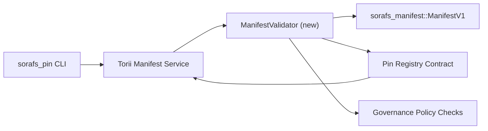

---
المعرف: خطة التحقق من صحة السجل
العنوان: Plano de validacao demanis do Pin Registry
Sidebar_label: Validacao do Pin Registry
الوصف: خطة التحقق من صحة بوابة ManifestV1 قبل بدء تشغيل Pin Registry SF-4.
---

:::ملاحظة فونتي كانونيكا
هذه الصفحة espelha `docs/source/sorafs/pin_registry_validation_plan.md`. الحفاظ على جميع المواقع من خلال توثيق دائم للقطيع.
:::

# خطة التحقق من صحة بيانات Pin Registry (Preparacao SF-4)

توضح هذه الخطة الخطوات اللازمة لدمج التحقق من الصحة
`sorafs_manifest::ManifestV1` هو عقد Pin Registry المستقبلي لذلك
لا يوجد أساسًا لأدوات SF-4 أي نسخة طبق الأصل من المنطق
ترميز/فك تشفير.

##الأهداف

1. لا يمكن لحافلات المراسلات أن يتحقق المضيف من مدى ظهور البنية التحتية أو الملف الشخصي
   تقطيع وتحكم المغلفات قبل الموافقة على العروض.
2. Torii وإعادة استخدام خدمات البوابة كرسائل التحقق الروتينية
   ضمان حتمية السلوك بين المضيفين.
3. تشمل الخصيتين التكامليتين الحالات الإيجابية/السلبية للحصول على
   البيانات وإنفاذ السياسة وقياس الأخطاء عن بعد.

## أركيتيتورا

### المكونات- `ManifestValidator` (وحدة جديدة بدون صندوق `sorafs_manifest` أو `sorafs_pin`)
  يفحص التغليف الهياكل والبوابات السياسية.
- Torii يعرض نقطة النهاية gRPC `SubmitManifest` التي تشير إلى ذلك
  `ManifestValidator` قبل الدخول في العقد.
- يمكن لطريق الجلب الخاص بالبوابة استهلاكه اختياريًا أو نفس المدقق أيضًا
  يقوم Cachear Novos بإظهار Vindos Do Registry.

## إلغاء الطلب| طريفة | وصف | الرد | الحالة |
|--------|-----------------|---------|--------|-|
| Esqueleto de API V1 | أضف `validate_manifest(manifest: &ManifestV1, policy: &PinPolicyInputs) -> Result<(), ValidationError>` إلى `sorafs_manifest`. قم بتضمين التحقق من ملخص BLAKE3 والبحث عن سجل القطع. | الأشعة تحت الحمراء الأساسية | الخلاصة | يتم مشاركة المساعدين (`validate_chunker_handle`، `validate_pin_policy`، `validate_manifest`) الآن في `sorafs_manifest::validation`. |
| الأسلاك السياسية | قم بتعيين تكوين سياسي للسجل (`min_replicas`، سجلات انتهاء الصلاحية، مقابض القطع المسموح بها) لإدخالات التحقق من الصحة. | الحوكمة / البنية التحتية الأساسية | معلقة - راستريدو في SORAFS-215 |
| انتيجراكاو Torii | مفتاح التحقق من طريق الإرسال Torii; إرجاع الأخطاء Norito estruturados em falhas. | فريق Torii | طائرة - راسترادو في SORAFS-216 |
| كعب العقد المضيف | ضمان أن نقطة الدخول في العقد تظهر أنها لا تحتوي على تجزئة صالحة؛ تصدير عدادات القياس. | فريق العقد الذكي | الخلاصة | `RegisterPinManifest` يتم الآن استدعاء التحقق من صحة المشاركة (`ensure_chunker_handle`/`ensure_pin_policy`) قبل التغيير أو الحالة والخصيتين الوحدويتين الموحدتين لحالات الخطأ. || الاختبارات | إضافة الخصيتين الوحدويتين من أجل التحقق من الصحة + حالات محاولة بناء البيانات غير الصالحة؛ الخصية المتكاملة في `crates/iroha_core/tests/pin_registry.rs`. | نقابة ضمان الجودة | م التقدم | تقوم الخصيتين الوحدويتين بإجراء عملية التحقق من الصحة جنبًا إلى جنب مع rejeicoes on-chain؛ مجموعة كاملة من التكامل المستمر. |
| مستندات | تم تحديث `docs/source/sorafs_architecture_rfc.md` و`migration_roadmap.md` عند التحقق من صحة البيانات؛ يستخدم التوثيق CLI في `docs/source/sorafs/manifest_pipeline.md`. | فريق المستندات | معلقة - تم النشر في DOCS-489 |

## التبعيات

- تم الانتهاء من اختبار Norito من Pin Registry (المرجع: العنصر SF-4 بدون خريطة طريق).
- تقوم المظاريف بعمل سجل مقسم Assinados Pelo Conselho (ضمان Mapeamento Deterministico do Validador).
- قرارات المصادقة Torii لتقديم البيانات.

## المخاطر والتخفيف

| ريسكو | امباكتو | ميتيجاكاو |
|-------|---------|-----------|
| تفسيرات سياسية مختلفة بين Torii والعقد | Aceitacao nao الحتمية. | مشاركة صندوق التحقق + إضافة اختبارات التكامل لمقارنة قرارات الاستضافة مع تلك الموجودة على السلسلة. |
| تراجع الأداء للبيانات الكبرى | يقدم أكثر من lentas | ميدير عبر معيار الشحن؛ ضع في اعتبارك نتائج التخزين المؤقت الواضحة. |
| مشتق من رسائل الخطأ | Confusao dooperador | تعريف رموز الخطأ Norito; توثيق em `manifest_pipeline.md`. |

## ميتاس دي كرونوجراما- الأسبوع 1: دخول الحدث `ManifestValidator` + الخصيتين الوحدويتين.
- الفصل 2: ​​دمج طريق الإرسال رقم Torii وتحديث CLI لاستعراض أخطاء التحقق من الصحة.
- الفصل 3: تنفيذ الخطافات للعقد، إضافة ميزات التكامل، تحديث المستندات.
- الأسبوع 4: قم بالتواصل من البداية إلى النهاية مع إدخال دفتر الأستاذ والتقاط الموافقة على المشورة.

هذه الخطة ستكون مرجعية لخارطة الطريق طالما أن العمل يأتي من المدقق.