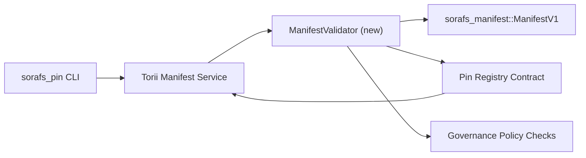

---
المعرف: خطة التحقق من صحة السجل
العنوان: بيان التحقق من صحة الخطة لسجل Pin
Sidebar_label: التحقق من صحة رقم التعريف الشخصي
الوصف: خطة التحقق من صحة Gating ManifestV1 قبل بدء تشغيل Pin Registry SF-4.
---

:::note Канонический источник
هذا الجزء يعرض `docs/source/sorafs/pin_registry_validation_plan.md`. بعد أن يتم نشر المستندات، يتم تنشيط المستندات التالية.
:::

# بيان التحقق من صحة الخطة لسجل Pin (الموافقة على SF-4)

توضح هذه الخطة الأشياء التي تحتاج إلى التحقق من الصحة الإضافية
`sorafs_manifest::ManifestV1` في عقد الدبوس المسجل للعمل على SF-4
قم بتفعيل الأدوات المتاحة دون الحاجة إلى منطق التشفير/فك التشفير.

## كيلي

1. قم بإجراء تصحيحات على مخزن المضيف والتحقق من هيكل البيان والملف الشخصي
   مظاريف التقطيع والحوكمة قبل اقتراحات الملكية.
2. Torii وخدمات البوابة تستخدمها أيضًا للتحقق من صحة الإجراءات
   تحديد القرار بين المضيفين.
3. اختبارات التكامل تجيب على الأسئلة الإيجابية والسلبية
   البيانات وسياسة الإنفاذ والقياس عن بعد.

## الهندسة المعمارية

### المكونات- `ManifestValidator` (وحدة جديدة في الصندوق `sorafs_manifest` أو `sorafs_pin`)
  تتضمن بوابات المراقبة والسياسة الهيكلية.
- Torii يفتح نقطة نهاية gRPC `SubmitManifest`، التي تم تحديدها
  `ManifestValidator` قبل التسليم في العقد.
- يمكن استخدام جلب البوابة بشكل اختياري من خلال أداة التحقق من الصحة
  تحرير البيانات الجديدة من التسجيل.

## مفاجأة| زادا | الوصف | فلاديليتس | الحالة |
|--------|--------------|--------|--------|
| سكيليت API V1 | أضف `validate_manifest(manifest: &ManifestV1, policy: &PinPolicyInputs) -> Result<(), ValidationError>` إلى `sorafs_manifest`. قم بإغلاق التحقق من سجل BLAKE3 الخاص بالهضم والبحث. | الأشعة تحت الحمراء الأساسية | ✅ بيع | المساعدون الرئيسيون (`validate_chunker_handle`، `validate_pin_policy`، `validate_manifest`) يتجهون إلى `sorafs_manifest::validation`. |
| تكملة السياسة | قم بتكوين تكوين السجل السياسي (`min_replicas`، حالة جيدة، مقابض مقسمة رائعة) من خلال عمليات التحقق من الصحة. | الحوكمة / البنية التحتية الأساسية | في الخدمة - يتم التخلص منها في SORAFS-215 |
| التكامل Torii | اختيار المدقق في وضع التقديم Torii; قم بإعادة بناء الوحدات الهيكلية Norito عند الاتصال بها. | فريق Torii | مخطط — يتم رصده في SORAFS-216 |
| عقد المضيفة | تأكد من أن عقد نقطة الدخول يُلغى البيانات، ولا يتبع التحقق من صحتها؛ عرض مقياس الإدراك. | فريق العقد الذكي | ✅ بيع | `RegisterPinManifest` يتم الآن التحقق من المدقق الرئيسي (`ensure_chunker_handle`/`ensure_pin_policy`) قبل تصحيح الحالة، واختبارات الوحدة تظهر يحدث ذلك. |
| الاختبارات | إضافة اختبارات الوحدة للمدقق + مفاتيح محاولة البناء للبيانات غير الصحيحة؛ اختبارات التكامل في `crates/iroha_core/tests/pin_registry.rs`. | نقابة ضمان الجودة | 🟠 في العملية | تمت إضافة مدقق اختبارات الوحدة إلى المراجعات عبر السلسلة؛ مجموعة متكاملة من التكامل في الخدمة. || التوثيق | قم بالتعرف على `docs/source/sorafs_architecture_rfc.md` و`migration_roadmap.md` بعد مدقق الاتصال؛ قم بسرد سطر الأوامر في `docs/source/sorafs/manifest_pipeline.md`. | فريق المستندات | في الخدمة - يتم الرجوع إلى DOCS-489 |

## Зависимости

- الانتهاء من مخططات Norito Pin Registry (المرجع: نقطة SF-4 في خريطة الطريق).
- مظاريف مجلس التقديم لسجل القطع (ضمان تحديد المواصفات في المدقق).
- حل المصادقة Torii لتقديم البيانات.

## المخاطر والمخاطر

| مخاطر | الحياة | التخفيف |
|------|---------|---------------|
| تفسيرات سياسية مختلفة بين Torii والعقد | عدم تحديد الملكية. | التحقق من صحة الصناديق + إضافة اختبارات التكامل لقرارات المضيف مقابل on-chain. |
| تراجع إنتاجية البيانات الكبيرة | تقديم كبير جدًا | المعيار من خلال معيار البضائع؛ قم بتوسيع نتائج البحث ملخص البيان. |
| انخفاض أسعار المنتجات | بوتانيسا في المشغلين | قم باقتراح كود أوشيبوك Norito; قم بالتعليق على `manifest_pipeline.md`. |

## استمتع بوقتك

- الجزء 1: اختبار الهيكل `ManifestValidator` + اختبارات الوحدة.
- الأسبوع 2: قم بإغلاق الإرسال عبر Torii واحصل على CLI للتحقق من صحة البيانات.
- الأسبوع 3: تحقيق عقد الخطافات، وإجراء اختبارات التكامل، وقراءة المستندات.
- الأسبوع 4: اختبر التكرار الشامل من خلال تسجيله في دفتر أستاذ الهجرة والحصول على الموافقة.سيتم وضع هذه الخطة في خريطة الطريق بعد بدء العمل من أجل التحقق.