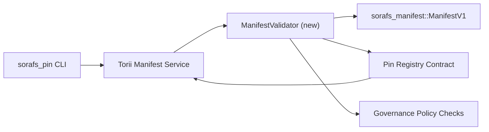

---
المعرف: خطة التحقق من صحة السجل
العنوان: يظهر رقم التعريف الشخصي المسجل في ملف توثیقی منصوبہ بندی
Sidebar_label: سجل الدبوس توثیق
الوصف: إطلاق سجل SF-4 Pin لـ ManifestV1 gating لـ ManifestV1.
---

:::ملاحظة مستند ماخذ
هذه هي الصفحة `docs/source/sorafs/pin_registry_validation_plan.md`. بعد أن أصبحت الإجراءات النشطة فعالة، فإنها ستعزز من أهميتها.
:::

# خطة التحقق من صحة بيان السجل (SF-4 Prep)

ما هو الإصلاح والإجراءات الصحيحة التي يجب اتخاذها `sorafs_manifest::ManifestV1`
هذا هو ملف Pin Registry الذي يحتوي على ملف SF-4
لا توجد أدوات متاحة للاستعلام والتشفير/فك التشفير في منطقة النقل.

##مقاصد

1. يتم تقديم البيان من جانب المضيف، وتقطيع الملف الشخصي، والحوكمة
   مظاريف کو مقترحات قبول کرنے سے پہلے التحقق من کرتے ہیں.
2. قم بإعادة استخدام Torii وتسلسلات البوابة وإجراءات التحقق من الصحة
   المضيفون هم السلوك الحتمي لقرار رہے۔
3. اختبارات التكامل الإيجابية/النفسية هي قبول واضح،
   يشمل تطبيق السياسة وقياس الأخطاء عن بعد كل شيء.

##الهندسة المعمارية

### المكونات- `ManifestValidator` (`sorafs_manifest` أو `sorafs_pin` صندوق جديد)
  هناك أشياء صغيرة وبوابات سياسية تغلفها.
- Torii نقطة نهاية gRPC `SubmitManifest` تعرض الكرتا والتقدم للأمام
  الرقم القياسي `ManifestValidator` هو الرقم القياسي.
- مسار جلب البوابة اختياريًا وأداة التحقق من صحة الاستخدام وبطاقة التسجيل
  جديد يظهر ذاكرة التخزين المؤقت.

## تقسيم المهام| مهمة | الوصف | المالك | الحالة |
|------|------------|-------|--------|
| هيكل V1 API | `sorafs_manifest` `validate_manifest(manifest: &ManifestV1, policy: &PinPolicyInputs) -> Result<(), ValidationError>` يشمل القراءة. يتضمن BLAKE3 التحقق من الملخص والبحث في السجل المقسم. | الأشعة تحت الحمراء الأساسية | ✅ تم | مساعدين مشتركين (`validate_chunker_handle`, `validate_pin_policy`, `validate_manifest`) اب `sorafs_manifest::validation`. |
| أسلاك السياسة | تكوين سياسة التسجيل (`min_replicas`، نوافذ انتهاء الصلاحية، مقابض القطع المسموح بها) ومدخلات التحقق من الصحة على الخريطة. | الحوكمة / البنية التحتية الأساسية | في انتظار — SORAFS-215 میں ٹریکڈ |
| التكامل Torii | مسار التقديم Torii لأداة التحقق من صحة الاندرويد؛ فشل في أخطاء Norito المنظمة. | فريق Torii | مخطط — SORAFS-216 ميجا ٹریکڈ |
| كعب عقد المضيف | قد تفشل إحدى نقاط دخول العقد والبيانات في رفض تجزئة التحقق من الصحة؛ عدادات المقاييس تظهر. | فريق العقد الذكي | ✅ تم | `RegisterPinManifest` الحالة المتحولة المدقق المشترك (`ensure_chunker_handle`/`ensure_pin_policy`) وحالات فشل اختبارات الوحدة. |
| الاختبارات | أداة التحقق من اختبارات الوحدة + البيانات غير الصالحة لحالات محاولة بناء الحالات شاملة؛ `crates/iroha_core/tests/pin_registry.rs` تتضمن اختبارات التكامل. | نقابة ضمان الجودة | 🟠 قيد التنفيذ | اختبارات وحدة التحقق من صحة اختبارات الرفض على السلسلة مستمرة؛ مجموعة التكامل مكملة. || مستندات | أداة التحقق من الصحة الموجودة بعد `docs/source/sorafs_architecture_rfc.md` و`migration_roadmap.md` للبطاقة؛ يتم استخدام CLI `docs/source/sorafs/manifest_pipeline.md`. | فريق المستندات | في انتظار — DOCS-489 میں ٹریکڈ |

## التبعيات

- مخطط Pin Registry Norito (المرجع: خريطة الطريق SF-4).
- مظاريف تسجيل القطع الموقعة من المجلس (رسم خرائط المدقق للفتيات الحتميات)۔
- تقديم البيان کے لیے Torii التوثيق فيصلے۔

## المخاطر والتخفيفات

| خطر | التأثير | التخفيف |
|------|--------|------------|
| Torii وتفسير السياسات الطبية مختلف | قبول غير حتمي ۔ | تتضمن اختبارات التكامل الشاملة لصندوق التحقق + المضيف مقابل التجزئة على السلسلة. |
| يظهر بڑے کے لیے تراجع الأداء | تقديم سست | معيار الحمولة هو المعيار القياسي؛ ملخص واضح لنتائج ذاكرة التخزين المؤقت في غور . |
| خطأ في إرسال الرسائل | المشغلون ملتزمون | تحدد رموز الخطأ Norito کریں؛ `manifest_pipeline.md` يحتوي على مستند. |

## أهداف الجدول الزمني

- الأسبوع 1: `ManifestValidator` الهيكل العظمي + اختبارات الوحدة.
- الأسبوع 2: سلك مسار الإرسال Torii وأخطاء التحقق من صحة CLI التي تم إجراؤها.
- الأسبوع 3: تقوم خطافات العقد بتنفيذ اختبارات التكامل، وتتضمن الكريں، ومستندات المستندات.
- الأسبوع 4: إدخال دفتر أستاذ الهجرة يتم من خلال بروفة شاملة وتوقيع المجلس.بدأت أداة التحقق من الصحة منذ البداية بعد إحالة خريطة الطريق.