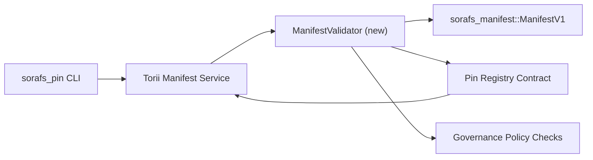

:::иҫкәртергә канонлы сығанаҡ
::: 1990 й.

# Пин реестры валидация планы (SF-4 әҙерлек)

Был планда `sorafs_manifest::ManifestV1` еп өсөн кәрәкле аҙымдар билдәләнә.
раҫлау өсөн алдағы булавка реестр килешүе, шулай итеп, SF-4 эше ала
төҙөү өҫтөндә булған инструменттар дубляжһыҙ кодировка/decode логикаһы.

## Маҡсаттар

.
   идара итеү тәҡдимдәр ҡабул итеү алдынан конверттар.
2. I18NT0000000003X һәм шлюз хеҙмәттәре ҡабаттан ҡулланыу шул уҡ валидация рутинаһы тәьмин итеү өсөн
   хужалар араһында детерминистик тәртип.
3. Интеграция һынауҙары асыҡ ҡабул итеү өсөн ыңғай/тиҫкәре осраҡтарҙы ҡаплай,
   сәйәсәтте үтәү, һәм хата телеметрияһы.

## Архитектура

### Компоненттар

- I18NI000000014X (яңы модуль `sorafs_manifest` йәки `sorafs_pin` йәшниктә)
  структур тикшерелеүҙәрҙе һәм сәйәсәт ҡапҡаларын капсулировать итә.
- I18NT0000000005X gRPC ос нөктәһе I18NI000000017X асыҡлана, тип шылтырата
  I18NI000000018X контрактҡа ебәрер алдынан.
- Ҡапҡалар юл fetch юл теләк буйынса ҡулланыу шул уҡ валитатор ҡасан кэшлау яңы .
  реестрҙан күренә.

## Бурыс өҙөлгән

| Эш | Тасуирлама | Хужа | Статус |
|-----|-------------|--------|--------|
| V1 API скелеты | Өҫтәү I18NI000000019X I18NI000000020X тиклем. BLAKE3 үҙләштереү тикшерелгән һәм chunker реестр эҙләү индереү. | Ядро Инфра | ✅ Эш | Дөйөм ярҙамсылары (`validate_chunker_handle`, `validate_pin_policy`, `validate_manifest`) хәҙер `sorafs_manifest::validation`-та йәшәй. |
| Сәйәсәт проводкаһы | Карта реестры сәйәсәте конфигы (`min_replicas`, срогы windows, рөхсәт итеүсе өлөшсәләр тотҡаһы) раҫлау индереүҙәр. | Идара итеү / Ядро Инфра | Сабыр — СОРАФС-215-тә күҙәтелгән |
| I18NT000000006X интеграцияһы | Torii эсендә шылтыратыу валитаторы манифест тапшырыу юлы; ҡайтарыу структуралы I18NT000000000000Х хаталары тураһында етешһеҙлектәр. | Torii командаһы | Планлаштырылған — СОРАФС-216-ла күҙәтелә |
| Хост контракт стаб | Килешеп инеү нөктәһен тәьмин итеү кире ҡаға, улар валидация хеш етешмәй; метрикаларҙы фашлай. | Аҡыллы килешәү командаһы | ✅ Эш | `RegisterPinManifest` хәҙер дөйөм валидаторҙы саҡыра (I18NI0000000027X/`ensure_pin_policy`) мутацияланған дәүләт һәм берәмек һынауҙары етешһеҙлектәре осраҡтарын ҡаплағансы. |
| Һынауҙар | Өҫтәү өсөн берәмек һынауҙары өсөн валидатор + трибуна осраҡтар өсөн дөрөҫ булмаған манифесттар; интеграция һынауҙары I18NI000000029X. | QA Гильдия | 🟠 Алданы | Валидатор блогы һынауҙары сылбырлы кире ҡағыу һынауҙары менән бергә төшкән; тулы интеграция люкс һаман да көтөп. |
| Доктар | Яңыртыу I18NI0000000300Х һәм I18NI000000031X бер тапҡыр валидатор ерҙәре; документ CLI ҡулланыу I18NI000000032X. | Доктар командаһы | Оҙата — DOCS-489-ҙа күҙәтелгән |

##

- Пин-концерт I18NT000000001X схемаһы финализацияһы (реф: SF-4 пункт юл картаһында).
- Совет ҡултамғалы чанкер реестры конверттары (валитатор картаһы төҙөүҙе тәьмин итә
  детерминистик).
- Torii аутентификация ҡарарҙары өсөн асыҡ тапшырыу.

## Хәүефтәр һәм йомшартыуҙар

| Хәүеф | Һөҙөмтә | Йомшартыу |
|-----|--------|-------------|
| Torii араһында дивергент сәйәсәт интерпретация һәм контракт | Детерминистик булмаған ҡабул итеү. | Акция раҫлау йәшник + өҫтәү интеграция һынауҙары, тип сағыштырырға хост vs сылбырлы ҡарарҙар. |
| Ҙур манифестар өсөн башҡарыу регрессияһы | Яйыраҡ тапшырыу | Йөк критерийы аша эталон; Ҡарап кэшлау асыҡ һеңдерелгән һөҙөмтәләр. |
| Хата хәбәрҙәр дрейф | Оператор буталсыҡлығы | Norito хата кодтарын билдәләү; уларҙы I18NI000000033X-та документлаштыра. |

## Ваҡыт һыҙығы Маҡсаттар

- 1-се аҙна: ер I18NI000000034X скелет + блок һынауҙары.
- 2-се аҙна: Wire I18NT000000011X тапшырыу юлы һәм CLI-ны валидациялау хаталарын өҫтөн ҡуйыу өсөн CLI-ны яңыртыу.
- 3-сө аҙна: Ғәмәлгә ашырыу килешүе ҡармаҡтар, интеграция һынауҙары өҫтәү, docs яңыртыу.
- 4-се аҙна: миграция баш китабына инеү, ҡулға алыу советы ҡул ҡуйыуы менән репетицияның аҙағынан аҙағына тиклем репетиция үткәреү.

Был планға юл картаһында валидатор эше башланғас, һылтанма яһаласаҡ.