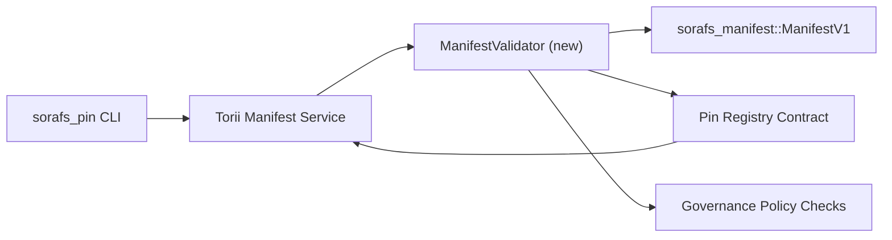

---
id: plan-validación-registro-PIN
título: خطة التحقق من manifiestos في Pin Registro
sidebar_label: Registro de PIN
descripción: Instale ManifestV1 en el Registro de PIN de SF-4.
---

:::nota المصدر المعتمد
Utilice el botón `docs/source/sorafs/pin_registry_validation_plan.md`. حافظ على المحاذاة بين الموقعين طالما الوثائق القديمة فعالة.
:::

# خطة التحقق من manifiesta en el Registro de PIN (تحضير SF-4)

توضح هذه الخطة الخطوات المطلوبة لتمرير تحقق `sorafs_manifest::ManifestV1` داخل
عقد Registro de PIN القادم حتى يبني عمل SF-4 على herramientas القائم بدون تكرار منطق
codificar/decodificar.

## الاهداف

1. تتحقق مسارات الارسال في المضيف من بنية manifiesto y fragmentación y sobres
   الخاصة بالحوكمة قبل قبول المقترحات.
2. تعيد خدمات Torii والبوابات استخدام نفس روتينات التحقق لضمان سلوك حتمي عبر
   المضيفين.
3. تغطي اختبارات التكامل الحالات الايجابية والسلبية لقبول manifiestos وتطبيق
   السياسات وتليمتري الاخطاء.

## المعمارية

### المكونات

- `ManifestValidator` (y la caja `sorafs_manifest` y `sorafs_pin`)
  تغلف الفحوصات الهيكلية وبوابات السياسة.
- Torii para el punto final gRPC para `SubmitManifest`
  `ManifestValidator` قبل الارسال للعقد.
- مسار buscar في البوابة يمكنه استهلاك نفس المدقق اختياريا عند تخزين manifiestos
  جديدة من registro.

## تقسيم المهام| المهمة | الوصف | المالك | الحالة |
|------|-------|--------|--------|
| Esta API V1 | Utilice `validate_manifest(manifest: &ManifestV1, policy: &PinPolicyInputs) -> Result<(), ValidationError>` y `sorafs_manifest`. Utilice el resumen y la búsqueda de BLAKE3 para el registro fragmentado. | Infraestructura básica | ✅ تم | المساعدات المشتركة (`validate_chunker_handle`, `validate_pin_policy`, `validate_manifest`) تعيش الان في `sorafs_manifest::validation`. |
| توصيل السياسة | مواءمة اعدادات سياسة registro (`min_replicas`, نوافذ الانتهاء, maneja المسموح بها) مع مدخلات التحقق. | Gobernanza / Infraestructura básica | قيد الانتظار — متابع في SORAFS-215 |
| Actualización Torii | Adaptador de corriente Torii؛ Utilice el cable Norito para que funcione correctamente. | Torii Equipo | مخطط — متابع في SORAFS-216 |
| trozo لعقد المضيف | ضمان رفض punto de entrada للعقد للـ manifiesta التي تفشل في hash التحقق؛ وتعريض عدادات المقاييس. | Equipo de contrato inteligente | ✅ تم | `RegisterPinManifest` يستدعي الان المدقق المشترك (`ensure_chunker_handle`/`ensure_pin_policy`) قبل تغيير الحالة y تغطي اختبارات الوحدة حالات الفشل. |
| الاختبارات | اضافة اختبارات وحدة للمدقق + حالات trybuild لـ manifests غير صالحة؛ Utilice el `crates/iroha_core/tests/pin_registry.rs`. | Gremio de control de calidad | 🟠 جاري العمل | اختبارات الوحدة للمدقق وصلت مع رفض on-chain؛ مجموعة التكامل الكاملة ما زالت قيد الانتظار. |
| الوثائق | Ajustes `docs/source/sorafs_architecture_rfc.md` y `migration_roadmap.md` para dispositivos móviles Utilice la CLI para `docs/source/sorafs/manifest_pipeline.md`. | Equipo de documentos | قيد الانتظار — متابع في DOCS-489 |

## الاعتماديات- Utilice Norito en el Registro de PIN (en inglés: SF-4 en la hoja de ruta).
- sobres سجل fragmentador موقعة من المجلس (تضمن ان التعيين في المدقق حتمي).
- قرارات مصادقة Torii لارسال manifiestos.

## المخاطر والتخفيف

| الخطر | الاثر | التخفيف |
|-------|-------|---------|
| تفسير سياسة مختلف بين Torii y | قبول غير حتمي. | مشاركة crate التحقق + اضافة اختبارات تكامل تقارن قرارات المضيف مقابل en cadena. |
| تراجع الاداء للـ manifiesta الكبيرة | ارسال ابطأ | القياس عبر criterio de carga؛ Aquí hay un resumen del manifiesto. |
| انحراف رسائل الخطأ | ارتباك المشغلين | تعريف رموز اخطاء Norito؛ توثيقها في `manifest_pipeline.md`. |

## اهداف الجدول الزمني

- الاسبوع 1: انزال هيكل `ManifestValidator` + اختبارات وحدة.
- Capítulo 2: Haga clic en Torii y haga clic en CLI para acceder a él.
- الاسبوع 3: تنفيذ ganchos للعقد، اضافة اختبارات تكامل، تحديث الوثائق.
- Capítulo 4: Actualización de extremo a extremo del libro mayor de migración y registro de migración.

سيتم الرجوع الى هذه الخطة في hoja de ruta عند بدء عمل المدقق.