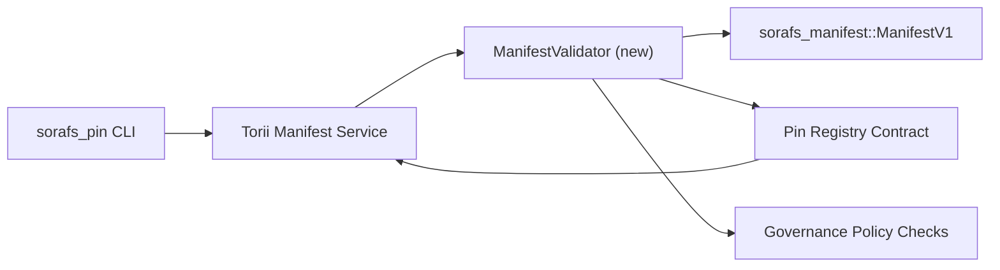

---
id: plan-validación-registro-PIN
título: Plan de validación de manifiestos del Registro Pin
sidebar_label: Validación del Registro Pin
descripción: Plan de validación para el gating de ManifestV1 previo al despliegue del Pin Registry SF-4.
---

:::nota Fuente canónica
Esta página refleja `docs/source/sorafs/pin_registry_validation_plan.md`. Mantenga ambas ubicaciones alineadas mientras la documentación heredada siga activa.
:::

# Plan de validación de manifiestos del Registro Pin (Preparación SF-4)

Este plan describe los pasos requeridos para integrar la validación de
`sorafs_manifest::ManifestV1` en el futuro contrato del Pin Registry para que el
trabajo de SF-4 se apoye en el tooling existente sin duplicar la lógica de
codificar/decodificar.

## Objetivos

1. Las rutas de envío del host verifican la estructura del manifiesto, el perfil de
   fragmentación y los sobres de gobernanza antes de aceptar propuestas.
2. Torii y los servicios de gateway reutilizan las mismas rutinas de validación
   para asegurar un comportamiento determinista entre anfitriones.
3. Las pruebas de integración cubren casos positivos/negativos para aceptación de
   manifiestos, cumplimiento de política y telemetría de errores.

##Arquitectura

### Componentes- `ManifestValidator` (nuevo módulo en la caja `sorafs_manifest` o `sorafs_pin`)
  encapsula los chequeos estructurales y las puertas de política.
- Torii expone un punto final gRPC `SubmitManifest` que llama a
  `ManifestValidator` antes de reenviar el contrato.
- La ruta de recuperación del gateway puede consumir opcionalmente el mismo validador
  al cachear nuevos manifiestos desde el registro.

## Desglose de tareas| Tarea | Descripción | Responsable | Estado |
|------|-------------|-------------|--------|
| Esqueleto de API V1 | Agregar `validate_manifest(manifest: &ManifestV1, policy: &PinPolicyInputs) -> Result<(), ValidationError>` a `sorafs_manifest`. Incluye verificación de resumen BLAKE3 y búsqueda del registro fragmentador. | Infraestructura básica | ✅Hecho | Los ayudantes compartidos (`validate_chunker_handle`, `validate_pin_policy`, `validate_manifest`) ahora viven en `sorafs_manifest::validation`. |
| Cableado de política | Mapear la configuración de política del registro (`min_replicas`, ventanas de vencimiento, manijas de fragmentación permitidas) a las entradas de validación. | Gobernanza / Infraestructura básica | Pendiente — rastreado en SORAFS-215 |
| Integración Torii | Llamar al validador dentro del envío de manifests en Torii; devolver errores Norito estructurados ante fallas. | Torii Equipo | Planificado — rastreado en SORAFS-216 |
| Trozo de contrato de host | Asegurar que el punto de entrada del contrato recache manifiesta que ha caído el hash de validación; expositor contadores de métricas. | Equipo de contrato inteligente | ✅Hecho | `RegisterPinManifest` ahora invoca el validador compartido (`ensure_chunker_handle`/`ensure_pin_policy`) antes de mutar el estado y los tests unitarios cubren los casos de falla. || Pruebas | Agregar pruebas unitarias para el validador + casos trybuild para manifiestos invalidos; pruebas de integracion en `crates/iroha_core/tests/pin_registry.rs`. | Gremio de control de calidad | 🟠 En progreso | Los tests unitarios del validador aterrizaron junto con los rechazos on-chain; la suite completa de integracion sigue pendiente. |
| Documentos | Actualizar `docs/source/sorafs_architecture_rfc.md` y `migration_roadmap.md` una vez que el validador aterrice; Uso documental de CLI en `docs/source/sorafs/manifest_pipeline.md`. | Equipo de documentos | Pendiente — rastreado en DOCS-489 |

## Dependencias

- Finalización del esquema Norito del Pin Registry (ref: item SF-4 en el roadmap).
- Sobres del registro de trozos firmados por el consejo (asegura que el mapeo del validador sea determinista).
- Decisiones de autenticacion de Torii para el envío de manifiestos.

## Riesgos y mitigaciones

| Riesgo | Impacto | Mitigación |
|--------|---------|------------|
| Interpretacion divergente de politica entre Torii y el contrato | Aceptación no determinista. | Compartir caja de validación + agregar pruebas de integración que comparan decisiones del host vs on-chain. |
| Regresión de rendimiento para manifiestos grandes | Envios mas lentos | Medir vía criterio de carga; considerar cachear resultados de digest del manifest. |
| Deriva de mensajes de error | Confusión de operadores | Definir códigos de error Norito; documentarlos en `manifest_pipeline.md`. |

## Objetivos de cronograma- Semana 1: aterrizar el esqueleto `ManifestValidator` + pruebas unitarios.
- Semana 2: cablear el envío en Torii y actualizar la CLI para mostrar errores de validación.
- Semana 3: implementar ganchos del contrato, agregar pruebas de integración, actualizar documentos.
- Semana 4: correr ensayo de extremo a extremo con entrada en el libro mayor de migración y capturar aprobacion del consejo.

Este plan se referenciará en el roadmap una vez que comience el trabajo del validador.