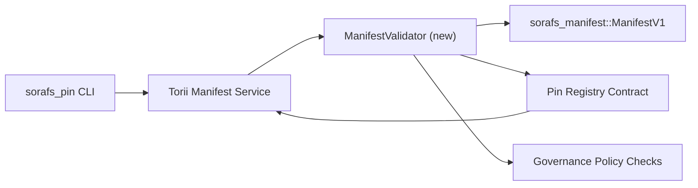

---
id: plan-validación-registro-PIN
título: Plan de validación de manifiestos del Registro Pin
sidebar_label: Registro de PIN de validación
Descripción: Plan de validación para la activación del ManifestV1 antes de la implementación del Registro Pin SF-4.
---

:::nota Fuente canónica
Esta página refleja `docs/source/sorafs/pin_registry_validation_plan.md`. Guarde los dos emplazamientos alineados hasta que la documentación heredada permanezca activa.
:::

# Plan de validación de manifiestos del Registro Pin (Préparación SF-4)

Este plan describe las etapas necesarias para integrar la validación de
`sorafs_manifest::ManifestV1` en el contrato Pin Registry à venir afin que le
travail SF-4 se aplica sobre las herramientas existentes sin duplicar la lógica
codificar/decodificar.

## Objetivos

1. Les chemins de soumission côté hôte vérifient la estructura del manifiesto, le
   perfil de fragmentación y sobres de gobierno antes de aceptarlos
   proposiciones.
2. Torii y la puerta de enlace de servicios utilizan las mismas rutinas de validación
   Para garantizar un comportamiento determinado entre los hogares.
3. Las pruebas de integración cubren los casos positivos/negativos para la aceptación.
   des manifests, l'application de la politique et la télémétrie d'erreurs.

## Arquitectura

### Compuestos- `ManifestValidator` (módulo nuevo en la caja `sorafs_manifest` o `sorafs_pin`)
  encapsula los controles estructurales y las puertas políticas.
- Torii expone un punto final gRPC `SubmitManifest` que llama
  `ManifestValidator` delante del transmisor al contrato.
- El camino de búsqueda de la puerta de enlace puede adquirirse opcionalmente y validarse
  Lors de la mise en cache de nouveaux manifiesta después del registro.

## Découpage des tâches| tache | Descripción | Propietario | Estatuto |
|------|-------------|-------|--------|
| API de esqueleto V1 | Agregue `validate_manifest(manifest: &ManifestV1, policy: &PinPolicyInputs) -> Result<(), ValidationError>` a `sorafs_manifest`. Incluya la verificación del resumen BLAKE3 y la búsqueda del registro fragmentador. | Infraestructura básica | ✅ Terminación | Los ayudantes participantes (`validate_chunker_handle`, `validate_pin_policy`, `validate_manifest`) viven desormados en `sorafs_manifest::validation`. |
| Cableado político | Asigne la configuración política del registro (`min_replicas`, ventanas de vencimiento, identificadores de fragmentación autorizados) a las entradas de validación. | Gobernanza / Infraestructura básica | Attente — sigue en SORAFS-215 |
| Integración Torii | Appeler le validador dans le chemin de soumission Torii ; retourner des erreurs Norito structurées en cas d'échec. | Torii Equipo | Planificado — seguido por SORAFS-216 |
| Talón contrato côté hôte | Asegúrese de que la entrada del contrato rechace los manifiestos que resuena en el hash de validación; Exponer des compteurs de métriques. | Equipo de contrato inteligente | ✅ Terminación | `RegisterPinManifest` invoque désormais le validador partagé (`ensure_chunker_handle`/`ensure_pin_policy`) antes de silenciar el estado y des pruebas unitarias que cubren los cas d'échec. || Pruebas | Agregar pruebas unitarias para el validador + cas trybuild para manifiestos no válidos; pruebas de integración en `crates/iroha_core/tests/pin_registry.rs`. | Gremio de control de calidad | 🟠 En curso | Las pruebas unitarias del validador se realizan con los rechazos en cadena; la suite d'intégration complète reste en attente. |
| Documentos | Mettre à jour `docs/source/sorafs_architecture_rfc.md` et `migration_roadmap.md` una vez le validador en libro; Documente el uso de CLI en `docs/source/sorafs/manifest_pipeline.md`. | Equipo de documentos | Attente — sigue en DOCS-489 |

## Dependencias

- Finalización del esquema Norito del Registro Pin (ref: elemento SF-4 en la hoja de ruta).
- Sobres del registro fragmentario firmados por el consejo (asegurar un mapeo determinante del validador).
- Decisiones de autenticación Torii para la transmisión de manifiestos.

## Riesgos y mitigaciones

| Riesgoso | Impacto | Mitigación |
|--------|--------|------------|
| Interpretación divergente de política entre Torii y el contrato | Aceptación no determinante. | Participe de la caja de validación + agregue las pruebas de integración para comparar las decisiones rápidas frente a las de la cadena. |
| Régresión de rendimiento para grandes manifiestos | Sumisiones más lentes | Benchmarker vía criterio de carga; Considere un caché de los resultados del resumen del manifiesto. |
| Deriva de mensajes de error | Operador de confusión | Definir códigos de error Norito ; documenter dans `manifest_pipeline.md`. |## Cibles de calendario

- Semana 1: livrer le squelette `ManifestValidator` + pruebas unitarias.
- Semana 2: conecte el camino de salida Torii y actualice la CLI para corregir los errores de validación.
- Semana 3: implemente los ganchos del contrato, agregue las pruebas de integración y agregue los documentos al día.
- Semana 4: ejecutar una repetición de un extremo a otro con una entrada del libro mayor de migración, capturar la aprobación del consejo.

Este plan será referenciado en la hoja de ruta una vez que el trabajo del validador comienza.