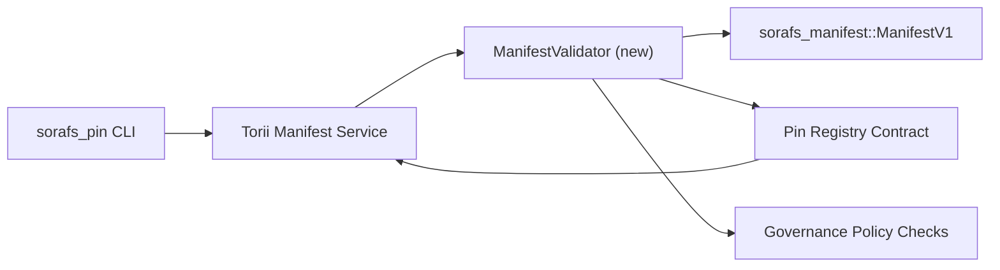

---
id: pin-registry-validation-plan
lang: es
direction: ltr
source: docs/portal/docs/sorafs/pin-registry-validation-plan.md
status: complete
generator: docs/portal/scripts/sync-i18n.mjs
---

:::note Fuente canónica
Esta pagina refleja `docs/source/sorafs/pin_registry_validation_plan.md`. Mantén ambas ubicaciones alineadas mientras la documentación heredada siga activa.
:::

# Plan de validacion de manifests del Pin Registry (Preparacion SF-4)

Este plan describe los pasos requeridos para integrar la validacion de
`sorafs_manifest::ManifestV1` en el futuro contrato del Pin Registry para que el
trabajo de SF-4 se apoye en el tooling existente sin duplicar la logica de
encode/decode.

## Objetivos

1. Las rutas de envio del host verifican la estructura del manifest, el perfil de
   chunking y los envelopes de gobernanza antes de aceptar propuestas.
2. Torii y los servicios de gateway reutilizan las mismas rutinas de validacion
   para asegurar un comportamiento determinista entre hosts.
3. Las pruebas de integracion cubren casos positivos/negativos para aceptacion de
   manifests, enforcement de politica y telemetria de errores.

## Arquitectura

### Componentes

- `ManifestValidator` (nuevo modulo en el crate `sorafs_manifest` o `sorafs_pin`)
  encapsula los chequeos estructurales y los gates de politica.
- Torii expone un endpoint gRPC `SubmitManifest` que llama a
  `ManifestValidator` antes de reenviar al contrato.
- La ruta de fetch del gateway puede consumir opcionalmente el mismo validador
  al cachear nuevos manifests desde el registry.

## Desglose de tareas

| Tarea | Descripcion | Responsable | Estado |
|------|-------------|-------------|--------|
| Esqueleto de API V1 | Agregar `validate_manifest(manifest: &ManifestV1, policy: &PinPolicyInputs) -> Result<(), ValidationError>` a `sorafs_manifest`. Incluir verificacion de digest BLAKE3 y lookup del chunker registry. | Core Infra | ✅ Hecho | Los helpers compartidos (`validate_chunker_handle`, `validate_pin_policy`, `validate_manifest`) ahora viven en `sorafs_manifest::validation`. |
| Cableado de politica | Mapear la configuracion de politica del registry (`min_replicas`, ventanas de expiracion, handles de chunker permitidos) a las entradas de validacion. | Governance / Core Infra | Pendiente — rastreado en SORAFS-215 |
| Integracion Torii | Llamar al validador dentro del envio de manifests en Torii; devolver errores Norito estructurados ante fallas. | Torii Team | Planificado — rastreado en SORAFS-216 |
| Stub de contrato host | Asegurar que el entrypoint del contrato rechace manifests que fallen el hash de validacion; exponer contadores de metricas. | Smart Contract Team | ✅ Hecho | `RegisterPinManifest` ahora invoca el validador compartido (`ensure_chunker_handle`/`ensure_pin_policy`) antes de mutar el estado y los tests unitarios cubren los casos de falla. |
| Tests | Agregar tests unitarios para el validador + casos trybuild para manifests invalidos; tests de integracion en `crates/iroha_core/tests/pin_registry.rs`. | QA Guild | 🟠 En progreso | Los tests unitarios del validador aterrizaron junto con los rechazos on-chain; la suite completa de integracion sigue pendiente. |
| Docs | Actualizar `docs/source/sorafs_architecture_rfc.md` y `migration_roadmap.md` una vez que el validador aterrice; documentar uso de CLI en `docs/source/sorafs/manifest_pipeline.md`. | Docs Team | Pendiente — rastreado en DOCS-489 |

## Dependencias

- Finalizacion del esquema Norito del Pin Registry (ref: item SF-4 en el roadmap).
- Envelopes del chunker registry firmados por el consejo (asegura que el mapping del validador sea determinista).
- Decisiones de autenticacion de Torii para el envio de manifests.

## Riesgos y mitigaciones

| Riesgo | Impacto | Mitigacion |
|--------|---------|------------|
| Interpretacion divergente de politica entre Torii y el contrato | Aceptacion no determinista. | Compartir crate de validacion + agregar tests de integracion que comparen decisiones del host vs on-chain. |
| Regresion de performance para manifests grandes | Envios mas lentos | Medir via cargo criterion; considerar cachear resultados de digest del manifest. |
| Deriva de mensajes de error | Confusion de operadores | Definir codigos de error Norito; documentarlos en `manifest_pipeline.md`. |

## Objetivos de cronograma

- Semana 1: aterrizar el esqueleto `ManifestValidator` + tests unitarios.
- Semana 2: cablear el envio en Torii y actualizar la CLI para mostrar errores de validacion.
- Semana 3: implementar hooks del contrato, agregar tests de integracion, actualizar docs.
- Semana 4: correr ensayo end-to-end con entrada en el ledger de migracion y capturar aprobacion del consejo.

Este plan se referenciara en el roadmap una vez que comience el trabajo del validador.
