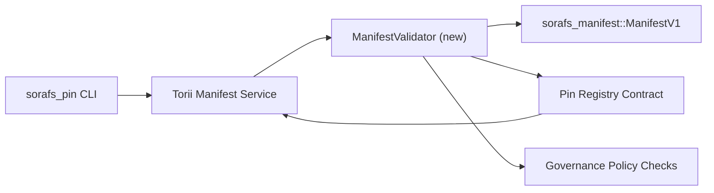

---
id: plan-validación-registro-PIN
título: Plano de validación de manifiestos del Registro Pin
sidebar_label: Validación del registro de PIN
Descripción: Plano de validación para la activación de ManifestV1 antes del lanzamiento del Registro Pin SF-4.
---

:::nota Fuente canónica
Esta página espelha `docs/source/sorafs/pin_registry_validation_plan.md`. Mantenha ambos os locais alinhados enquanto a documentacao herdada permanecer activa.
:::

# Plano de validación de manifiestos del Registro de PIN (Preparacao SF-4)

Este plano describe los pasos necesarios para integrar una validación de
`sorafs_manifest::ManifestV1` no futuro contrato do Pin Registry para que o
trabajo de SF-4 se basa en herramientas existentes sin duplicar la lógica de
codificar/decodificar.

## Objetivos

1. Os caminhos de envio no host verificam a estrutura do manifest, o perfil de
   fragmentación y os sobres de gobierno antes de aceitar propuestas.
2. Torii y los servicios de gateway se reutilizan como mesmas rotinas de validación para
   Garantía de comportamiento determinístico entre hosts.
3. Os testes de integracao cobrem casos positivos/negativos para aceitacao de
   manifiestos, aplicación de políticas y telemetría de errores.

##Arquitectura

### Componentes- `ManifestValidator` (nuevo módulo sin caja `sorafs_manifest` o `sorafs_pin`)
  encapsula checks etruturais e gates de politica.
- Torii expone un punto final gRPC `SubmitManifest` que chama
  `ManifestValidator` antes de encaminhar ao contrato.
- El camino de búsqueda de la puerta de enlace puede consumir opcionalmente o mesmo validador ao
  cachear novos manifiesta vindos do registro.

##Desdobramento de tarefas| Tarefa | Descripción | Responsavel | Estado |
|--------|-----------|-------------|--------|
| Esqueleto de API V1 | Agregar `validate_manifest(manifest: &ManifestV1, policy: &PinPolicyInputs) -> Result<(), ValidationError>` a `sorafs_manifest`. Incluye verificación de resumen BLAKE3 y búsqueda en el registro fragmentado. | Infraestructura básica | Concluido | Ayudantes compartidos (`validate_chunker_handle`, `validate_pin_policy`, `validate_manifest`) ahora viven en `sorafs_manifest::validation`. |
| Cableado político | Mapear una configuración política del registro (`min_replicas`, janelas de expiracao, handles de chunker permitidos) para como entradas de validación. | Gobernanza / Infraestructura básica | Colgante - rastreado en SORAFS-215 |
| Integracao Torii | Chamar o validador no caminho de submissao Torii; retornar errores Norito estructurados en falhas. | Torii Equipo | Planejado - rastreado en SORAFS-216 |
| Trozo de contrato de host | Garantizar que el punto de entrada del contrato rejeite manifiesta que falham no hash de validacao; export contadores de métricas. | Equipo de contrato inteligente | Concluido | `RegisterPinManifest` ahora invoca o validador compartilhado (`ensure_chunker_handle`/`ensure_pin_policy`) antes de mutar o estado e testes unitarios cobrem os casos de falha. || Pruebas | Agregar pruebas unitarias para el validador + casos trybuild para manifiestos inválidos; Testículos de integración en `crates/iroha_core/tests/pin_registry.rs`. | Gremio de control de calidad | En progreso | Los testes unitarios do validador chegaram junto com rejeicoes on-chain; una suite completa de integracao segue pendente. |
| Documentos | Actualizar `docs/source/sorafs_architecture_rfc.md` e `migration_roadmap.md` cuando o validador chegar; Uso del documento CLI en `docs/source/sorafs/manifest_pipeline.md`. | Equipo de documentos | Colgante - rastreado en DOCS-489 |

## Dependencias

- Finalización del esquema Norito del Registro de PIN (ref: elemento SF-4 sin hoja de ruta).
- Sobres do registro fragmentado assinados pelo conselho (garante mapeamento determinístico do validador).
- Decisiones de autenticacao do Torii para presentación de manifiestos.

## Riesgos y mitigaciones

| Risco | Impacto | Mitigacao |
|-------|---------|-----------|
| Interpretación divergente de política entre Torii y contrato | Aceitacao nao determinística. | Comparar caja de validación + agregar pruebas de integración para comparar decisiones entre host y on-chain. |
| Regreso de performance para manifiestos grandes | Submissoes más lentas | Medir vía criterio de carga; considerar cachear resultados de digest do manifest. |
| Deriva de mensajes de error | Confusión del operador | Definir códigos de error Norito; documental en `manifest_pipeline.md`. |

## Metas de cronograma- Semana 1: entrega o esqueleto `ManifestValidator` + testes unitarios.
- Semana 2: integrar el camino de envío no Torii y actualizar a CLI para exportar errores de validación.
- Semana 3: implementar ganchos del contrato, agregar pruebas de integracao, actualizar documentos.
- Semana 4: rodar ensayo de extremo a extremo con entrada no migración ledger e capturar aprovacao do conselho.

Este plano será referenciado no roadmap asim que o trabalho do validador comecar.