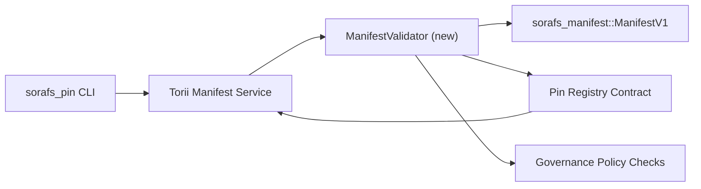

---
id: plan-validación-registro-PIN
título: Plan de validación de manifiestos para el Registro de Pin
sidebar_label: Registro de PIN de Validez
descripción: Plan de validación para gating ManifestV1 antes del lanzamiento del Pin Registry SF-4.
---

:::nota Канонический источник
Esta página está escrita `docs/source/sorafs/pin_registry_validation_plan.md`. Si desea realizar una copia de seguridad de los documentos, la documentación actual estará activa.
:::

# Plan de validación de manifiestos para el Registro de PIN (Подготовка SF-4)

Este plan de descripción no es necesario para validaciones
`sorafs_manifest::ManifestV1` en el contrato de registro de PIN, чтобы работа SF-4
Utilice las herramientas de software para codificar/decodificar.

## Цели

1. Poner en evidencia la estructura del manifiesto, perfil
   fragmentación y sobres de gobernanza перед принятием предложений.
2. Torii y los servicios de puerta de enlace supervisan los procedimientos válidos para el usuario
   детерминированного поведения между хостами.
3. Pruebas de integración de claves positivas/negativas
   manifiestos, aplicación de la ley политик и телеметрию ошибок.

## Arquitecto

### Componentes- `ManifestValidator` (nuevo módulo en caja `sorafs_manifest` o `sorafs_pin`)
  инкапсулирует структурные проверки и políticas de puertas.
- Torii elimina el punto final de gRPC `SubmitManifest`, según el código fuente
  `ManifestValidator` Antes del contrato.
- La recuperación de puerta de enlace puede implementarse opcionalmente en el validador previo
  кешировании новых manifiesta из registro.

## Разбиение задач| Задача | Descripción | Владелец | Estado |
|--------|----------|----------|--------|
| Esqueleto API V1 | Agregue `validate_manifest(manifest: &ManifestV1, policy: &PinPolicyInputs) -> Result<(), ValidationError>` a `sorafs_manifest`. Utilice el resumen BLAKE3 y el registro fragmentador de búsqueda. | Infraestructura básica | ✅ Сделано | Los ayudantes adicionales (`validate_chunker_handle`, `validate_pin_policy`, `validate_manifest`) se conectan a `sorafs_manifest::validation`. |
| Políticas de privacidad | Configure el registro de políticas de configuración (`min_replicas`, окна истечения, разрешенные fragmenters handles) en todas las validaciones. | Gobernanza / Infraestructura básica | В ожидании — отслеживается в SORAFS-215 |
| Integración Torii | Verifique el validador en el envío Torii; возвращать структурированные ошибки Norito при сбоях. | Torii Equipo | Запланировано — отслеживается в SORAFS-216 |
| Contrato de contrato de alojamiento | Убедиться, что punto de entrada контракта отклоняет manifiestos, не прошедшие хэш валидации; экспонировать счетчики метрик. | Equipo de contrato inteligente | ✅ Сделано | `RegisterPinManifest` теперь вызывает общий валидатор (`ensure_chunker_handle`/`ensure_pin_policy`) antes de la configuración y pruebas unitarias случаи отказа. |
| Pruebas | Agregue pruebas unitarias para validadores + claves trybuild para manifiestos no correctos; Pruebas integradas en `crates/iroha_core/tests/pin_registry.rs`. | Gremio de control de calidad | 🟠 En el proceso | Pruebas unitarias validadoras de datos en cadena; полноценная интеграционная suite пока в ожидании. || Documentación | Retire `docs/source/sorafs_architecture_rfc.md` e `migration_roadmap.md` después del validador de datos; Consulte CLI en `docs/source/sorafs/manifest_pipeline.md`. | Equipo de documentos | В ожидании — отслеживается в DOCS-489 |

## Зависимости

- Finalización Norito con el Registro de PIN (ref: пункт SF-4 en la hoja de ruta).
- Подписанные sobres del consejo для registro de trozos (гарантируют детерминированное сопоставление в валидаторе).
- Revisión de las autentificaciones Torii para manifiestos de envío.

## Риски и меры

| Riesgo | Влияние | Митигирование |
|------|---------|---------------|
| Política de interpretación del método Torii y contrato | No es necesario realizar una limpieza. | Eliminar las validaciones de cajas + realizar pruebas de integración de host vs on-chain. |
| Regresión de los manifiestos de gran tamaño | Более медленные presentación | Бенчмарк через criterio de carga; рассмотреть кеширование результатов resumen manifiesto. |
| Дрейф сообщений об ошибках | Путаница у операторов | Определить коды ошибок Norito; задокументировать в `manifest_pipeline.md`. |

## Цели по времени

- Número 1: seleccione el esqueleto `ManifestValidator` + pruebas unitarias.
- Punto 2: para enviar el envío, introduzca Torii y abra la CLI para realizar validaciones de archivos.
- Número 3: realizar contratos de ganchos, realizar pruebas de integración y consultar documentos.
- Punto 4: Pruebe las repeticiones de un extremo a otro con el registro rápido del libro mayor de migración y pruebe el código binario.Este plan se incluirá en la hoja de ruta después de iniciar el proceso de validación.