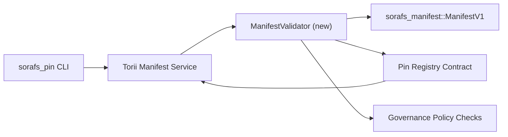

---
id: plan-validación-registro-PIN
título: Registro de PIN کے manifiesta کی توثیقی منصوبہ بندی
sidebar_label: Registro de PIN
descripción: Implementación del Registro de pines SF-4 سے پہلے ManifestV1 gating کے لیے توثیقی منصوبہ۔
---

:::nota مستند ماخذ
یہ صفحہ `docs/source/sorafs/pin_registry_validation_plan.md` کی عکاسی کرتا ہے۔ جب تک پرانی دستاویزات فعال ہیں دونوں مقامات کو ہم آہنگ رکھیں۔
:::

# Plan de validación del manifiesto del registro de PIN (preparación SF-4)

یہ منصوبہ وہ اقدامات بیان کرتا ہے جو `sorafs_manifest::ManifestV1` کی توثیق کو
آنے والے Registro de PIN کنٹریکٹ میں جوڑنے کے لیے درکار ہیں تاکہ SF-4 کا کام
Herramientas adicionales پر استوار ہو اور codificación/decodificación منطق کی نقل نہ بنے۔

## مقاصد

1. Envío del lado del host: manifiesto, perfil de fragmentación y gobernanza
   sobres کو propuestas قبول کرنے سے پہلے verificar کرتے ہیں۔
2. Torii اور gateway سروسز وہی rutinas de validación دوبارہ استعمال کرتی ہیں تاکہ
   hosts کے درمیان comportamiento determinista برقرار رہے۔
3. Pruebas de integración مثبت/منفی کیسز کو کور کرتے ہیں، جن میں aceptación manifiesta،
   aplicación de políticas, telemetría de errores شامل ہیں۔

## Arquitectura

### Componentes- `ManifestValidator` (`sorafs_manifest` یا `sorafs_pin` caja میں نیا ماڈیول)
  ساختی چیکس اور puertas de política کو encapsular کرتا ہے۔
- Torii ایک gRPC endpoint `SubmitManifest` expone کرتا ہے جو کنٹریکٹ کو hacia adelante
  کرنے سے پہلے `ManifestValidator` کو کال کرتا ہے۔
- Ruta de recuperación de puerta de enlace opcionalmente y validador استعمال کرتا ہے جب registro سے
  نئے manifiesta caché کیے جائیں۔

## Desglose de tareas| Tarea | Descripción | Propietario | Estado |
|------|-------------|-------|--------|
| Esqueleto API V1 | `sorafs_manifest` Pantalla `validate_manifest(manifest: &ManifestV1, policy: &PinPolicyInputs) -> Result<(), ValidationError>` Pantalla táctil Verificación de resumen BLAKE3 y búsqueda de registro fragmentado شامل کریں۔ | Infraestructura básica | ✅ Hecho | مشترکہ ayudantes (`validate_chunker_handle`, `validate_pin_policy`, `validate_manifest`) اب `sorafs_manifest::validation` میں ہیں۔ |
| Cableado de políticas | configuración de política de registro (`min_replicas`, ventanas de caducidad, identificadores de fragmentos permitidos) کو entradas de validación سے mapa کریں۔ | Gobernanza / Infraestructura básica | Pendiente — SORAFS-215 میں ٹریکڈ |
| Integración Torii | Ruta de envío Torii کے اندر validador کال کریں؛ falla پر errores estructurados Norito واپس کریں۔ | Torii Equipo | Planificado — SORAFS-216 میں ٹریکڈ |
| Talón de contrato de anfitrión | یقینی بنائیں کہ punto de entrada del contrato وہ manifiestos rechazan کرے جو hash de validación میں falla ہوں؛ contadores de métricas ظاہر کریں۔ | Equipo de contrato inteligente | ✅ Hecho | `RegisterPinManifest` اب state mutate کرنے سے پہلے validador compartido (`ensure_chunker_handle`/`ensure_pin_policy`) چلاتا ہے اور casos de falla de pruebas unitarias کور کرتے ہیں۔ |
| Pruebas | validador کے لیے pruebas unitarias + manifiestos no válidos کے لیے casos de trybuild شامل کریں؛ `crates/iroha_core/tests/pin_registry.rs` Pruebas de integración de میں شامل کریں۔ | Gremio de control de calidad | 🟠 En curso | pruebas unitarias del validador pruebas de rechazo en cadena کے ساتھ آ گئے ہیں؛ Suite de integración مکمل ابھی باقی ہے۔ || Documentos | validador آنے کے بعد `docs/source/sorafs_architecture_rfc.md` اور `migration_roadmap.md` اپڈیٹ کریں؛ CLI استعمال `docs/source/sorafs/manifest_pipeline.md` میں لکھیں۔ | Equipo de documentos | Pendiente — DOCS-489 میں ٹریکڈ |

## Dependencias

- Esquema de Registro de PIN Norito کی تکمیل (ref: hoja de ruta میں SF-4 آئٹم)۔
- Sobres de registro fragmentados firmados por el consejo (mapeo del validador کو determinista بناتے ہیں)۔
- Envío de manifiesto کے لیے Autenticación Torii فیصلے۔

## Riesgos y mitigaciones

| Riesgo | Impacto | Mitigación |
|------|--------|------------|
| Torii اور کنٹریکٹ کے درمیان interpretación de políticas میں فرق | Aceptación no determinista۔ | caja de validación شیئر کریں + host vs on-chain فیصلوں کا موازنہ کرنے والی pruebas de integración شامل کریں۔ |
| بڑے manifiesta کے لیے regresión de rendimiento | Presentación سست | criterio de carga سے punto de referencia کریں؛ caché de resultados de resumen de manifiesto کرنے پر غور کریں۔ |
| Desviación de mensajes de error | Operadores میں کنفیوژن | Los códigos de error Norito definen کریں؛ `manifest_pipeline.md` Documento میں کریں۔ |

## Objetivos del cronograma

- Semana 1: esqueleto `ManifestValidator` + pruebas unitarias لینڈ کریں۔
- Semana 2: Cable de ruta de envío Torii کریں اور CLI کو errores de validación دکھانے کے لیے اپڈیٹ کریں۔
- Semana 3: los ganchos de contrato implementan pruebas de integración کریں، شامل کریں، docs اپڈیٹ کریں۔
- Semana 4: entrada en el libro mayor de migración کے ساتھ ensayo de extremo a extremo چلائیں اور aprobación del consejo حاصل کریں۔یہ منصوبہ validador کام شروع ہونے کے بعد hoja de ruta میں حوالہ دیا جائے گا۔