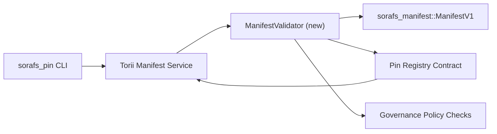

---
identifiant : plan-de-validation-registre-pin
titre : خطة التحقق من manifeste dans le registre des broches
sidebar_label : Ajouter le registre des broches
description: Vous avez trouvé ManifestV1 dans le registre des broches par SF-4.
---

:::note المصدر المعتمد
Il s'agit de la référence `docs/source/sorafs/pin_registry_validation_plan.md`. حافظ على المحاذاة بين الموقعين طالما الوثائق القديمة فعالة.
:::

# خطة التحقق من manifestes dans le registre Pin (تحضير SF-4)

توضح هذه الخطة الخطوات المطلوبة لتمرير تحقق `sorafs_manifest::ManifestV1` داخل
عقد Pin Registry حتى يبني عمل SF-4 على tooling القائم بدون تكرار منطق
encoder/décoder.

## الاهداف

1. Utiliser des méthodes de création de manifestes et de découpage d'enveloppes
   الخاصة بالحوكمة قبل قبول المقترحات.
2. تعيد خدمات Torii والبوابات استخدام نفس روتينات التحقق لضمان سلوك حتمي عبر
   المضيفين.
3. تغطي اختبارات التكامل الحالات الايجابية والسلبية لقبول manifeste وتطبيق
   السياسات وتليمتري الاخطاء.

## المعمارية

### المكونات

- `ManifestValidator` (pour la caisse `sorafs_manifest` et `sorafs_pin`)
  تغلف الفحوصات الهيكلية وبوابات السياسة.
- Torii pour le point de terminaison gRPC par `SubmitManifest`.
  `ManifestValidator` pour la lecture.
- مسار fetch في البوابة يمكنه استهلاك نفس المدقق اختياريا عند تخزين manifestes
  جديدة من registre.

## تقسيم المهام

| المهمة | الوصف | المالك | الحالة |
|------|-------|--------|--------|
| par API V1 | `validate_manifest(manifest: &ManifestV1, policy: &PinPolicyInputs) -> Result<(), ValidationError>` à `sorafs_manifest`. J'ai consulté BLAKE3 digest et recherché le registre des chunker. | Infrastructure de base | ✅ تم | Les éléments de base (`validate_chunker_handle`, `validate_pin_policy`, `validate_manifest`) sont également compatibles avec `sorafs_manifest::validation`. |
| توصيل السياسة | مواءمة اعدادات سياسة Registry (`min_replicas`, نوافذ الانتهاء, handles المسموح بها) مع مدخلات التحقق. | Gouvernance / Infrastructure de base | Dans ce cas — Pour SORAFS-215 |
| Télécharger Torii | استدعاء المدقق في مسار ارسال Torii؛ اعادة اخطاء Norito منظمة عند الفشل. | Équipe Torii | مخطط — متابع في SORAFS-216 |
| bout لعقد المضيف | Le point d'entrée est un manifeste qui se manifeste par un hachage وتعريض عدادات المقاييس. | Équipe de contrats intelligents | ✅ تم | `RegisterPinManifest` يستدعي الان الحالة وتغطي اختبارات الوحدة حالات الفشل. |
| الاختبارات | اضافة اختبارات وحدة للمدقق + حالات trybuild لـ manifests غير صالحة؛ اختبارات تكامل في `crates/iroha_core/tests/pin_registry.rs`. | Guilde d'assurance qualité | 🟠 جاري العمل | اختبارات الوحدة للمدقق وصلت مع رفض on-chain؛ مجموعة التكامل الكاملة ما زالت قيد الانتظار. |
| الوثائق | Utilisez `docs/source/sorafs_architecture_rfc.md` et `migration_roadmap.md` pour votre téléphone Utilisez la CLI pour `docs/source/sorafs/manifest_pipeline.md`. | Équipe Documents | قيد الانتظار — متابع في DOCS-489 |

## الاعتماديات

- Utilisez Norito pour le registre des broches (lien : vers SF-4 et la feuille de route).
- Enveloppes سجل chunker موقعة من المجلس (تضمن ان التعيين في المدقق حتمي).
- قرارات مصادقة Torii لارسال manifestes.

## المخاطر والتخفيف| الخطر | الاثر | التخفيف |
|-------|-------|---------|
| تفسير سياسة مختلف بين Torii والعقد | قبول غير حتمي. | مشاركة crate التحقق + اضافة اختبارات تكامل تقارن قرارات المضيف مقابل on-chain. |
| تراجع الاداء للـ manifeste الكبيرة | ارسال ابطأ | القياس عبر critère de fret؛ النظر في تخزين نتائج digest للـ manifeste. |
| انحراف رسائل الخطأ | ارتباك المشغلين | تعريف رموز اخطاء Norito؛ Il s'agit de `manifest_pipeline.md`. |

## اهداف الجدول الزمني

- Étape 1 : انزال هيكل `ManifestValidator` + اختبارات وحدة.
- Section 2 : توصيل مسار ارسال Torii et CLI لاظهار اخطاء التحقق.
- Étape 3 : crochets à crochets pour les crochets à crochets.
- Partie 4 : Mise en œuvre de bout en bout du grand livre de migration et du grand livre de migration.

سيتم الرجوع الى هذه الخطة في roadmap عند بدء عمل المدقق.