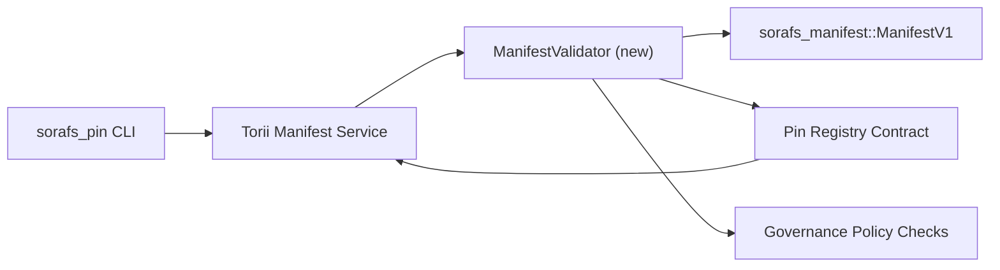

---
identifiant : plan-de-validation-registre-pin
titre : Plan de validation des manifestes du registre Pin
sidebar_label : Validation du registre des broches
description : Plan de validation pour le portail de ManifestV1 avant le déploiement du registre Pin SF-4.
---

:::note Source canonique
Cette page reflète `docs/source/sorafs/pin_registry_validation_plan.md`. Gardez les emplacements alignés au milieu de la documentation héritée si active.
:::

# Plan de validation des manifestes du registre Pin (Preparación SF-4)

Ce plan décrit les étapes requises pour intégrer la validation de
`sorafs_manifest::ManifestV1` dans le futur contrat du registre des broches pour le
Le travail de SF-4 est apoye dans l'outillage existant sans dupliquer la logique de
encoder/décoder.

## Objets

1. Les itinéraires d'envoi de l'hôte vérifient la structure du manifeste, le profil de
   chunking et les enveloppes de gouvernement avant d'accepter les propositions.
2. Torii et les services de passerelle réutilisent les mêmes règles de validation
   pour garantir un comportement déterminé entre les hôtes.
3. Les essais d'intégration portent sur les cas positifs/négatifs pour l'acceptation de
   manifestes, application de la politique et télémétrie des erreurs.

## Architecture

### Composants

- `ManifestValidator` (nouveau module dans la caisse `sorafs_manifest` ou `sorafs_pin`)
  encapsula les chèques structurels et les portes politiques.
- Torii expose un point de terminaison gRPC `SubmitManifest` qui appelle un
  `ManifestValidator` avant de renvoyer le contrat.
- La route de récupération de la passerelle peut consommer facultativement le même validateur
  al cachear nuevos manifeste depuis le registre.

## Desglose de tareas| Tarée | Description | Responsable | État |
|------|-------------|-------------|--------|
| Esquelette de l'API V1 | Agréger `validate_manifest(manifest: &ManifestV1, policy: &PinPolicyInputs) -> Result<(), ValidationError>` et `sorafs_manifest`. Inclut la vérification du résumé BLAKE3 et la recherche du registre chunker. | Infrastructure de base | ✅Hécho | Les assistants partagés (`validate_chunker_handle`, `validate_pin_policy`, `validate_manifest`) vivent maintenant dans `sorafs_manifest::validation`. |
| Câble politique | Mapper la configuration politique du registre (`min_replicas`, fenêtres d'expiration, poignées de chunker autorisées) aux entrées de validation. | Gouvernance / Infrastructure de base | Pendiente — rastreado en SORAFS-215 |
| Intégration Torii | Appeler le validateur dans l'envoi des manifestes en Torii ; devolver errores Norito estructurados ante fallas. | Équipe Torii | Planifié — rastreado en SORAFS-216 |
| Stub du contrat hôte | Assurez-vous que le point d'entrée du contrat revient à manifester que le hachage de validation est tombé ; exponer contadores de metricas. | Équipe de contrats intelligents | ✅Hécho | `RegisterPinManifest` appelle maintenant le validateur partagé (`ensure_chunker_handle`/`ensure_pin_policy`) avant de changer l'état et les tests unitaires cubren les cas de chute. |
| Essais | Agréger les tests unitaires pour le validateur + cas trybuild pour les manifestes invalides ; tests d'intégration en `crates/iroha_core/tests/pin_registry.rs`. | Guilde d'assurance qualité | 🟠 En cours | Les tests unitaires du validateur sont effectués conjointement avec les rechazos en chaîne ; la suite complète d’intégration reste pendante. |
| Documents | Actualisez `docs/source/sorafs_architecture_rfc.md` et `migration_roadmap.md` une fois que le validateur est sur le terrain ; documenter l'utilisation de CLI en `docs/source/sorafs/manifest_pipeline.md`. | Équipe Documents | Pendiente — rastreado en DOCS-489 |

## Dépendances

- Finalisation du schéma Norito du registre Pin (réf: élément SF-4 dans la feuille de route).
- Enveloppes du registre des gros morceaux établies par le conseiller (assurent que la cartographie du validateur marin est déterminée).
- Décisions d'authentification de Torii pour l'envoi des manifestes.

## Riesgos et atténuations

| Riesgo | Impact | Atténuation |
|--------|---------|------------|
| Interprétation politique divergente entre Torii et le contrat | Acceptation non déterministe. | Partager la caisse de validation + ajouter des tests d'intégration qui comparent les décisions de l'hôte par rapport à la chaîne. |
| Régression de performance pour manifestes grandes | Envios plus lentos | Medir via le critère du fret ; Considérez cacher les résultats du résumé du manifeste. |
| Dérivé des messages d'erreur | Confusion des opérateurs | Définir les codes d'erreur Norito ; documenter en `manifest_pipeline.md`. |

## Objets du chronogramme

- Semana 1 : aterrizar el esqueleto `ManifestValidator` + tests unitarios.
- Semana 2 : câbler l'envoi en Torii et actualiser la CLI pour afficher les erreurs de validation.
- Semaine 3 : implémenter les hooks du contrat, assembler les tests d'intégration, actualiser la documentation.
- Semana 4 : correr ensayo end-to-end con entrada in el ledger de miracion and capturar aprobacion del consejo.Ce plan sera référencé dans la feuille de route une fois que commencera le travail du validateur.