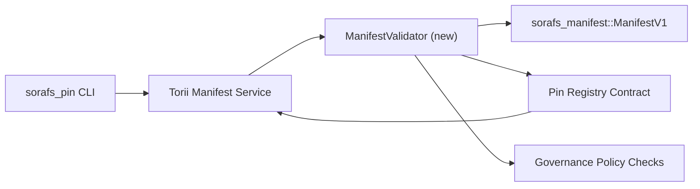

---
identifiant : plan-de-validation-registre-pin
titre : Plan de validation des manifestes du Pin Registry
sidebar_label : Registre des broches de validation
description : Plan de validation pour le gating ManifestV1 avant le déploiement du Pin Registry SF-4.
---

:::note Source canonique
Cette page reflète `docs/source/sorafs/pin_registry_validation_plan.md`. Gardez les deux emplacements alignés tant que la documentation héritée reste active.
:::

# Plan de validation des manifestes du Pin Registry (Préparation SF-4)

Ce plan décrit les étapes nécessaires pour intégrer la validation de
`sorafs_manifest::ManifestV1` dans le contrat Pin Registry à venir afin que le
travail SF-4 s'appuie sur le tooling existant sans dupliquer la logique
encoder/décoder.

## Objectifs

1. Les chemins de soumission côté hôte vérifient la structure du manifeste, le
   profil de chunking et les enveloppes de gouvernance avant d'accepter les
   propositions.
2. Torii et les services gateway réutilisent les mêmes routines de validation
   pour garantir un comportement déterministe entre les hôtes.
3. Les tests d'intégration couvrent les cas positifs/négatifs pour l'acceptation
   des manifestes, l'application de la politique et la télémétrie d'erreurs.

##Architecture

### Composants

- `ManifestValidator` (nouveau module dans le crate `sorafs_manifest` ou `sorafs_pin`)
  encapsule les contrôles structurels et les portes de politique.
- Torii expose un point de terminaison gRPC `SubmitManifest` qui appelle
  `ManifestValidator` avant de transmettre au contrat.
- Le chemin de fetch du gateway peut optionnellement consommer le même validateur
  lors de la mise en cache de nouveaux manifestes depuis le registre.

## Découpage des tâches| Tâche | Descriptif | Propriétaire | Statuts |
|------|-------------|-------|--------|
| API Squelette V1 | Ajouter `validate_manifest(manifest: &ManifestV1, policy: &PinPolicyInputs) -> Result<(), ValidationError>` à `sorafs_manifest`. Inclut la vérification de digest BLAKE3 et la recherche du registre chunker. | Infrastructure de base | ✅Terminé | Les helpers partagés (`validate_chunker_handle`, `validate_pin_policy`, `validate_manifest`) vivent désormais dans `sorafs_manifest::validation`. |
| Câblage de politique | Mapper la configuration de politique du registre (`min_replicas`, fenêtres d'expiration, handles de chunker autorisés) vers les entrées de validation. | Gouvernance / Infrastructure de base | En attente — suivi dans SORAFS-215 |
| Intégration Torii | Appeler le validateur dans le chemin de soumission Torii ; retourner des erreurs Norito structurées en cas d'échec. | Équipe Torii | Planifié — suivi dans SORAFS-216 |
| Stub contrat côté hôte | S'assurer que l'entrée du contrat rejette les manifestes qui échouent au hash de validation ; exposer les compteurs de métriques. | Équipe de contrats intelligents | ✅Terminé | `RegisterPinManifest` invoque désormais le validateur partagé (`ensure_chunker_handle`/`ensure_pin_policy`) avant de muter l'état et des tests unitaires couvrent les cas d'échec. |
| Essais | Ajouter des tests unitaires pour le validateur + des cas trybuild pour manifestes invalides ; tests d'intégration dans `crates/iroha_core/tests/pin_registry.rs`. | Guilde d'assurance qualité | 🟠 En cours | Les tests unitaires du validateur ont atterri avec les rejets en chaîne ; la suite d'intégration complète reste en attente. |
| Documents | Mettre à jour `docs/source/sorafs_architecture_rfc.md` et `migration_roadmap.md` une fois le validateur livré ; documenter l'utilisation CLI dans `docs/source/sorafs/manifest_pipeline.md`. | Équipe Documents | En attente — suivi dans DOCS-489 |

## Dépendances

- Finalisation du schéma Norito du Pin Registry (réf : item SF-4 dans la roadmap).
- Enveloppes du chunker registre signées par le conseil (assurer un mapping déterministe du validateur).
- Décisions d'authentification Torii pour la soumission de manifestes.

## Risques et atténuations

| Risques | Impact | Atténuation |
|--------|--------|------------|
| Interprétation divergente de politique entre Torii et le contrat | Acceptation non déterministe. | Partager le crate de validation + ajouter des tests d'intégration comparer les décisions hôte vs on-chain. |
| Régression de performance pour de gros manifestes | Soumissions plus lentes | Benchmarking via critère cargo ; envisagez un cache des résultats du digest manifest. |
| Dérive des messages d'erreur | Confusion opérateur | définir les codes d'erreur Norito ; les documenter dans `manifest_pipeline.md`. |

## Cibles de calendrier

- Semaine 1 : livrer le squelette `ManifestValidator` + tests unitaires.
- Semaine 2 : câbler le chemin de soumission Torii et mettre à jour la CLI pour remonter les erreurs de validation.
- Semaine 3 : implémenter les hooks du contrat, ajouter des tests d'intégration, mettre à jour les docs.
- Semaine 4 : exécuter une répétition de bout en bout avec une entrée de migration ledger, capturer l'approbation du conseil.Ce plan sera référencé dans la feuille de route une fois le travail du validateur commencé.