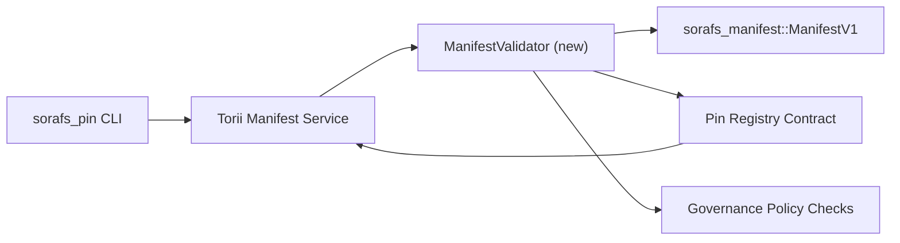

---
id: pin-registry-validation-plan
lang: fr
direction: ltr
source: docs/portal/docs/sorafs/pin-registry-validation-plan.md
status: complete
generator: docs/portal/scripts/sync-i18n.mjs
---

:::note Source canonique
Cette page reflète `docs/source/sorafs/pin_registry_validation_plan.md`. Gardez les deux emplacements alignés tant que la documentation héritée reste active.
:::

# Plan de validation des manifests du Pin Registry (Préparation SF-4)

Ce plan décrit les étapes nécessaires pour intégrer la validation de
`sorafs_manifest::ManifestV1` dans le contrat Pin Registry à venir afin que le
travail SF-4 s'appuie sur le tooling existant sans dupliquer la logique
encode/decode.

## Objectifs

1. Les chemins de soumission côté hôte vérifient la structure du manifest, le
   profil de chunking et les envelopes de gouvernance avant d'accepter les
   propositions.
2. Torii et les services gateway réutilisent les mêmes routines de validation
   pour garantir un comportement déterministe entre hôtes.
3. Les tests d'intégration couvrent les cas positifs/négatifs pour l'acceptation
   des manifests, l'application de la politique et la télémétrie d'erreurs.

## Architecture

### Composants

- `ManifestValidator` (nouveau module dans le crate `sorafs_manifest` ou `sorafs_pin`)
  encapsule les contrôles structurels et les gates de politique.
- Torii expose un endpoint gRPC `SubmitManifest` qui appelle
  `ManifestValidator` avant de transmettre au contrat.
- Le chemin de fetch du gateway peut optionnellement consommer le même validateur
  lors de la mise en cache de nouveaux manifests depuis le registry.

## Découpage des tâches

| Tâche | Description | Owner | Statut |
|------|-------------|-------|--------|
| Squelette API V1 | Ajouter `validate_manifest(manifest: &ManifestV1, policy: &PinPolicyInputs) -> Result<(), ValidationError>` à `sorafs_manifest`. Inclure la vérification de digest BLAKE3 et le lookup du chunker registry. | Core Infra | ✅ Terminé | Les helpers partagés (`validate_chunker_handle`, `validate_pin_policy`, `validate_manifest`) vivent désormais dans `sorafs_manifest::validation`. |
| Câblage de politique | Mapper la configuration de politique du registry (`min_replicas`, fenêtres d'expiration, handles de chunker autorisés) vers les entrées de validation. | Governance / Core Infra | En attente — suivi dans SORAFS-215 |
| Intégration Torii | Appeler le validateur dans le chemin de soumission Torii ; retourner des erreurs Norito structurées en cas d'échec. | Torii Team | Planifié — suivi dans SORAFS-216 |
| Stub contrat côté hôte | S'assurer que l'entrée du contrat rejette les manifests qui échouent au hash de validation ; exposer des compteurs de métriques. | Smart Contract Team | ✅ Terminé | `RegisterPinManifest` invoque désormais le validateur partagé (`ensure_chunker_handle`/`ensure_pin_policy`) avant de muter l'état et des tests unitaires couvrent les cas d'échec. |
| Tests | Ajouter des tests unitaires pour le validateur + des cas trybuild pour manifests invalides ; tests d'intégration dans `crates/iroha_core/tests/pin_registry.rs`. | QA Guild | 🟠 En cours | Les tests unitaires du validateur ont atterri avec les rejets on-chain ; la suite d'intégration complète reste en attente. |
| Docs | Mettre à jour `docs/source/sorafs_architecture_rfc.md` et `migration_roadmap.md` une fois le validateur livré ; documenter l'usage CLI dans `docs/source/sorafs/manifest_pipeline.md`. | Docs Team | En attente — suivi dans DOCS-489 |

## Dépendances

- Finalisation du schéma Norito du Pin Registry (ref: item SF-4 dans la roadmap).
- Envelopes du chunker registry signés par le conseil (assure un mapping déterministe du validateur).
- Décisions d'authentification Torii pour la soumission de manifests.

## Risques et mitigations

| Risque | Impact | Mitigation |
|--------|--------|------------|
| Interprétation divergente de politique entre Torii et le contrat | Acceptation non déterministe. | Partager le crate de validation + ajouter des tests d'intégration comparant les décisions hôte vs on-chain. |
| Régression de performance pour de gros manifests | Soumissions plus lentes | Benchmarker via cargo criterion ; envisager un cache des résultats de digest manifest. |
| Dérive des messages d'erreur | Confusion opérateur | Définir des codes d'erreur Norito ; les documenter dans `manifest_pipeline.md`. |

## Cibles de calendrier

- Semaine 1 : livrer le squelette `ManifestValidator` + tests unitaires.
- Semaine 2 : câbler le chemin de soumission Torii et mettre à jour la CLI pour remonter les erreurs de validation.
- Semaine 3 : implémenter les hooks du contrat, ajouter des tests d'intégration, mettre à jour les docs.
- Semaine 4 : exécuter une répétition end-to-end avec une entrée de migration ledger, capturer l'approbation du conseil.

Ce plan sera référencé dans la roadmap une fois le travail du validateur démarré.
