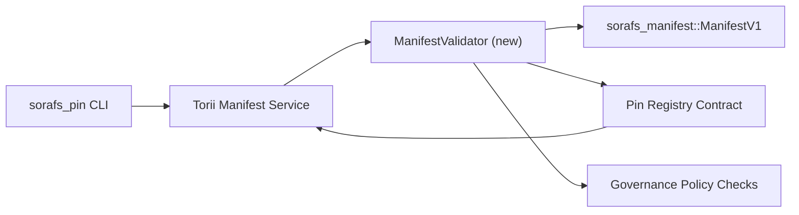

---
identifiant : plan-de-validation-registre-pin
titre : Plan de validation des manifestes du registre des broches
sidebar_label : validation du registre des broches
description : Plan de validation pour le déclenchement de ManifestV1 avant le déploiement du registre Pin SF-4.
---

:::note Fonte canonica
Cette page espelha `docs/source/sorafs/pin_registry_validation_plan.md`. Mantenha ambos os local alinhados enquanto a documentacao herdada permanecer ativa.
:::

# Plan de validation des manifestes du registre Pin (Préparation SF-4)

Ce plan décrit les étapes nécessaires pour intégrer la validation de
`sorafs_manifest::ManifestV1` pas de futur contrat avec le registre Pin pour que
Le travail du SF-4 n'est basé sur aucun outil existant mais est dupliqué dans la logique
encoder/décoder.

## Objets

1. Les chemins d'envoi ne sont pas vérifiés par l'hôte et la structure du manifeste, ou le profil de
   le chunking et les enveloppes de gouvernance avant l'achat de propositions.
2. Torii et les services de passerelle réutilisés comme tables de validation pour
   garantir un comportement déterministe entre les hôtes.
3. Les testicules d'intégration couvrent les cas positifs/négatifs pour l'huile de
   manifestes, application de la politique et télémétrie des erreurs.

## Architecture

### Composants

- `ManifestValidator` (novo modulo no crate `sorafs_manifest` ou `sorafs_pin`)
  encapsula vérifie les structures et les portes politiques.
- Torii expose un point de terminaison gRPC `SubmitManifest` qui a lieu
  `ManifestValidator` avant de conclure le contrat.
- Le chemin de récupération de la passerelle peut être consommé facultativement par le même validateur
  cachear novos manifeste vindos do registre.

## Départ des tares| Taréfa | Description | Responsavel | Statut |
|--------|-----------|-------------|--------|
| Esquelette de l'API V1 | Ajouter `validate_manifest(manifest: &ManifestV1, policy: &PinPolicyInputs) -> Result<(), ValidationError>` à `sorafs_manifest`. Inclut la vérification du résumé BLAKE3 et la recherche du registre chunker. | Infrastructure de base | Concluido | Les assistants sont partagés (`validate_chunker_handle`, `validate_pin_policy`, `validate_manifest`) il y a peu avec `sorafs_manifest::validation`. |
| Câblage politique | Recherchez la configuration politique du registre (`min_replicas`, dates d'expiration, poignées de permis de chunker) pour les entrées de validation. | Gouvernance / Infrastructure de base | Pendentif - rastré sur SORAFS-215 |
| Intégration Torii | Chamar ou validateur sur le chemin de soumission Torii ; retornar erros Norito estruturados em falhas. | Équipe Torii | Plané - rastré sur SORAFS-216 |
| Stub du contrat hôte | Garantir que le point d'entrée du contrat refuse de manifester qu'il n'y a pas de hachage de validation ; expor contadores de metricas. | Équipe de contrats intelligents | Concluido | `RegisterPinManifest` appelle maintenant le validateur partagé (`ensure_chunker_handle`/`ensure_pin_policy`) avant de changer l'état et les tests unitaires pour résoudre les cas de fraude. |
| Essais | Ajouter des tests unitaires pour le validateur + des cas trybuild pour les manifestes invalides ; testicules d'intégration dans `crates/iroha_core/tests/pin_registry.rs`. | Guilde d'assurance qualité | En progrès | Les tests unitaires du validateur achètent des produits en chaîne ; une suite complète d'intégration en cours. |
| Documents | Activez `docs/source/sorafs_architecture_rfc.md` et `migration_roadmap.md` lorsque le validateur choisit ; documenter l'utilisation de la CLI dans `docs/source/sorafs/manifest_pipeline.md`. | Équipe Documents | Pendentif - rastré dans DOCS-489 |

## Dépendances

- Finalisation de l'esquema Norito du registre Pin (réf : article SF-4 sans feuille de route).
- Les enveloppes font le registre chunker assinados pelo conselho (garante mapeamento deterministico do validador).
- Décisions d'authentification du Torii pour la soumission des manifestes.

## Risques et mitigacoes

| Risco | Impact | Mitigacao |
|-------|---------|---------------|
| Interprétation politique divergente entre Torii et le contrat | Aceitacao nao deterministica. | Comparer la caisse de validation + les tests d'intégration supplémentaires qui comparent les décisions entre l'hôte et la chaîne. |
| Régression de la performance pour les grandes manifestations | Soumis mais lentes | Medir via le critère du fret ; considérer cachear resultados de digest do manifest. |
| Dérivés des messages d'erreur | Confusao de l'opérateur | Définir les codes d'erreur Norito ; documenter sur `manifest_pipeline.md`. |

## Métaux de chronogramme

- Semana 1 : entregar o esqueleto `ManifestValidator` + testes unitarios.
- Semaine 2 : intégrer le chemin de soumission n° Torii et actualiser la CLI pour exporer les erreurs de validation.
- Semana 3 : implémenter les hooks dans le contrat, ajouter les tests d'intégration, actualiser la documentation.
- Semaine 4 : entrez de bout en bout dans le registre des migrations et capturez l'approbation du conseil.

Ce plan ne sera pas référencé dans la feuille de route pour que le travail du validateur vienne le faire.