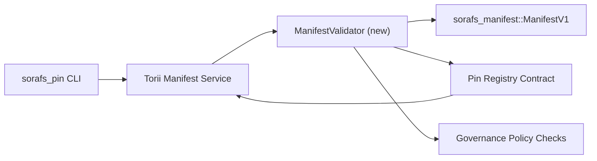

---
identifiant : plan-de-validation-registre-pin
titre : Plan de validation des manifestes pour le registre des broches
sidebar_label : Validation du registre des broches
description : Plan de validation pour le portail ManifestV1 avant le déploiement du registre des broches SF-4.
---

:::note Канонический источник
Cette page correspond à `docs/source/sorafs/pin_registry_validation_plan.md`. Assurez-vous que la documentation est active.
:::

# Plan de validation des manifestes pour le registre des broches (Подготовка SF-4)

Ce plan propose des choses qui ne sont pas nécessaires pour la validation
`sorafs_manifest::ManifestV1` dans le registre des broches du contrat de travail, pour le SF-4
J'utilise des outils utiles sans doubler la logique d'encodage/décodage.

## Celi

1. Путь отправки на стороне хоста проверяет структуру manifeste, profil
   le découpage et les enveloppes de gouvernance avant l'arrivée.
2. Torii et les services de passerelle vous permettent de valider les procédures pour
   детерминированного поведения между хостами.
3. Les tests d'intégration révèlent des résultats positifs/négatifs
   manifestes, application politique et télémétrie.

## Architecture

### Composants

- `ManifestValidator` (nouveau module dans la caisse `sorafs_manifest` ou `sorafs_pin`)
  инкапсулирует структурные проверки и politiques portes.
- Torii ouvre le point de terminaison gRPC `SubmitManifest`, que vous avez sélectionné
  `ManifestValidator` avant le contrat.
- La récupération de la passerelle peut être utilisée de manière optionnelle par le validateur
  кешировании новых manifestes из registre.

## Разбиение задач| Задача | Description | Владелец | Statut |
|--------|----------|--------------|--------|
| Squelette API V1 | Ajoutez `validate_manifest(manifest: &ManifestV1, policy: &PinPolicyInputs) -> Result<(), ValidationError>` à `sorafs_manifest`. Vérifiez le registre BLAKE3 digest et search chunker. | Infrastructure de base | ✅Détail | Les assistants (`validate_chunker_handle`, `validate_pin_policy`, `validate_manifest`) se trouvent dans `sorafs_manifest::validation`. |
| Politiques politiques | Enregistrez la configuration du registre politique (`min_replicas`, selon l'histoire, en définissant les poignées de chunker) lors des validations. | Gouvernance / Infrastructure de base | В ожидании — отслеживается в SORAFS-215 |
| Intégration Torii | Sélectionnez le validateur dans la soumission Torii ; возвращать структурированные ошибки Norito при сбоях. | Équipe Torii | Planifié — ajouté au SORAFS-216 |
| Contrat pour l'hôte | Par conséquent, le contrat de point d'entrée ouvert aux manifestes ne procède pas à leur validation ; экспонировать счетчики метрик. | Équipe de contrats intelligents | ✅Détail | `RegisterPinManifest` vous permet de valider votre système de validation (`ensure_chunker_handle`/`ensure_pin_policy`) avant de créer un système de validation et de tester les tests unitaires. отказа. |
| Tests | Faire des tests unitaires pour les validateurs + trybuild кейсы pour les manifestes non-corrects ; Tests d'intégration dans `crates/iroha_core/tests/pin_registry.rs`. | Guilde d'assurance qualité | 🟠Processus | Les tests unitaires sont effectués avec des validations en chaîne ; La suite d'intégration complète est située dans l'entreprise. |
| Documentation | Vérifiez `docs/source/sorafs_architecture_rfc.md` et `migration_roadmap.md` après le validateur ; Consultez la CLI dans `docs/source/sorafs/manifest_pipeline.md`. | Équipe Documents | Вожидании — отслеживается в DOCS-489 |

## Avis

- Finalisation du schéma Norito Pin Registry (réf : point SF-4 dans la feuille de route).
- Подписанные conseil enveloppes для chunker registre (garantirуют детерминированное сопоставление в VALидаторе).
- Résolution de l'authentification Torii pour la soumission des manifestes.

## Risques et meres

| Risque | Влияние | Mesures d'atténuation |
|------|---------|--------------------|
| L'interprétation politique de moi Torii et contrat | Недетерминированное принятие. | Supprimez la validation de la caisse + effectuez les tests d'intégration pour la résolution de l'hôte par rapport à la chaîne. |
| Règlements de régression pour les grands manifestes | Plus de soumission médicale | Бенчмарк через critère de fret ; рассмотреть кеширование результатов digest manifeste. |
| Дрейф сообщений об ошибках | Fournisseurs d'opérateurs | Определить коды ошибок Norito ; задокументировать в `manifest_pipeline.md`. |

## Ce que je viens de faire

- Étape 1 : exécuter le squelette `ManifestValidator` + tests unitaires.
- Étape 2 : cliquez sur la soumission pour Torii et ouvrez la CLI pour la validation de la validation du formulaire.
- Étape 3 : Réaliser le contrat des crochets, réaliser des tests d'intégration, consulter des documents.
- Étape 4 : vérifiez la répétition de bout en bout en entrant dans le grand livre de migration et en transférant la demande de paiement.

Ce plan est prévu pour la feuille de route après le démarrage du travail de validation.