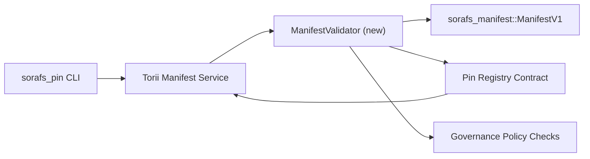

---
identifiant : plan-de-validation-registre-pin
titre : Pin Registry کے manifeste کی توثیقی منصوبہ بندی
sidebar_label : Registre des broches en cours
description : Déploiement du registre SF-4 Pin pour le portail ManifestV1.
---

:::note مستند ماخذ
یہ صفحہ `docs/source/sorafs/pin_registry_validation_plan.md` کی عکاسی کرتا ہے۔ جب تک پرانی دستاویزات فعال ہیں دونوں مقامات کو ہم آہنگ رکھیں۔
:::

# Plan de validation du manifeste du registre des broches (préparation SF-4)

یہ منصوبہ وہ اقدامات بیان کرتا ہے جو `sorafs_manifest::ManifestV1` کی توثیق کو
Le registre des broches est également disponible pour le SF-4.
Outils pour l'encodage/décodage des outils

## مقاصد

1. Soumission côté hôte du manifeste et du profil de segmentation et de la gouvernance
   enveloppes et propositions قبول کرنے سے پہلے vérifier کرتے ہیں۔
2. Torii pour les routines de validation de la passerelle et des routines de validation de la passerelle Torii
   hôtes کے درمیان comportement déterministe برقرار رہے۔
3. Tests d'intégration مثبت/منفی کیسز کو کور کرتے ہیں، جن میں manifeste d'acceptation،
   application des politiques, et télémétrie des erreurs

##Architecture

### Composants

- `ManifestValidator` (`sorafs_manifest` ou `sorafs_pin` caisse de stockage)
  Il s'agit de portes politiques qui encapsulent les portes politiques
- Torii et le point de terminaison gRPC `SubmitManifest` exposent les utilisateurs en avant
  کرنے سے پہلے `ManifestValidator` کو کال کرتا ہے۔
- Chemin de récupération de la passerelle en option et validateur pour le registre et le registre
  نئے manifeste le cache کیے جائیں۔

## Répartition des tâches

| Tâche | Descriptif | Propriétaire | Statut |
|------|-------------|-------|--------|
| Squelette de l'API V1 | `sorafs_manifest` et `validate_manifest(manifest: &ManifestV1, policy: &PinPolicyInputs) -> Result<(), ValidationError>` شامل کریں۔ Vérification du résumé BLAKE3 et recherche dans le registre des chunkers | Infrastructure de base | ✅ Terminé | Aides (`validate_chunker_handle`, `validate_pin_policy`, `validate_manifest`) et `sorafs_manifest::validation` میں ہیں۔ |
| Câblage de politique | configuration de la politique de registre (`min_replicas`, fenêtres d'expiration, poignées de chunker autorisées) et entrées de validation et carte | Gouvernance / Infrastructure de base | En attente — SORAFS-215 en attente |
| Intégration Torii | Chemin de soumission Torii pour le validateur échec des erreurs structurées Norito et des erreurs | Équipe Torii | Prévu — SORAFS-216 en cours |
| Talon du contrat d'accueil | Il y a un point d'entrée du contrat et un rejet du manifeste ou un hachage de validation ou un échec compteurs de métriques | Équipe de contrats intelligents | ✅ Terminé | `RegisterPinManifest` pour la mutation d'état et les cas d'échec des tests unitaires (`ensure_chunker_handle`/`ensure_pin_policy`) pour les cas d'échec des tests unitaires |
| Essais | validateur pour les tests unitaires + manifestes invalides pour les cas trybuild `crates/iroha_core/tests/pin_registry.rs` pour les tests d'intégration | Guilde d'assurance qualité | 🟠 En cours | tests unitaires du validateur tests de rejet en chaîne Suite d'intégration complète en anglais |
| Documents | validateur est en cours de `docs/source/sorafs_architecture_rfc.md` et `migration_roadmap.md` est en cours de réalisation CLI `docs/source/sorafs/manifest_pipeline.md` میں لکھیں۔ | Équipe Documents | En attente — DOCS-489 Lire la suite |

## Dépendances- Schéma Pin Registry Norito ici (réf: feuille de route comme SF-4)۔
- Enveloppes de registre de chunker signées par le Conseil (cartographie du validateur et cartes déterministes)۔
- Soumission du manifeste et authentification Torii

## Risques et atténuations

| Risque | Impact | Atténuation |
|------|--------|------------|
| Torii اور کنٹریکٹ کے درمیان interprétation politique میں فرق | Acceptation non déterministe۔ | caisse de validation + hôte vs chaîne en chaîne pour les tests d'intégration et les tests d'intégration |
| بڑے manifeste une régression des performances کے لیے | Soumission | critère de fret et référence cache des résultats du résumé du manifeste |
| Dérive des messages d'erreur | Opérateurs میں کنفیوژن | Les codes d'erreur Norito définissent les erreurs `manifest_pipeline.md` Document de référence |

## Objectifs de la chronologie

- Semaine 1 : squelette `ManifestValidator` + tests unitaires
- Semaine 2 : Fil du chemin de soumission Torii et erreurs de validation CLI et erreurs de validation
- Semaine 3 : les hooks de contrat implémentent les tests d'intégration et les documents اپڈیٹ کریں۔
- Semaine 4 : saisie du grand livre de migration et répétition de bout en bout avant l'approbation du conseil.

Il s'agit d'un validateur en ligne et d'une feuille de route en cours de route.