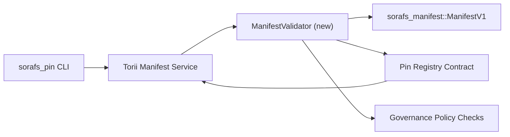

---
מזהה: pin-registry-validation-plan
כותרת: Plan de validacion de manifests del Pin Registry
sidebar_label: Validacion del Pin Registry
תיאור: Plan de validacion para el gating de ManifestV1 קודם להפצה של Pin Registry SF-4.
---

:::הערה Fuente canónica
Esta pagina refleja `docs/source/sorafs/pin_registry_validation_plan.md`. Mantén ambas ubicaciones alineadas mientras la documentación heredada siga active.
:::

# Plan de validacion de manifests del Pin Registry (הכנה SF-4)

תוכנית אסטה לתאר את לוס pasos requeridos para integrar la validacion de
`sorafs_manifest::ManifestV1` en el futuro contrato del Pin Registry para que el
trabajo de SF-4 se apoye en el tooling existente sin duplicar la logica de
קידוד/פענוח.

## אובייקטיביות

1. Las rutas de envio del host verifican la estructura del manifest, el perfil de
   chunking y los envelopes de gobernanza antes de aceptar propuestas.
2. Torii y los servicios de gateway reutilizan las mismas rutinas de validacion
   para asegurar un comportamiento determinista entre מארחים.
3. Las pruebas de integracion cubren casos positivos/negativos para aceptacion de
   מניפסטים, אכיפה פוליטיקה וטלמטריה דה טעות.

## ארכיטקטורה

### רכיבים

- `ManifestValidator` (nuevo modulo en el crate `sorafs_manifest` o `sorafs_pin`)
  encapsula los chequeos estructurales y los gates de politica.
- Torii expone unpoint end gRPC `SubmitManifest` que llama a
  `ManifestValidator` לפני חידושים.
- La ruta de fetch del gateway puede consumir opcionalmente el mismo validador
  al cachear nuevos manifests desde el registry.

## Desglose de tareas| טארא | תיאור | אחראי | Estado |
|------|-------------|--------|--------|
| Esqueleto de API V1 | Agregar `validate_manifest(manifest: &ManifestV1, policy: &PinPolicyInputs) -> Result<(), ValidationError>` ו-`sorafs_manifest`. כלול אימות של עיכול BLAKE3 ובדיקת רישום chunker. | אינפרא ליבה | ✅ Hecho | Los helpers compartidos (`validate_chunker_handle`, `validate_pin_policy`, `validate_manifest`) ahora viven en `sorafs_manifest::validation`. |
| Cableado de politica | Mapear la configuracion de politica del registry (`min_replicas`, ventanas de expiracion, handles de chunker permitidos) a las entradas de validacion. | ממשל / Infra Core | Pendiente — rastreado en SORAFS-215 |
| אינטגרציה Torii | Llamar al validador dentro del envio de manifests en Torii; devolver errores Norito estructurados ante fallas. | צוות Torii | Planificado — rastreado en SORAFS-216 |
| מארח Stub de contrato | Asegurar que el entrypoint del contrato rechace manifests que fallen el hash de validacion; exponer contadores de metricas. | צוות חוזה חכם | ✅ Hecho | `RegisterPinManifest` ahora invoca el validador compartido (`ensure_chunker_handle`/`ensure_pin_policy`) antes de mutar el estado y los tests unitarios cubren los casos de falla. |
| מבחנים | Agregar tests unitarios para el validador + casos trybuild para manifests invalidos; tests de integracion en `crates/iroha_core/tests/pin_registry.rs`. | QA Guild | בשלב התקדמות | Los tests unitarios del validador aterrizaron junto con los rechazos on-chain; la suite completa de integracion segue pendiente. |
| מסמכים | Actualizar `docs/source/sorafs_architecture_rfc.md` y `migration_roadmap.md` una vez que el validador aterrice; דוקומנטרי Uso de CLI en `docs/source/sorafs/manifest_pipeline.md`. | צוות Docs | Pendiente — rastreado en DOCS-489 |

## Dependencias

- Finalizacion del esquema Norito del Pin Registry (ר': פריט SF-4 במפת הדרכים).
- Envelopes del chunker registry firmados por el consejo (asegura que el mapping del validador sea determinista).
- Decisiones de autenticacion de Torii para el envio de manifests.

## Riesgos y mitigaciones

| ריסגו | אימפקטו | מיטיגציון |
|--------|--------|----------------|
| Interpretacion divergente de politica entre Torii y el contrato | קבלה לא דטרמיניסטה. | השווה ארגז אימות + בדיקות אינטגרציה כדי להשוות החלטות מארח לעומת רשת. |
| Regresion de Performance para manifests grandes | Envios mas lentos | קריטריון מדיר באמצעות מטען; שקול cachear resultados de digest del manifest. |
| Deriva de mensajes de error | בלבול המבצעים | הגדרת קוד קוד שגיאה Norito; documentarlos en `manifest_pipeline.md`. |

## אובייקטיבוס של קרונוגרמה

- סמנה 1: aterrizar el esqueleto `ManifestValidator` + בדיקות יחידות.
- סמנה 2: cablear el envio en Torii y actualizar la CLI para mostrar errores de validacion.
- סמנה 3: יישום ה-hooks del contrato, בדיקות שילוב, מסמכים ממשיים.
- סמנה 4: תקנה מקצה לקצה עם אנטרדה ב-El Ledger de Migracion y Capturar Aprobacion del Consejo.Este plan se referenciara en el מפת הדרכים una vez que comience el trabajo del validador.