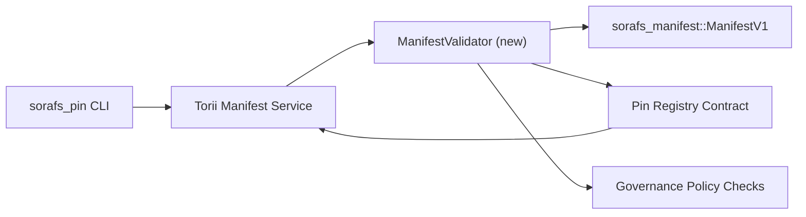

---
מזהה: pin-registry-validation-plan
כותרת: Plan de validation des manifests du Pin Registry
sidebar_label: רישום Pin Validation
תיאור: Plan de validation pour le gating ManifestV1 avant le rollout du Pin Registry SF-4.
---

:::הערה מקור קנוניק
Cette page reflète `docs/source/sorafs/pin_registry_validation_plan.md`. Gardez les deux emplacements alignés tant que la documentation héritée reste active.
:::

# Plan de validation des manifests du Pin Registry (הכנה SF-4)

Ce plan décrit les étapes nécessaires pour intégrer la validation de
`sorafs_manifest::ManifestV1` in the contrat Pin Registry à venir afin que le
travail SF-4 s'appuie sur le tooling existant sans dupliquer la logique
קידוד/פענוח.

## אובייקטים

1. Les chemins de soumission côté hôte vérifient la structure du manifest, le
   profil de chunking et les envelopes de governance avant d'accepter les
   הצעות.
2. Torii et les services gateway réutilisent les mêmes routines de validation
   pour garantir un comportement déterministe entre hôtes.
3. Les tests d'integration couvrent les cas positifs/négatifs pour l'acceptation
   des manifests, l'application de la politique et la télémétrie d'erreurs.

## אדריכלות

### מרכיבים

- `ManifestValidator` (נובו מודול dans le crate `sorafs_manifest` או `sorafs_pin`)
  encapsule les contrôles structurels et les ports de politique.
- Torii חשיפת נקודת קצה gRPC `SubmitManifest` qui appelle
  `ManifestValidator` avant de transmettre au contrat.
- Le chemin de fetch du gateway peut optionnellement consommer le même validateur
  lors de la mise en cache de nouveaux manifests depuis le registry.

## Découpage des tâches| טאצ'ה | תיאור | בעלים | סטטוט |
|------|-------------|-------|--------|
| Squelette API V1 | Ajouter `validate_manifest(manifest: &ManifestV1, policy: &PinPolicyInputs) -> Result<(), ValidationError>` à `sorafs_manifest`. כלול את בדיקת BLAKE3 ואת בדיקת הרישום של chunker. | אינפרא ליבה | ✅ Terminé | Les helpers partagés (`validate_chunker_handle`, `validate_pin_policy`, `validate_manifest`) vivent désormais dans `sorafs_manifest::validation`. |
| Câblage de politique | Mapper la configuration de politique du registry (`min_replicas`, fenêtres d'expiration, handles de chunker autorisés) vers les entrées de validation. | ממשל / Infra Core | En attente — suivi dans SORAFS-215 |
| אינטגרציה Torii | Appeler le validateur dans le chemin de soumission Torii; retourner des erreurs Norito structurées en cas d'échec. | צוות Torii | Planifié — suivi dans SORAFS-216 |
| Stub contrat côté hôte | S'assurer que l'entrée du contrat rejette les manifests qui échouent au hash de validation; חושף מחשבים מדעיים. | צוות חוזה חכם | ✅ Terminé | `RegisterPinManifest` invoque désormais le validateur partagé (`ensure_chunker_handle`/`ensure_pin_policy`) avant de muter l'état et des tests unitaires couvrent les cas d'échec. |
| מבחנים | Ajouter des tests unitaires pour le validateur + des cas trybuild pour manifests invalides; בדיקות אינטגרציה ב-`crates/iroha_core/tests/pin_registry.rs`. | QA Guild | 🟠 כמובן | Les tests unitaires du validateur ont atterri avec les rejets on-chain; la suite d'intégration complète reste en attente. |
| מסמכים | Mettre à jour `docs/source/sorafs_architecture_rfc.md` et `migration_roadmap.md` une fois le validateur livré; מתעד l'usage CLI dans `docs/source/sorafs/manifest_pipeline.md`. | צוות Docs | En attente — suivi dans DOCS-489 |

## תלות

- Finalization du schéma Norito du Pin Registry (ר': פריט SF-4 במפת הדרכים).
- מעטפות של chunker registry signnés par le conseil (הבטח un mipping déterministe du validateur).
- Decisions d'authentification Torii pour la soumission de manifests.

## סיכונים והקלות

| ריסק | השפעה | הקלה |
|--------|--------|------------|
| פירוש divergente de politique entre Torii et le contrat | קבלה לא דטרמיניסטית. | Partager le crate de validation + ajouter des tests d'intégration comparant les décisions hôte vs on-chain. |
| Régression de Performance pour de gros manifests | Soumissions plus lentes | Benchmarker באמצעות קריטריון מטען; envisager un cache des résultats de digest manifest. |
| Derive des messages d'erreur | אופרטור בלבול | Définir des codes d'erreur Norito ; les documenter dans `manifest_pipeline.md`. |

## Cibles de Calendrier

- Semaine 1 : livrer le squelette `ManifestValidator` + בדיקות יחידות.
- Semaine 2 : câbler le chemin de soumission Torii et mettre à jour la CLI pour remonter les erreurs de validation.
- Semaine 3 : implémenter les hooks du contrat, ajouter des tests d'intégration, mettre à jour les docs.
- Semaine 4 : מבצע פעולות חוזרות מקצה לקצה עם פתח חשבונות הגירה, לוכד את ההסכמה.Ce plan sera référencé dans la roadmap une fois le travail du validateur démarré.