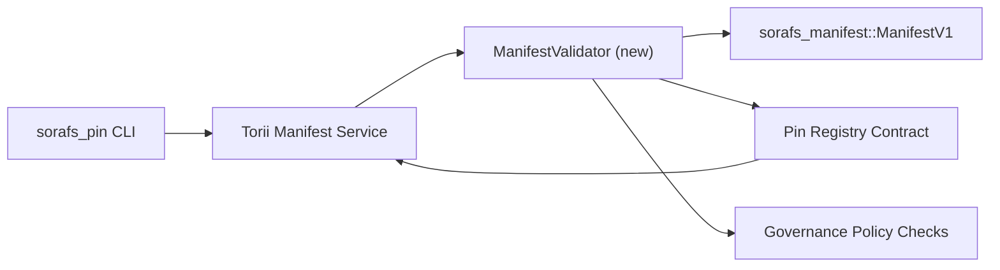

<!-- Auto-generated stub for Hebrew (he) translation. Replace this content with the full translation. -->

---
id: pin-registry-validation-plan
lang: he
direction: rtl
source: docs/portal/docs/sorafs/pin-registry-validation-plan.md
status: complete
generator: docs/portal/scripts/sync-i18n.mjs
---

:::note מקור קנוני
עמוד זה משקף את `docs/source/sorafs/pin_registry_validation_plan.md`. שמרו על שני המיקומים מיושרים כל עוד התיעוד הישן נשאר פעיל.
:::

# תוכנית אימות manifests ל-Pin Registry (הכנת SF-4)

תוכנית זו מתארת את הצעדים הדרושים לשילוב אימות
`sorafs_manifest::ManifestV1` בחוזה Pin Registry העתידי, כך שעבודת SF-4 תבנה
על ה-tooling הקיים ללא שכפול לוגיקת encode/decode.

## מטרות

1. מסלולי submission בצד ה-host מאמתים מבנה manifest, פרופיל chunking ו-envelopes
   של ממשל לפני קבלת הצעות.
2. Torii ושירותי gateway עושים שימוש חוזר באותן רוטינות אימות כדי להבטיח התנהגות
   דטרמיניסטית בין hosts.
3. בדיקות אינטגרציה מכסות מקרים חיוביים/שליליים לקבלת manifests, אכיפת מדיניות
   וטלמטריית שגיאות.

## ארכיטקטורה

### רכיבים

- `ManifestValidator` (מודול חדש ב-crate `sorafs_manifest` או `sorafs_pin`)
  מכיל בדיקות מבניות ושערי מדיניות.
- Torii חושף endpoint gRPC בשם `SubmitManifest` שקורא ל-`ManifestValidator`
  לפני העברה לחוזה.
- נתיב fetch ב-gateway יכול לצרוך אופציונלית את אותו validator בעת caching
  של manifests חדשים מה-registry.

## פירוק משימות

| משימה | תיאור | בעלים | סטטוס |
|-------|-------|-------|-------|
| שלד API V1 | הוספת `validate_manifest(manifest: &ManifestV1, policy: &PinPolicyInputs) -> Result<(), ValidationError>` ל-`sorafs_manifest`. לכלול בדיקת BLAKE3 digest ו-lookup של chunker registry. | Core Infra | ✅ הושלם | עזרי שיתוף (`validate_chunker_handle`, `validate_pin_policy`, `validate_manifest`) נמצאים כעת ב-`sorafs_manifest::validation`. |
| חיבור מדיניות | מיפוי קונפיגורציית מדיניות registry (`min_replicas`, חלונות תפוגה, handles של chunker מותרים) לקלטי אימות. | Governance / Core Infra | בהמתנה — במעקב ב-SORAFS-215 |
| אינטגרציית Torii | קריאה ל-validator במסלול submission ב-Torii; החזרת שגיאות Norito מובנות בכשל. | Torii Team | מתוכנן — במעקב ב-SORAFS-216 |
| stub לחוזה בצד ה-host | להבטיח שה-entrypoint בחוזה דוחה manifests שלא עוברים hash אימות; לחשוף מונים של metrics. | Smart Contract Team | ✅ הושלם | `RegisterPinManifest` קורא ל-validator המשותף (`ensure_chunker_handle`/`ensure_pin_policy`) לפני שינוי מצב ובדיקות יחידה מכסות מקרי כשל. |
| בדיקות | להוסיף unit tests ל-validator + מקרי trybuild ל-manifests לא תקינים; בדיקות אינטגרציה ב-`crates/iroha_core/tests/pin_registry.rs`. | QA Guild | 🟠 בתהליך | בדיקות יחידה ל-validator נחתו יחד עם בדיקות הדחייה on-chain; חבילת האינטגרציה המלאה עדיין בהמתנה. |
| Docs | לעדכן `docs/source/sorafs_architecture_rfc.md` ו-`migration_roadmap.md` לאחר נחיתת ה-validator; לתעד שימוש CLI ב-`docs/source/sorafs/manifest_pipeline.md`. | Docs Team | בהמתנה — במעקב ב-DOCS-489 |

## תלויות

- סיום סכמת Norito ל-Pin Registry (ref: פריט SF-4 ב-roadmap).
- chunker registry envelopes חתומים על ידי המועצה (מבטיחים מיפוי דטרמיניסטי של ה-validator).
- החלטות אימות Torii עבור submission של manifests.

## סיכונים ומזעור

| סיכון | השפעה | מזעור |
|-------|-------|-------|
| פרשנות מדיניות שונה בין Torii לחוזה | קבלה לא דטרמיניסטית. | לשתף crate אימות + להוסיף בדיקות אינטגרציה שמשוות החלטות host מול on-chain. |
| ירידת ביצועים עבור manifests גדולים | submission איטי יותר | Benchmark דרך cargo criterion; לשקול caching של תוצאות digest עבור manifest. |
| סטיה בהודעות שגיאה | בלבול למפעילים | להגדיר קודי שגיאה Norito; לתעד ב-`manifest_pipeline.md`. |

## יעדי לוח זמנים

- שבוע 1: נחיתת שלד `ManifestValidator` + unit tests.
- שבוע 2: חיבור מסלול submission ב-Torii ועדכון CLI להצגת שגיאות אימות.
- שבוע 3: מימוש hooks לחוזה, הוספת בדיקות אינטגרציה, עדכון docs.
- שבוע 4: הרצת חזרה end-to-end עם רשומת migration ledger ואיסוף אישור המועצה.

תוכנית זו תוזכר ב-roadmap עם תחילת עבודת ה-validator.
