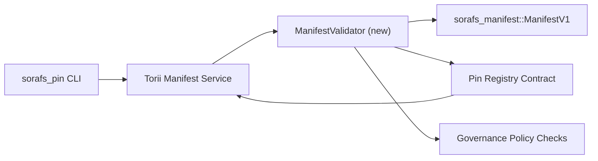

---
מזהה: pin-registry-validation-plan
כותרת: Plano de validacao de manifests do Pin Registry
sidebar_label: Validacao do Pin Registry
תיאור: Plano de validacao para o gating de ManifestV1 מבצעים השקה של Pin Registry SF-4.
---

:::שים לב Fonte canonica
Esta pagina espelha `docs/source/sorafs/pin_registry_validation_plan.md`. Mantenha ambos os locais alinhados enquanto a documentacao herdada permanecer ativa.
:::

# Plano de validacao de manifests do Pin Registry (Preparacao SF-4)

Este plano descreve os passos necessarios para integrar a validacao de
`sorafs_manifest::ManifestV1` no futuro contrato do Pin Registry para que o
trabalho de SF-4 se baseie no tooling existente sem duplicar a logica de
קידוד/פענוח.

## אובייקטיביות

1. Os caminhos de envio no host verificam a estrutura do manifest, o perfil de
   chunking e os envelopes de governanca antes de aceitar propostas.
2. Torii e os servicos de gateway reutilizam as mesmas rotinas de validacao para
   garantir comportamento deterministico entre מארחים.
3. Os testes de integracao cobrem casos positivos/negativos para aceitacao de
   מניפסטים, אכיפה פוליטיקה וטלמטריה דה שגיאות.

## ארכיטטורה

### רכיבים

- `ManifestValidator` (נובו מודולו ללא ארגז `sorafs_manifest` או `sorafs_pin`)
  encapsula בודק estruturais e gates de politica.
- Torii expoe um endpoint gRPC `SubmitManifest` que chama
  `ManifestValidator` אנטס דה אנקאמינהר וכדומה.
- O caminho de fetch do gateway pode consumir opcionalmente o mesmo validador ao
  cachear novos manifests vindos do registry.

## Desdobramento de tarefas| טארפה | תיאור | שו"ת | סטטוס |
|--------|--------|----------------|--------|
| Esqueleto de API V1 | Adicionar `validate_manifest(manifest: &ManifestV1, policy: &PinPolicyInputs) -> Result<(), ValidationError>` em `sorafs_manifest`. כלול אימות של BLAKE3 ובדיקת מידע לרישום chunker. | אינפרא ליבה | קונקלוידו | Helpers compartilhados (`validate_chunker_handle`, `validate_pin_policy`, `validate_manifest`) agora vivem em `sorafs_manifest::validation`. |
| Wiring de politica | Mapear a configuracao de politica do registry (`min_replicas`, Janelas de expiracao, handles de chunker permitidos) para as entradas de validacao. | ממשל / Infra Core | Pendente - rastreado em SORAFS-215 |
| Integracao Torii | Chamar o validador no caminho de submissao Torii; retornar erros Norito estruturados em falhas. | צוות Torii | Planejado - rastreado em SORAFS-216 |
| מארח Stub de contrato | Garantir que o entrypoint do contrato rejeite manifests que falham no hash de validacao; expor contadores de metricas. | צוות חוזה חכם | קונקלוידו | `RegisterPinManifest` agora invoca o validador compartilhado (`ensure_chunker_handle`/`ensure_pin_policy`) antes de mutar o estado e testes unitarios cobrem os casos de falha. |
| מבחנים | Adicionar testes unitarios para o validador + casos trybuild para manifests invalidos; testes de integracao em `crates/iroha_core/tests/pin_registry.rs`. | QA Guild | Em progresso | Os testes unitarios do validador chegaram junto com rejeicoes on-chain; a suite completa de integracao segue pendente. |
| מסמכים | Atualizar `docs/source/sorafs_architecture_rfc.md` e `migration_roadmap.md` quando o validador chegar; דוקומנטרי Uso da CLI em `docs/source/sorafs/manifest_pipeline.md`. | צוות Docs | Pendente - rastreado em DOCS-489 |

## Dependencias

- Finalizacao do esquema Norito לעשות Pin Registry (ר': פריט SF-4 ללא מפת דרכים).
- מעטפות לעשות chunker registry assinados pelo conselho (garante mapeamento deterministico do validador).
- Decisoes de autenticacao do Torii para submissao de manifests.

## Riscos e mitigacoes

| ריסקו | אימפקטו | מיטיגקאו |
|-------|--------|--------|
| Interpretacao divergente de politica entre Torii e o contrato | Aceitacao nao deterministica. | Compartilhar crate de validacao + אדיציונרים דה אינטגראקאו que comparem decisoes do host vs on-chain. |
| Regressao de performance para manifests grandes | Submissoes mais lentas | קריטריון מדיר באמצעות מטען; תוצאות המטמון נחשבות לתכלס. |
| Deriva de mensagens de erro | Confusao do Operador | הגדרת קודיגו דה שגיאה Norito; דוקומנטרי עם `manifest_pipeline.md`. |

## Metas de Cronograma

- סמנה 1: entregar o esqueleto `ManifestValidator` + testes unitarios.
- סמנה 2: אינטגרר או קמינהו דה סובמיסאו לא Torii e tualizar a CLI para expor erros de validacao.
- סמנה 3: ווים ליישם בניגוד, אדיקוניור בדיקות אינטגרה, אטואליסר מסמכים.
- סמנה 4: מדריך מקצה לקצה ללא פנקס העברת חשבונות ואישורים.

Este plano sera referenciado no מפת דרכים assim que o trabalho do validador comecar.