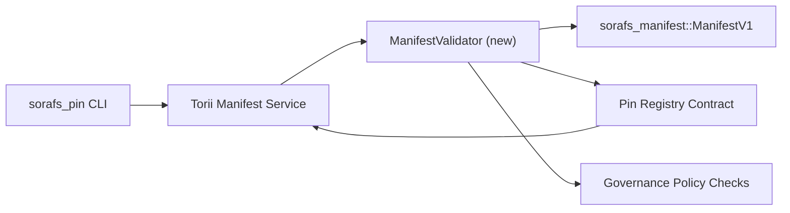

---
id: pin-registry-validation-plan
title: Plano de validacao de manifests do Pin Registry
sidebar_label: Validacao do Pin Registry
description: Plano de validacao para o gating de ManifestV1 antes do rollout do Pin Registry SF-4.
---

:::note Fonte canonica
Esta pagina espelha `docs/source/sorafs/pin_registry_validation_plan.md`. Mantenha ambos os locais alinhados enquanto a documentacao herdada permanecer ativa.
:::

# Plano de validacao de manifests do Pin Registry (Preparacao SF-4)

Este plano descreve os passos necessarios para integrar a validacao de
`sorafs_manifest::ManifestV1` no futuro contrato do Pin Registry para que o
trabalho de SF-4 se baseie no tooling existente sem duplicar a logica de
encode/decode.

## Objetivos

1. Os caminhos de envio no host verificam a estrutura do manifest, o perfil de
   chunking e os envelopes de governanca antes de aceitar propostas.
2. Torii e os servicos de gateway reutilizam as mesmas rotinas de validacao para
   garantir comportamento deterministico entre hosts.
3. Os testes de integracao cobrem casos positivos/negativos para aceitacao de
   manifests, enforcement de politica e telemetria de erros.

## Arquitetura

### Componentes

- `ManifestValidator` (novo modulo no crate `sorafs_manifest` ou `sorafs_pin`)
  encapsula checks estruturais e gates de politica.
- Torii expoe um endpoint gRPC `SubmitManifest` que chama
  `ManifestValidator` antes de encaminhar ao contrato.
- O caminho de fetch do gateway pode consumir opcionalmente o mesmo validador ao
  cachear novos manifests vindos do registry.

## Desdobramento de tarefas

| Tarefa | Descricao | Responsavel | Status |
|--------|-----------|-------------|--------|
| Esqueleto de API V1 | Adicionar `validate_manifest(manifest: &ManifestV1, policy: &PinPolicyInputs) -> Result<(), ValidationError>` em `sorafs_manifest`. Incluir verificacao de digest BLAKE3 e lookup do chunker registry. | Core Infra | Concluido | Helpers compartilhados (`validate_chunker_handle`, `validate_pin_policy`, `validate_manifest`) agora vivem em `sorafs_manifest::validation`. |
| Wiring de politica | Mapear a configuracao de politica do registry (`min_replicas`, janelas de expiracao, handles de chunker permitidos) para as entradas de validacao. | Governance / Core Infra | Pendente - rastreado em SORAFS-215 |
| Integracao Torii | Chamar o validador no caminho de submissao Torii; retornar erros Norito estruturados em falhas. | Torii Team | Planejado - rastreado em SORAFS-216 |
| Stub de contrato host | Garantir que o entrypoint do contrato rejeite manifests que falham no hash de validacao; expor contadores de metricas. | Smart Contract Team | Concluido | `RegisterPinManifest` agora invoca o validador compartilhado (`ensure_chunker_handle`/`ensure_pin_policy`) antes de mutar o estado e testes unitarios cobrem os casos de falha. |
| Tests | Adicionar testes unitarios para o validador + casos trybuild para manifests invalidos; testes de integracao em `crates/iroha_core/tests/pin_registry.rs`. | QA Guild | Em progresso | Os testes unitarios do validador chegaram junto com rejeicoes on-chain; a suite completa de integracao segue pendente. |
| Docs | Atualizar `docs/source/sorafs_architecture_rfc.md` e `migration_roadmap.md` quando o validador chegar; documentar uso da CLI em `docs/source/sorafs/manifest_pipeline.md`. | Docs Team | Pendente - rastreado em DOCS-489 |

## Dependencias

- Finalizacao do esquema Norito do Pin Registry (ref: item SF-4 no roadmap).
- Envelopes do chunker registry assinados pelo conselho (garante mapeamento deterministico do validador).
- Decisoes de autenticacao do Torii para submissao de manifests.

## Riscos e mitigacoes

| Risco | Impacto | Mitigacao |
|-------|---------|-----------|
| Interpretacao divergente de politica entre Torii e o contrato | Aceitacao nao deterministica. | Compartilhar crate de validacao + adicionar testes de integracao que comparem decisoes do host vs on-chain. |
| Regressao de performance para manifests grandes | Submissoes mais lentas | Medir via cargo criterion; considerar cachear resultados de digest do manifest. |
| Deriva de mensagens de erro | Confusao do operador | Definir codigos de erro Norito; documentar em `manifest_pipeline.md`. |

## Metas de cronograma

- Semana 1: entregar o esqueleto `ManifestValidator` + testes unitarios.
- Semana 2: integrar o caminho de submissao no Torii e atualizar a CLI para expor erros de validacao.
- Semana 3: implementar hooks do contrato, adicionar testes de integracao, atualizar docs.
- Semana 4: rodar ensaio end-to-end com entrada no migration ledger e capturar aprovacao do conselho.

Este plano sera referenciado no roadmap assim que o trabalho do validador comecar.
