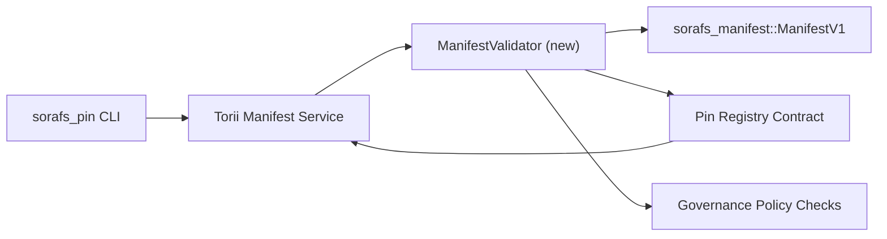

---
מזהה: pin-registry-validation-plan
כותרת: מניפסטים של План валидации ל-Pin Registry
sidebar_label: Валидация Pin Registry
תיאור: План валидации для gating ManifestV1 перед השקת Pin Registry SF-4.
---

:::note Канонический источник
Эта страница отражает `docs/source/sorafs/pin_registry_validation_plan.md`. Держите оба расположения согласованными, пока наследственная документация остается активной.
:::

# מניפסטים של План валидации ל-Pin Registry (Подготовка SF-4)

Этот план описывает шаги, необходимые для подключения валидации
`sorafs_manifest::ManifestV1` в будущий контракт Pin Registry, чтобы работа SF-4
התקן את כלי העבודה ללא קידוד/פענוח.

## Цели

1. Путь отправки на стороне хоста проверяет структуру מניפסט, профиль
   מעטפות chunking и ממשל перед принятием предложений.
2. Torii ו-gateway сервисы переиспользуют те же процедуры валидации для
   детерминированного поведения между хостами.
3. Интеграционные тесты покрывают позитивные/негативные кейсы принятия
   מניפסטים, אכיפה политик и телеметрию ошибок.

## Архитектура

### Компоненты

- `ManifestValidator` (новый модуль в crate `sorafs_manifest` או `sorafs_pin`)
  инкапсулирует структурные проверки и שערי מדיניות.
- Torii открывает gRPC endpoint `SubmitManifest`, который вызывает
  `ManifestValidator` перед передачей в контракт.
- Путь gateway fetch может опционально использовать тот же валидатор при
  кешировании новых מניפסט из הרישום.

## Разбиение задач| Задача | Описание | Владелец | Статус |
|--------|--------|--------|--------|
| Скелет API V1 | Добавить `validate_manifest(manifest: &ManifestV1, policy: &PinPolicyInputs) -> Result<(), ValidationError>` в `sorafs_manifest`. פתח את BLAKE3 digest ו-lookup chunker registry. | אינפרא ליבה | ✅ Сделано | Общие עוזרים (`validate_chunker_handle`, `validate_pin_policy`, `validate_manifest`) теперь находятся в `sorafs_manifest::validation`. |
| Подключение политики | Смапить конфигурацию политики registry (`min_replicas`, окна истечения, разрешенные chunker handles) в входы валидах. | ממשל / Infra Core | В ожидании — отслеживается в SORAFS-215 |
| Интеграция Torii | Вызывать валидатор в пути הגשת Torii; возвращать структурированные ошибки Norito при сбоях. | צוות Torii | Запланировано — отслеживается в SORAFS-216 |
| Заглушка контракта на хосте | Убедиться, что נקודת כניסה контракта отклоняет מניפסטים, не прошедшие хэш валидации; экспонировать счетчики метрик. | צוות חוזה חכם | ✅ Сделано | `RegisterPinManifest` теперь вызывает общий валидатор (`ensure_chunker_handle`/`ensure_pin_policy`) перед измением состоия unit tests, случаи отказа. |
| Тесты | Добавить בדיקות יחידה для валидатора + trybuild кейсы для некорректных מניפסטים; интеграционные тесты в `crates/iroha_core/tests/pin_registry.rs`. | QA Guild | 🟠 В процессе | בדיקות יחידה валидатора добавлены вместе с on-chain отказами; полноценная интеграционная suite пока в ожидании. |
| Документация | Обновить `docs/source/sorafs_architecture_rfc.md` ו-`migration_roadmap.md` после внедрения валидатора; הצג CLI ב-`docs/source/sorafs/manifest_pipeline.md`. | צוות Docs | В ожидании — отслеживается в DOCS-489 |

## Зависимости

- Финализация Norito схемы Pin Registry (ר': пункт SF-4 в מפת הדרכים).
- הצגת מעטפות של המועצה ל-chunker registry (гарантируют детерминированное сопоставление валидаторе).
- הנחיות לגבי אישורים Torii למניפסטים להגשה.

## Риски и меры

| Риск | Влияние | Митигирование |
|------|--------|--------------|
| Разная интерпретация политики между Torii וקונטרקטום | Недетерминированное принятие. | שלח את הארגז валидации + добавить интеграционные тесты сравнения решений מארח לעומת רשת. |
| Регрессия производительности для больших מניפסטים | הגשת Более медленные | קריטריון מטען Бенчмарк через; рассмотреть кеширование результатов לעכל מניפסט. |
| Дрейф сообщений об ошибках | Путаница у операторов | Определить коды ошибок Norito; задокументировать в `manifest_pipeline.md`. |

## Цели по времени

- Неделя 1: приземлить скелет `ManifestValidator` + בדיקות יחידה.
- ערב 2: שלח את ההגשה ל-Torii וקבל את ה-CLI למען אופטימיזציית אובטחה.
- עדה 3: реализовать hooks контракта, добавить интеграционные тесты, обновить docs.
- שדרה 4: הצג דיווחים מקצה לקצה עבור ספר חשבונות העברת מידע וקבל מידע נוסף.

Этот план будет указан валидатору после старта работ по валидатору.