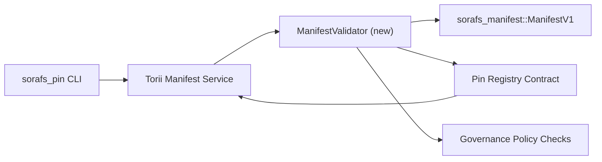

:::note Կանոնական աղբյուր
:::

# Pin Registry Manifest Validation Plan (SF-4 Prep)

Այս պլանը ուրվագծում է `sorafs_manifest::ManifestV1` շարանը կապելու համար անհրաժեշտ քայլերը
վավերացում Pin Registry-ի առաջիկա պայմանագրում, որպեսզի SF-4-ը կարողանա աշխատել
հիմնվել առկա գործիքների վրա՝ առանց կոդավորման/վերծանման տրամաբանության կրկնօրինակման:

## Գոլեր

1. Հյուրընկալող կողմի ներկայացման ուղիները ստուգում են մանիֆեստի կառուցվածքը, մասնատման պրոֆիլը և
   կառավարման ծրարները՝ նախքան առաջարկներն ընդունելը:
2. Torii և gateway ծառայությունները նորից օգտագործում են նույն վավերացման ռեժիմները՝ ապահովելու համար
   դետերմինիստական վարքագիծ տանտերերի միջև:
3. Ինտեգրման թեստերը ներառում են դրական/բացասական դեպքեր՝ ակնհայտ ընդունման համար,
   քաղաքականության կիրարկում և սխալների հեռաչափություն:

## Ճարտարապետություն

### Բաղադրիչներ

- `ManifestValidator` (նոր մոդուլ `sorafs_manifest` կամ `sorafs_pin` վանդակում)
  ներառում է կառուցվածքային ստուգումներ և քաղաքականության դարպասներ:
- Torii-ը բացահայտում է gRPC վերջնակետը `SubmitManifest`, որը կոչ է անում
  `ManifestValidator` մինչև պայմանագրին փոխանցելը:
- Դարպասի բեռնման ուղին կամայականորեն սպառում է նույն վավերացուցիչը նորը քեշավորելիս
  դրսևորվում է գրանցամատյանից:

## Առաջադրանքի բաշխում

| Առաջադրանք | Նկարագրություն | Սեփականատեր | Կարգավիճակը |
|------|-------------|-------|--------|
| V1 API կմախք | Ավելացնել `validate_manifest(manifest: &ManifestV1, policy: &PinPolicyInputs) -> Result<(), ValidationError>` `sorafs_manifest`-ին: Ներառեք BLAKE3 digest ստուգումը և chunker ռեեստրի որոնումը: | Core Infra | ✅ Կատարված է | Համօգտագործվող օգնականները (`validate_chunker_handle`, `validate_pin_policy`, `validate_manifest`) այժմ ապրում են `sorafs_manifest::validation`-ում: |
| Քաղաքականության միացում | Քարտեզի ռեեստրի քաղաքականության կազմաձևումը (`min_replicas`, ժամկետի ավարտի պատուհաններ, թույլատրված բլոկների բռնակներ) վավերացման մուտքերում: | Կառավարում / Core Infra | Սպասող — հետևված է SORAFS-215 |
| Torii ինտեգրում | Զանգահարեք վավերացուցիչը Torii մանիֆեստի ներկայացման ուղու ներսում; վերադարձնել կառուցվածքային Norito սխալները ձախողման դեպքում: | Torii Թիմ | Պլանավորված — հետևված է SORAFS-216 |
| Հոսթի պայմանագրի անավարտ | Համոզվեք, որ պայմանագրի մուտքի կետը մերժում է մանիֆեստները, որոնք ձախողում են վավերացման հեշը. բացահայտել չափման հաշվիչներ. | Խելացի պայմանագրային թիմ | ✅ Կատարված է | `RegisterPinManifest`-ն այժմ կանչում է ընդհանուր վավերացնողը (`ensure_chunker_handle`/`ensure_pin_policy`) նախքան մուտացիոն վիճակի և միավորի թեստերը ծածկում են ձախողման դեպքերը: |
| Թեստեր | Ավելացրեք միավորի թեստեր վավերացնողի համար + trybuild դեպքեր անվավեր մանիֆեստների համար; ինտեգրման թեստեր `crates/iroha_core/tests/pin_registry.rs`-ում: | ՈԱ գիլդիա | Ընթացքի մեջ է | Վավերացնող միավորի թեստերը վայրէջք կատարեցին շղթայի մերժման թեստերի կողքին. ամբողջական ինտեգրման փաթեթը դեռ սպասվում է: |
| Փաստաթղթեր | Թարմացրեք `docs/source/sorafs_architecture_rfc.md`-ը և `migration_roadmap.md`-ը, երբ վավերացնողը վայրէջք կատարի; փաստաթուղթ CLI-ի օգտագործումը `docs/source/sorafs/manifest_pipeline.md`-ում: | Փաստաթղթերի թիմ | Սպասող — հետևված է DOCS-489-ում |

## Կախվածություններ

- Pin Registry Norito սխեմայի վերջնականացում (հղում. SF-4 կետ ճանապարհային քարտեզում):
- Խորհրդի կողմից ստորագրված chunker ռեգիստրի ծրարներ (ապահովում է վավերացնողի քարտեզագրումը
  դետերմինիստական):
- Torii նույնականացման որոշումներ մանիֆեստի ներկայացման համար:

## Ռիսկեր և մեղմացումներ

| Ռիսկ | Ազդեցություն | Մեղմացում |
|------|--------|------------|
| Տարբեր քաղաքականության մեկնաբանումը Torii-ի և պայմանագրի | Ոչ դետերմինիստական ​​ընդունում. | Համօգտագործեք վավերացման տուփ + ավելացրեք ինտեգրման թեստեր, որոնք համեմատում են հյուրընկալող և շղթայական որոշումները: |
| Կատարման ռեգրեսիա խոշոր դրսևորումների համար | Ավելի դանդաղ ներկայացում | Հենանիշ բեռների չափանիշով; հաշվի առեք մանիֆեստի մարսողության արդյունքների քեշավորումը: |
| Հաղորդագրման սխալ դրեյֆ | Օպերատորի շփոթություն | Սահմանեք Norito սխալի կոդերը; փաստաթղթավորեք դրանք `manifest_pipeline.md`-ում: |

## Ժամանակացույցի թիրախներ

- Շաբաթ 1. Հողատարածք `ManifestValidator` կմախք + միավորի թեստեր:
- Շաբաթ 2. Մետաղական Torii ներկայացման ուղի և թարմացրեք CLI-ն մինչև մակերեսային վավերացման սխալները:
- Շաբաթ 3. Իրականացնել պայմանագրային կեռիկներ, ավելացնել ինտեգրման թեստեր, թարմացնել փաստաթղթերը:
- Շաբաթ 4. Անցկացրեք վերջից մինչև վերջ փորձը միգրացիայի մատյանում մուտքագրելով, գրավեք խորհրդի ստորագրումը:

Այս պլանը կտեղեկացվի ճանապարհային քարտեզում, երբ սկսվի վավերացման աշխատանքները: