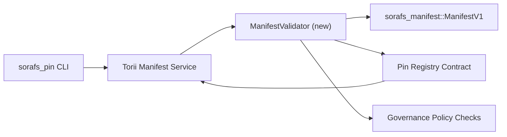

---
id: pin-registry-validation-plan
title: خطة التحقق من manifests في Pin Registry
sidebar_label: تحقق Pin Registry
description: خطة تحقق لتقييد ManifestV1 قبل اطلاق Pin Registry ضمن SF-4.
---

:::note المصدر المعتمد
تعكس هذه الصفحة `docs/source/sorafs/pin_registry_validation_plan.md`. حافظ على المحاذاة بين الموقعين طالما الوثائق القديمة فعالة.
:::

# خطة التحقق من manifests في Pin Registry (تحضير SF-4)

توضح هذه الخطة الخطوات المطلوبة لتمرير تحقق `sorafs_manifest::ManifestV1` داخل
عقد Pin Registry القادم حتى يبني عمل SF-4 على tooling القائم بدون تكرار منطق
encode/decode.

## الاهداف

1. تتحقق مسارات الارسال في المضيف من بنية manifest وملف chunking وenvelopes
   الخاصة بالحوكمة قبل قبول المقترحات.
2. تعيد خدمات Torii والبوابات استخدام نفس روتينات التحقق لضمان سلوك حتمي عبر
   المضيفين.
3. تغطي اختبارات التكامل الحالات الايجابية والسلبية لقبول manifests وتطبيق
   السياسات وتليمتري الاخطاء.

## المعمارية

### المكونات

- `ManifestValidator` (وحدة جديدة في crate `sorafs_manifest` او `sorafs_pin`)
  تغلف الفحوصات الهيكلية وبوابات السياسة.
- Torii تعرض endpoint gRPC باسم `SubmitManifest` يستدعي
  `ManifestValidator` قبل الارسال للعقد.
- مسار fetch في البوابة يمكنه استهلاك نفس المدقق اختياريا عند تخزين manifests
  جديدة من registry.

## تقسيم المهام

| المهمة | الوصف | المالك | الحالة |
|------|-------|--------|--------|
| هيكل API V1 | اضافة `validate_manifest(manifest: &ManifestV1, policy: &PinPolicyInputs) -> Result<(), ValidationError>` الى `sorafs_manifest`. تضمين تحقق BLAKE3 digest وlookup للـ chunker registry. | Core Infra | ✅ تم | المساعدات المشتركة (`validate_chunker_handle`, `validate_pin_policy`, `validate_manifest`) تعيش الان في `sorafs_manifest::validation`. |
| توصيل السياسة | مواءمة اعدادات سياسة registry (`min_replicas`, نوافذ الانتهاء, handles المسموح بها) مع مدخلات التحقق. | Governance / Core Infra | قيد الانتظار — متابع في SORAFS-215 |
| تكامل Torii | استدعاء المدقق في مسار ارسال Torii؛ اعادة اخطاء Norito منظمة عند الفشل. | Torii Team | مخطط — متابع في SORAFS-216 |
| stub لعقد المضيف | ضمان رفض entrypoint للعقد للـ manifests التي تفشل في hash التحقق؛ وتعريض عدادات المقاييس. | Smart Contract Team | ✅ تم | `RegisterPinManifest` يستدعي الان المدقق المشترك (`ensure_chunker_handle`/`ensure_pin_policy`) قبل تغيير الحالة وتغطي اختبارات الوحدة حالات الفشل. |
| الاختبارات | اضافة اختبارات وحدة للمدقق + حالات trybuild لـ manifests غير صالحة؛ اختبارات تكامل في `crates/iroha_core/tests/pin_registry.rs`. | QA Guild | 🟠 جاري العمل | اختبارات الوحدة للمدقق وصلت مع رفض on-chain؛ مجموعة التكامل الكاملة ما زالت قيد الانتظار. |
| الوثائق | تحديث `docs/source/sorafs_architecture_rfc.md` و `migration_roadmap.md` بعد وصول المدقق؛ توثيق استخدام CLI في `docs/source/sorafs/manifest_pipeline.md`. | Docs Team | قيد الانتظار — متابع في DOCS-489 |

## الاعتماديات

- انهاء مخطط Norito لـ Pin Registry (مرجع: بند SF-4 في roadmap).
- envelopes سجل chunker موقعة من المجلس (تضمن ان التعيين في المدقق حتمي).
- قرارات مصادقة Torii لارسال manifests.

## المخاطر والتخفيف

| الخطر | الاثر | التخفيف |
|-------|-------|---------|
| تفسير سياسة مختلف بين Torii والعقد | قبول غير حتمي. | مشاركة crate التحقق + اضافة اختبارات تكامل تقارن قرارات المضيف مقابل on-chain. |
| تراجع الاداء للـ manifests الكبيرة | ارسال ابطأ | القياس عبر cargo criterion؛ النظر في تخزين نتائج digest للـ manifest. |
| انحراف رسائل الخطأ | ارتباك المشغلين | تعريف رموز اخطاء Norito؛ توثيقها في `manifest_pipeline.md`. |

## اهداف الجدول الزمني

- الاسبوع 1: انزال هيكل `ManifestValidator` + اختبارات وحدة.
- الاسبوع 2: توصيل مسار ارسال Torii وتحديث CLI لاظهار اخطاء التحقق.
- الاسبوع 3: تنفيذ hooks للعقد، اضافة اختبارات تكامل، تحديث الوثائق.
- الاسبوع 4: تشغيل تمرين end-to-end مع ادخال في migration ledger والتقاط موافقة المجلس.

سيتم الرجوع الى هذه الخطة في roadmap عند بدء عمل المدقق.
