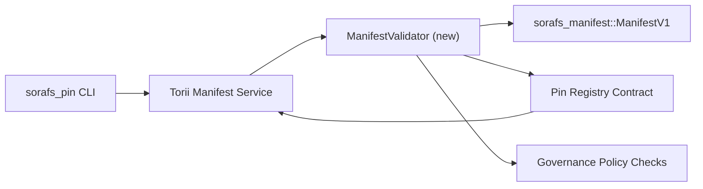

---
id: pin-registry-validation-plan
タイトル: خطة التحقق من マニフェスト في Pin Registry
Sidebar_label: ピン レジストリ
説明: ManifestV1 のピン レジストリ SF-4。
---

:::note ノート
テストは `docs/source/sorafs/pin_registry_validation_plan.md` です。 حافظ على المحاذاة بين الموقعين طالما الوثائق القديمة فعالة。
:::

# خطة التحقق من マニフェスト في Pin Registry (تحضير SF-4)

`sorafs_manifest::ManifestV1` を確認してください。
Pin レジストリの管理 SF-4 ツールの管理
エンコード/デコード。

## ああ

1. マニフェストのチャンク化と封筒の作成
   ありがとうございます。
2. عيد خدمات Torii والبوابات استخدام نفس روتينات التحقق لضمان سلوك حتمي عبر
   ヤステル。
3. マニフェストを作成する
   ありがとうございます。

## ああ

### ああ

- `ManifestValidator` (クレート `sorafs_manifest` او `sorafs_pin`)
  を確認してください。
- Torii エンドポイント gRPC の `SubmitManifest` 評価
  `ManifestValidator` です。
- マニフェストを取得する
  レジストリ。

## いいえ

|ああ |ああ |ああ |ああ |
|------|----------|----------|----------|
| API V1 | `validate_manifest(manifest: &ManifestV1, policy: &PinPolicyInputs) -> Result<(), ValidationError>`、`sorafs_manifest`。 BLAKE3 ダイジェストを検索し、チャンカー レジストリを検索します。 |コアインフラ | ✅ さい | (`validate_chunker_handle`、`validate_pin_policy`、`validate_manifest`) は、`sorafs_manifest::validation` です。 |
|ニュース | ニュースレジストリ (`min_replicas`、نوافذ الانتهاء、ハンドル المسموح بها) を処理します。 |ガバナンス / コアインフラ | SORAFS-215 | ログイン アカウント新規登録
|評価 Torii |回答 Torii؛ Norito を確認してください。 | Torii チーム | مخطط — متابع في SORAFS-216 |
|スタブ عقد المضيف |エントリ ポイント マニフェスト ハッシュ ハッシュログインしてください。 |スマートコントラクトチーム | ✅ さい | `RegisterPinManifest` يستدعي الان المدقق المشترك (`ensure_chunker_handle`/`ensure_pin_policy`) قبل تغيير الحالة وتغطيありがとうございます。 |
|ああ、テストはマニフェストをマニフェストします。 `crates/iroha_core/tests/pin_registry.rs` です。 | QAギルド | 🟠 और देखेंオンチェーンでの接続大事なことは、自分自身のことです。 |
|ああ | تحديث `docs/source/sorafs_architecture_rfc.md` و `migration_roadmap.md` بعد وصول المدقق؛ CLI は `docs/source/sorafs/manifest_pipeline.md` です。 |ドキュメントチーム | DOCS-489 | ニュース

## ああ

- Norito ピン レジストリ (重要: SF-4 ロードマップ)。
- 封筒のチャンカー موقعة من المجلس (تضمن ان التعيين في المدقق حتمي)。
- マニフェスト Torii が表示されます。

## ありがとうございます

|ああ |認証済み | और देखें
|------|-------|----------|
| تفسير سياسة مختلف بين Torii والعقد | قبول غير حتمي. |クレートはオンチェーン + オンチェーンで使用できます。 |
|マニフェストを表示する |ログイン | ログイン貨物基準ダイジェストとマニフェスト。 |
|ログインしてください。 और देखें عريف رموز اخطاء Norito؛ `manifest_pipeline.md`。 |

## और देखें

- バージョン 1: バージョン `ManifestValidator` + バージョン。
- バージョン 2: Torii وتحديث CLI は、バージョン 2 です。
- 3: フックは、フックをフックします。
- 4: エンドツーエンドの移行台帳と移行台帳。

ロードマップとロードマップを確認してください。