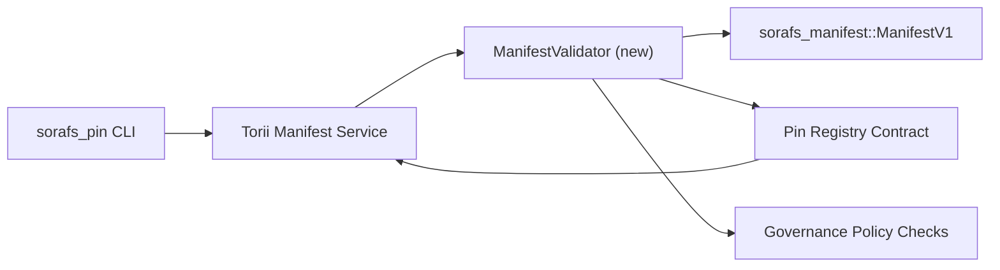

---
id: pin-registry-validation-plan
タイトル: Pin レジストリのマニフェストの検証計画
Sidebar_label: Validacion del Pin レジストリ
説明: ManifestV1 の事前ロールアウトの Pin Registry SF-4 の検証パラレル ゲートを計画します。
---

:::メモ フエンテ カノニカ
エスタページナリフレジャ`docs/source/sorafs/pin_registry_validation_plan.md`。あらゆる活動を記録し、記録を残すことができます。
:::

# Pin レジストリのマニフェスト検証の計画 (Preparacion SF-4)

エステプランは、検証のための統合的な必要性を説明します
`sorafs_manifest::ManifestV1` ピン レジストリ パラレルの将来のコントラト
SF-4 のセキュリティとツールの存在を保証し、論理的に複製します
エンコード/デコード。

## オブジェクト

1. マニフェストの構造をホスト検証し、実行する環境を確認する
   封筒を大量に分割して、受け取った手続きを完了します。
2. Torii はゲートウェイの再利用サービスを失い、検証は失敗しました
   ホストを決定するための準備を整えます。
3. 肯定的/否定的な受け入れに対する統合のラス・プルエバス
   マニフェスト、政治的執行およびエラーに関するテレメトリ。

## アーキテクチュラ

### コンポーネント

- `ManifestValidator` (新しいモジュール法 `sorafs_manifest` または `sorafs_pin`)
  政治の構造と政治のカプセル化。
- Torii エンドポイント gRPC を説明します `SubmitManifest` クエリーラマ
  `ManifestValidator` 再確認前。
- ゲートウェイの取得オプションとミスモ検証の確認
  al cachear nuevos は、レジストリのマニフェストを作成します。

## デグロース デ タレアス

|タレア |説明 |責任者 |エスタード |
|------|---------------|---------------|----------|
| API V1 のエスケレート | Agregar `validate_manifest(manifest: &ManifestV1, policy: &PinPolicyInputs) -> Result<(), ValidationError>` と `sorafs_manifest`。 BLAKE3 のダイジェスト検証とチャンカー レジストリの検索が含まれます。 |コアインフラ | ✅ヘチョ | Los helpers compartidos (`validate_chunker_handle`、`validate_pin_policy`、`validate_manifest`) は、`sorafs_manifest::validation` で生きています。 |
|政治ケーブル | Mapear は、レジストリの政治構成 (`min_replicas`、有効期限、チャンカー許可のハンドル) を検証します。 |ガバナンス / コアインフラ |ペンディエンテ — rastreado en SORAFS-215 |
|インテグレーション Torii | Llamar al validador dentro del envio de manages en Torii; devolver エラー Norito は、事前に構造化されていました。 | Torii チーム | Planificado — ラストレッド en SORAFS-216 |
|コントラートホストのスタブ | Asegurar que elEntrypoint del contrato rechace は、堕落したエルハッシュの検証を明らかにします。エクスポナー・コンタドール・デ・メトリカス。 |スマートコントラクトチーム | ✅ヘチョ | `RegisterPinManifest` アホラは、有効性を検証するための競争 (`ensure_chunker_handle`/`ensure_pin_policy`) は、安全性をテストするために必要な試験を実施します。 |
|テスト | Agregar は、有効性を検証するための単位テスト + 無効なマニフェストを実行する casos trybuild をテストします。 `crates/iroha_core/tests/pin_registry.rs` の統合テスト。 | QAギルド | 🟠進行中 |ロスはオンチェーンでユニタリオス・デル・バリダドール・アテリザロン・ジュント・コン・ロス・レチャソスをテストする。すべての統合を完了するためのスイート。 |
|ドキュメント |実際の `docs/source/sorafs_architecture_rfc.md` と `migration_roadmap.md` は、検証済みの検証結果を表示します。 CLI を使用したドキュメンタリー `docs/source/sorafs/manifest_pipeline.md`。 |ドキュメントチーム |ペンディエンテ — rastreado en DOCS-489 |

## 依存関係

- Norito del Pin レジストリを最終化します (参照: 項目 SF-4 en el ロードマップ)。
- エンベロープ デル チャンカー レジストリ ファームアドス ポル エル コンセホ (アセグラ クエリ エル マッピング デル バリダドール シー デターミニスタ)。
- マニフェストの環境に関する Torii の認証に関する決定。

## リースゴスとミティガシオネス

|リースゴ |インパクト |軽減策 |
|----------|-----------|---------------|
|政治的解釈の相違 Torii と el contrato |アセプタシオンは決定的なものではありません。 |検証と統合テストの比較により、ホストとオンチェーンでの意思決定を比較します。 |
|パフォーマンスの回帰は大きな問題を引き起こす |エンヴィオス マス レントス |地中海経由貨物基準。マニフェストのダイジェストのキャッシュ結果を考慮します。 |
|エラーの発生 |オペラドールの混乱 |エラーコード Norito を定義します。ドキュメンタロス en `manifest_pipeline.md`。 |

## クロノグラマの観察- セマナ 1: テスト `ManifestValidator` + ユニタリオをテストします。
- セマナ 2: Torii でのケーブル接続で、CLI のほとんどの検証エラーが実際に発生します。
- Semana 3: コントラクトの実装フック、統合テストの統合、実際のドキュメント。
- セマナ 4: 移行の元帳とコンセホのキャプチャをエンドツーエンドで確認します。

エステの計画は、有効な管理のためのロードマップを参照してください。