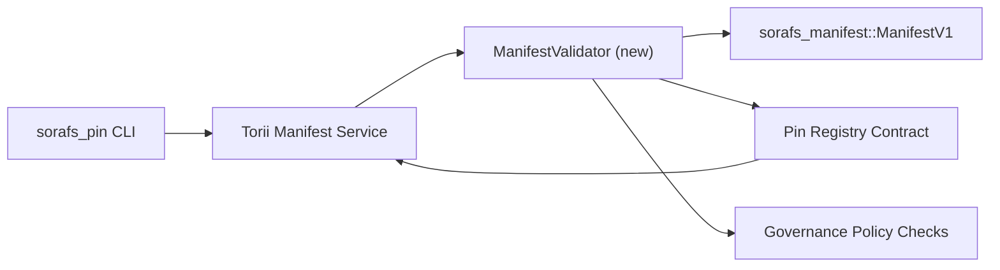

---
id: pin-registry-validation-plan
タイトル: Pin レジストリのマニフェストの検証計画
Sidebar_label: 検証ピン レジストリ
説明: Pin Registry SF-4 のロールアウト前に ManifestV1 の検証を計画します。
---

:::note ソースカノニク
Cette ページは `docs/source/sorafs/pin_registry_validation_plan.md` を参照します。 Gardez les deux emplacements は、ドキュメントの安全性を維持するために有効です。
:::

# Pin レジストリのマニフェスト検証の計画 (SF-4 の準備)

検証の統合を行うために必要な計画を立てる
`sorafs_manifest::ManifestV1` は、ピン レジストリを参照してください
travail SF-4 は、論理的な二重構造のない既存のツールを備えています
エンコード/デコード。

## 目的

1. マニフェストの構造を検証する方法
   チャンキングと封筒の管理に関する事前承認のプロファイル
   提案。
2. Torii およびサービス ゲートウェイの検証ルーチンの再利用
   保証金を保証して、最終的な準備を整えてください。
3. 受容を受け入れるために、統合のテストと否定のテストを行う
   マニフェスト、政治および政治的問題の適用。

## アーキテクチャ

### 成分

- `ManifestValidator` (ルクレート `sorafs_manifest` または `sorafs_pin` のヌーボー モジュール)
  構造の制御と政治の門をカプセル化します。
- Torii エンドポイント gRPC を公開する `SubmitManifest` 異議申し立て
  `ManifestValidator` 高度な通信機能。
- ゲートウェイのオプションをフェッチする方法、コンソマー、ミームの検証を行う
  lors de la mise en cache de nouveaux は depuis le レジストリをマニフェストします。

## デコパージュ デ ターシュ

|ターシュ |説明 |オーナー |法令 |
|------|-------------|------|----------|
| Squelette API V1 |アジョター `validate_manifest(manifest: &ManifestV1, policy: &PinPolicyInputs) -> Result<(), ValidationError>` から `sorafs_manifest`。 BLAKE3 のダイジェストの検証とチャンカー レジストリの検索を含めます。 |コアインフラ | ✅ テルミネ |ヘルパー パルタージェ (`validate_chunker_handle`、`validate_pin_policy`、`validate_manifest`) は、`sorafs_manifest::validation` での解決策です。 |
|政治家 | 政治家レジストリの政治構成のマッパー (`min_replicas`、有効期限の設定、チャンカーの自動処理のハンドル) と検証のエントリ。 |ガバナンス / コアインフラ | En attente — スイヴィ ダン SORAFS-215 |
|統合 Torii | Appeler le validateur dans le chemin de soumission Torii ;エラー Norito の構造を報告します。 | Torii チーム | Planifié — SORAFS-216 によるスイビ |
|スタブ コントラ コート オテ |検証のハッシュを要求するマニフェストを保証します。測定基準を暴露する者。 |スマートコントラクトチーム | ✅ テルミネ | `RegisterPinManifest` 検査結果の検証 (`ensure_chunker_handle`/`ensure_pin_policy`) を呼び出して、検査結果の検査を開始します。 |
|テスト | Ajouter des test unaires pour le validateur + des cas trybuild pour manifests valides ; `crates/iroha_core/tests/pin_registry.rs` による統合テスト。 | QAギルド | 🟠 アンクール |オンチェーンでのテスト単位の検証。 la suite d'intégration complète reste en attente。 |
|ドキュメント |時間内に `docs/source/sorafs_architecture_rfc.md` および `migration_roadmap.md` を検証する必要があります。 CLI の使用法を文書化して `docs/source/sorafs/manifest_pipeline.md` にします。 |ドキュメントチーム | En attente — スイヴィ ダン DOCS-489 |

## 依存関係

- スキーマ Norito デュ ピン レジストリの最終化 (参照: ロードマップの項目 SF-4)。
- チャンカー レジストリの署名を管理するエンベロープ (検証のマッピング決定を保証する)。
- マニフェストの承認 Torii の決定。

## リスクと緩和策

|きわどい |影響 |緩和 |
|----------|----------|---------------|
|政治的観点からの解釈の相違 Torii et le contrat |受け入れは決定的ではありません。 |検証とオンチェーンの決定を比較するための、検証とテストの統合を検討します。 |
|全体的なマニフェストによるパフォーマンスの回帰 |交通費とレント |貨物基準によるベンチマーカー。ダイジェストマニフェストの結果をキャッシュすることを検討します。 |
|エラーメッセージを受け取る |混乱オペレーター |コードの定義 Norito ; `manifest_pipeline.md` のドキュメント。 |

## シブル・ド・カランドリエ- セメイン 1 : livrer le squelette `ManifestValidator` + ユニットをテストします。
- セメイン 2 : Torii のケーブルを使用して、定期的に CLI を実行し、検証のエラーを報告します。
- セメイン 3 : フックの実装、統合のテスト、ドキュメントの管理。
- セメイン 4 : 移行台帳のエンドツーエンドの繰り返し実行者、承認の取得者。

ロードマップを参照して検証を行う計画を立てます。