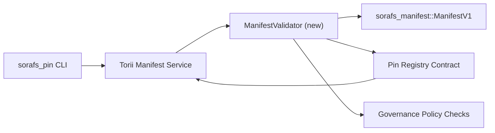

---
id: pin-registry-validation-plan
lang: ja
direction: ltr
source: docs/portal/docs/sorafs/pin-registry-validation-plan.md
status: complete
generator: docs/portal/scripts/sync-i18n.mjs
---

:::note 正規ソース
このページは `docs/source/sorafs/pin_registry_validation_plan.md` を反映しています。レガシー文書が有効な間は両方を同期してください。
:::

# Pin Registry Manifest 検証計画 (SF-4 準備)

この計画は、`sorafs_manifest::ManifestV1` の検証を今後の Pin Registry コントラクトへ
組み込むために必要な手順を示します。SF-4 の作業が既存 tooling を土台にでき、
encode/decode ロジックを重複させないことが狙いです。

## 目標

1. ホスト側の submission パスは、提案を受け付ける前に manifest 構造、chunking
   プロファイル、ガバナンス envelope を検証する。
2. Torii と gateway サービスは同一の検証ルーチンを再利用し、ホスト間での
   決定論的挙動を保証する。
3. 統合テストは、manifest 受理、ポリシー enforcement、エラーテレメトリの
   正負ケースをカバーする。

## アーキテクチャ

### コンポーネント

- `ManifestValidator` (新規モジュール。`sorafs_manifest` または `sorafs_pin` crate)
  が構造チェックとポリシーゲートを内包。
- Torii は gRPC endpoint `SubmitManifest` を公開し、コントラクトへ渡す前に
  `ManifestValidator` を呼び出す。
- gateway の fetch パスは、registry から新しい manifests をキャッシュする際に
  同じバリデータをオプションで利用する。

## タスク分解

| タスク | 説明 | Owner | Status |
|-------|------|-------|--------|
| V1 API スケルトン | `sorafs_manifest` に `validate_manifest(manifest: &ManifestV1, policy: &PinPolicyInputs) -> Result<(), ValidationError>` を追加。BLAKE3 digest 検証と chunker registry lookup を含める。 | Core Infra | ✅ 完了 | 共有 helpers (`validate_chunker_handle`, `validate_pin_policy`, `validate_manifest`) は `sorafs_manifest::validation` に配置済み。 |
| ポリシー配線 | registry ポリシー設定 (`min_replicas`, 期限ウィンドウ, 許可 chunker handles) を検証入力にマッピング。 | Governance / Core Infra | Pending — SORAFS-215 で追跡 |
| Torii 統合 | Torii の submission パス内でバリデータを呼び出し、失敗時は構造化 Norito エラーを返す。 | Torii Team | Planned — SORAFS-216 で追跡 |
| ホスト側コントラクト stub | コントラクト entrypoint が検証ハッシュに失敗した manifests を拒否することを保証し、メトリクスカウンタを公開。 | Smart Contract Team | ✅ 完了 | `RegisterPinManifest` は状態変更前に共有バリデータ (`ensure_chunker_handle`/`ensure_pin_policy`) を呼び出し、unit tests で失敗ケースをカバー。 |
| テスト | バリデータの unit tests + 不正 manifest の trybuild ケースを追加。`crates/iroha_core/tests/pin_registry.rs` に統合テストを追加。 | QA Guild | 🟠 進行中 | バリデータ unit tests は on-chain 拒否テストと一緒に着地。統合スイートは未完了。 |
| Docs | `docs/source/sorafs_architecture_rfc.md` と `migration_roadmap.md` を更新し、`docs/source/sorafs/manifest_pipeline.md` に CLI 利用を記載。 | Docs Team | Pending — DOCS-489 で追跡 |

## 依存関係

- Pin Registry Norito スキーマの最終化 (roadmap の SF-4 項目参照)。
- Council 署名済み chunker registry envelopes (バリデータのマッピングを決定論的にする)。
- Manifest submission に関する Torii 認証方針の決定。

## リスクと緩和

| リスク | 影響 | 緩和 |
|-------|------|------|
| Torii とコントラクト間のポリシー解釈の差異 | 非決定的な受理。 | 検証 crate を共有し、host vs on-chain の判定を比較する統合テストを追加。 |
| 大きな manifests での性能劣化 | submission が遅くなる | cargo criterion でベンチマークし、manifest digest 結果のキャッシュを検討。 |
| エラーメッセージのドリフト | オペレータの混乱 | Norito エラーコードを定義し、`manifest_pipeline.md` に記載。 |

## タイムライン目標

- Week 1: `ManifestValidator` スケルトン + unit tests を着地。
- Week 2: Torii submission パスを配線し、CLI で検証エラーを表示。
- Week 3: コントラクト hooks を実装し、統合テストを追加、docs 更新。
- Week 4: migration ledger エントリ付きの end-to-end リハーサルを実施し、評議会の承認を取得。

この計画はバリデータ作業が始まった時点で roadmap から参照されます。
