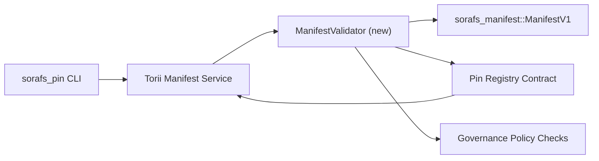

---
id: pin-registry-validation-plan
タイトル: Pin レジストリのマニフェストを検証する計画
Sidebar_label: Validacao do Pin レジストリ
説明: Pin Registry SF-4 をロールアウトする前に、ManifestV1 の検証を計画します。
---

:::note フォンテ カノニカ
エスタ・ページナ・エスペルハ`docs/source/sorafs/pin_registry_validation_plan.md`。 Mantenha ambos os locais alinhados enquanto a documentacao herdada permanecer ativa.
:::

# Pin レジストリをマニフェストで検証する計画 (Preparacao SF-4)

エステ プランは、必要なすべての機能を有効にします。
`sorafs_manifest::ManifestV1` ピン レジストリ パラメータに将来のコントラトがありません
SF-4 SE ベースのトラバルホには、論理的な重複したツールは存在しません
エンコード/デコード。

## オブジェクト

1. ホストの検証が行われていない、または実行されていないことを確認する
   政府の提案を行う前に、OS 封筒をチャンク化します。
2. Torii ゲートウェイのサービスは、検証用のメスとして再利用されます
   ホストの決定性を保証します。
3. 安全性に関する陽性/陰性の精巣統合機能
   マニフェスト、政治的執行およびエロティックなテレメトリ。

## アーキテトゥーラ

### コンポーネント

- `ManifestValidator` (ノボモジュロなしクレート `sorafs_manifest` または `sorafs_pin`)
  カプセル化は構造と政治の門をチェックします。
- Torii エンドポイント gRPC を公開 `SubmitManifest` クエリ チャマ
  `ManifestValidator` アンテ・デ・エンカミンハール・アオ・コントラト。
- ゲートウェイのフェッチを実行するために必要なオプションを取得し、有効なメッセージを送信します
  cachear novos は、vindos do レジストリをマニフェストします。

## デスドブラメント デ タレファス

|タレファ |説明 |返信 |ステータス |
|----------|----------|---------------|----------|
| API V1 のエスケレート | `validate_manifest(manifest: &ManifestV1, policy: &PinPolicyInputs) -> Result<(), ValidationError>` と `sorafs_manifest` を追加します。 BLAKE3 ダイジェストの検証とチャンカー レジストリの検索が含まれます。 |コアインフラ |結論 |ヘルパーは、`validate_chunker_handle`、`validate_chunker_handle`、`validate_pin_policy`、`validate_manifest`) と `sorafs_manifest::validation` を比較します。 |
|政治の配線 |レジストリ (`min_replicas`、期限切れ、チャンカー許可のハンドル) を有効なエントリとしてマップします。 |ガバナンス / コアインフラ |ペンダント - ラストレッド em SORAFS-215 |
|インテグラカオ Torii | Chamar o validador no caminho de submissao Torii; Retornar erros Norito estruturados em falhas。 | Torii チーム | Planejado - ラストレッド em SORAFS-216 |
|コントラートホストのスタブ |エントリポイントは、ハッシュ デ バリダカオのないファルハムを明示します。コンタドール デ メトリカスをエクスポートします。 |スマートコントラクトチーム |結論 | `RegisterPinManifest` は、検証と比較を行う前に (`ensure_chunker_handle`/`ensure_pin_policy`) テストを開始し、テストを行う必要があります。 |
|テスト | Adicionar testes unitarios para o validador + casos trybuild para マニフェスト無効。精巣統合性`crates/iroha_core/tests/pin_registry.rs`。 | QAギルド | Em進行形 | Os testes unitarios は、オンチェーンで検証を行います。セグエペンデンテを完全に統合したスイート。 |
|ドキュメント | Atualizar `docs/source/sorafs_architecture_rfc.md` と `migration_roadmap.md` Quando または validador chegar; CLI em `docs/source/sorafs/manifest_pipeline.md` のドキュメンタリーを使用します。 |ドキュメントチーム |ペンダント - ラストレド em DOCS-489 |

## 依存関係

- Norito の Pin レジストリを終了します (参照: 項目 SF-4 ロードマップなし)。
- エンベロープはチャンカー レジストリ assinados pelo conselho (garante Mapeamento deterministico do validador) を実行します。
- マニフェストの提出に関する Torii の認証を決定します。

## リスクとリスク

|リスコ |インパクト |ミティガカオ |
|----------|-----------|----------|
| Torii e o contrato | 政治的解釈の相違 | Aceitacao nao deterministica。 |ホストとオンチェーンを比較して、検証結果と統合テストの比較を決定します。 |
|盛大なパフォーマンスを実現するための回帰 |提出してください |地中海経由貨物基準。マニフェストのダイジェストのキャッシュ結果を考慮します。 |
|デリーバ・デ・メンサーゲン・デ・エロ |コンフサオ・ド・オペラドール |コード Norito を定義します。ドキュメンタリー映画 `manifest_pipeline.md`。 |

## メタス デ クロノグラマ

- セマナ 1: entregar o esqueleto `ManifestValidator` + 精巣ユニタリオス。
- セマナ 2: Torii を実行して、検証エラーをエクスポートするための CLI の統合。
- Semana 3: フックの実装、コントラト、追加テスト、統合ドキュメント、およびドキュメント。
- Semana 4: エンドツーエンドの通信は必要ありません。移行台帳やキャプチャーは必要ありません。エステプラノセラレファレンシアドは、バリダドールカムカーを行うためのロードマップはありません。