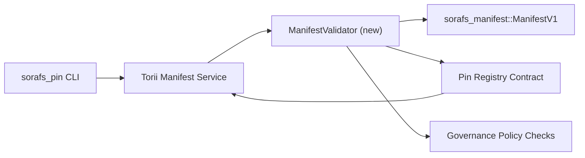

---
id: pin-registry-validation-plan
タイトル: План валидации マニフェスト для Pin レジストリ
Sidebar_label: Валидация Pin レジストリ
説明: ManifestV1 のロールアウト Pin Registry SF-4 をゲートします。
---

:::note Канонический источник
Эта страница отражает `docs/source/sorafs/pin_registry_validation_plan.md`. жержите оба расположения согласованными, пока наследственная документация остается активной.
:::

# План валидации マニフェスト для Pin Registry (Подготовка SF-4)

Этот план описывает заги, необходимые для подключения валидации
`sorafs_manifest::ManifestV1` のピン レジストリ、SF-4 のピン レジストリ
エンコード/デコードに必要なツールを提供します。

## Цели

1. Путь отправки на стороне хоста проверяет структуру マニフェスト、профиль
   チャンキングとガバナンス エンベロープがわかります。
2. Torii およびゲートウェイは、ゲートウェイにアクセスできます。
   детерминированного поведения между хостами.
3. Интеграционные тесты покрывают позитивные/негативные кейсы принятия
   マニフェスト、強制執行。

## Архитектура

### Компоненты

- `ManifestValidator` (クレート `sorafs_manifest` または `sorafs_pin`)
  ポリシー ゲートとセキュリティ ゲート。
- Torii открывает gRPC エンドポイント `SubmitManifest`、который вызывает
  `ManifestValidator` が表示されます。
- ゲートウェイフェッチを実行して、ファイルを取得します。
  кезировании новых マニフェスト из レジストリ。

## Разбиение задач

| Задача | Описание | Владелец | Статус |
|----------|----------|----------|----------|
| Скелет API V1 | `validate_manifest(manifest: &ManifestV1, policy: &PinPolicyInputs) -> Result<(), ValidationError>` と `sorafs_manifest` を確認してください。 BLAKE3 ダイジェストとチャンカー レジストリの検索を行います。 |コアインフラ | ✅ Сделано |ヘルパー (`validate_chunker_handle`、`validate_pin_policy`、`validate_manifest`) が `sorafs_manifest::validation` に対応します。 |
| Подключение политики |レジストリ (`min_replicas`、チャンカー ハンドル、チャンカー ハンドル) を確認します。 |ガバナンス / コアインフラ | В ожидании — отслеживается в SORAFS-215 |
| Интеграция Torii |送信 Torii; Norito を確認してください。 | Torii チーム | Запланировано — отслеживается в SORAFS-216 |
| Заглузка контракта на хосте | Убедиться、что エントリポイント контракта отклоняет マニフェスト、не продиться、что entrypoint контракта отклоняет マニフェスト、не продиться、что entrypoint контракта отклоняет не продиться、что entrypoint контракта отклоняет マニフェスト。 Ѝкспонировать счетчики метрик。 |スマートコントラクトチーム | ✅ Сделано | `RegisterPinManifest` のテスト (`ensure_chunker_handle`/`ensure_pin_policy`) のテスト、および単体テストСокрывают случаи отказа. |
| Тесты |単体テスト для валидатора + trybuild кейсы для некорректных マニフェスト; `crates/iroha_core/tests/pin_registry.rs` を参照してください。 | QAギルド | 🟠 В процессе |単体テストはオンチェーンで実行されます。スイートに位置します。 |
| Документация | `docs/source/sorafs_architecture_rfc.md` と `migration_roadmap.md` が表示されます。 CLI と `docs/source/sorafs/manifest_pipeline.md` を接続します。 |ドキュメントチーム | В ожидании — отслеживается в DOCS-489 |

## Зависимости

- Norito ピン レジストリ (参照: SF-4 とロードマップ)。
- 評議会エンベロープとチャンカー レジストリ (гарантируют детерминированное сопоставление в валидаторе)。
- Резения по аутентификации Torii 日の提出マニフェスト。

## Риски и меры

| Риск | Влияние | Митигирование |
|------|------|------|
| Разная интерпретация политики между Torii и контрактом | Недетерминированное принятие。 |クレートをクレート + ホストとオンチェーンで比較します。 |
|マニフェストの производительности для бользих |提出方法 | Бенчмарк через 貨物基準。ダイジェスト マニフェストを参照してください。 |
| Дрейф сообщений об осибках | Путаница у операторов | Определить коды олибок Norito; `manifest_pipeline.md` を参照してください。 |

## Цели по времени

- 例 1: `ManifestValidator` + 単体テストを実行します。
- 手順 2: Torii を送信し、CLI を実行してください。
- バージョン 3: フック、ドキュメント、およびドキュメントを参照してください。
- バージョン 4: エンドツーエンドの移行台帳と移行元帳の統合。

ロードマップを確認してください。