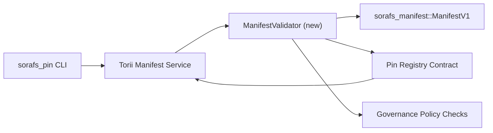

---
id: pin-registry-validation-plan
タイトル: Pin レジストリのマニフェスト توثیقی منصوبہ بندی
Sidebar_label: レジストリをピン留めする
説明: SF-4 Pin Registry のロールアウト、ManifestV1 のゲート制御、および منصوبہ۔
---

:::note メモ
یہ صفحہ `docs/source/sorafs/pin_registry_validation_plan.md` کی عکاسی کرتا ہے۔ جب تک پرانی دستاویزات فعال ہیں دونوں مقامات کو ہم آہنگ رکھیں۔
:::

# Pin レジストリ マニフェスト検証計画 (SF-4 準備)

یہ منصوبہ وہ اقدامات بیان کرتا ہے جو `sorafs_manifest::ManifestV1` کی توثیق کو
ピン レジストリ کنٹریکٹ میں جوڑنے کے لیے درکار ہیں تاکہ SF-4 کا کام
ツールのエンコード/デコードの実行

## 大事

1. ホスト側の提出マニフェスト、チャンキング プロファイル、ガバナンス
   封筒 プロポーズ قبول کرنے سے پہلے 確認 کرتے ہیں۔
2. Torii ゲートウェイの検証ルーチンの検証ルーチン
   ホストの決定論的な動作
3. 統合テストのテスト/テスト、マニフェストの受け入れ、テスト
   ポリシーの施行、エラー テレメトリ、および

## アーキテクチャ

### コンポーネント

- `ManifestValidator` (`sorafs_manifest` یا `sorafs_pin` クレート میں نیا ماڈیول)
  ポリシー ゲートをカプセル化する
- Torii gRPC エンドポイント `SubmitManifest` 転送を公開します
  سے پہلے `ManifestValidator` کو کال کرتا ہے۔
- ゲートウェイフェッチパス (オプション) バリデーター、レジストリー、レジストリ
  マニフェスト キャッシュ

## タスクの内訳

|タスク |説明 |オーナー |ステータス |
|------|-------------|------|----------|
| V1 API スケルトン | `sorafs_manifest` すごい `validate_manifest(manifest: &ManifestV1, policy: &PinPolicyInputs) -> Result<(), ValidationError>` すごいBLAKE3 ダイジェスト検証、チャンカー レジストリ検索の実行|コアインフラ | ✅ 完了 |ヘルパー (`validate_chunker_handle`、`validate_pin_policy`、`validate_manifest`) および `sorafs_manifest::validation` میں ہیں۔ |
|ポリシーの配線 |レジストリ ポリシー設定 (`min_replicas`、有効期限ウィンドウ、許可されたチャンカー ハンドル) 検証入力とマップ|ガバナンス / コアインフラ |保留中 — SORAFS-215 میں ٹریکڈ |
| Torii 統合 | Torii 送信パス テスト バリデーター テスト障害 構造化 Norito エラー واپس کریں۔ | Torii チーム |計画中 — SORAFS-216 میں ٹریکڈ |
|ホスト契約スタブ |契約のエントリーポイント マニフェスト拒否 検証ハッシュ 失敗 契約のエントリポイントメトリクス カウンター|スマートコントラクトチーム | ✅ 完了 | `RegisterPinManifest` 状態の変更 共有バリデータ (`ensure_chunker_handle`/`ensure_pin_policy`) 単体テストの失敗例 単体テストの失敗例|
|テスト |バリデータ 単体テスト + 無効なマニフェスト Trybuild ケース`crates/iroha_core/tests/pin_registry.rs` 統合テストのテスト| QAギルド | 🟠 進行中 |バリデータ単体テスト オンチェーン拒否テスト統合スイート 統合スイート|
|ドキュメント |バリデーター آنے کے بعد `docs/source/sorafs_architecture_rfc.md` اور `migration_roadmap.md` اپڈیٹ کریں؛ CLI は `docs/source/sorafs/manifest_pipeline.md` を実行します。 |ドキュメントチーム |保留中 — DOCS-489 ٹریکڈ |

## 依存関係

- ピン レジストリ Norito スキーマ (参照: ロードマップ SF-4 の図)۔
- 評議会が署名したチャンカー レジストリ エンベロープ (バリデータ マッピング、決定論的手法)۔
- マニフェストの提出 فیصلے۔ Torii 認証 فیصلے۔

## リスクと軽減策

|リスク |影響 |緩和 |
|------|--------|-----------|
| Torii セキュリティ ポリシーの解釈 セキュリティ | Torii非決定的な受け入れ|検証クレート + ホスト vs オンチェーン 統合テスト 統合テスト|
|パフォーマンスの回帰を明らかにします。提出する貨物基準 ベンチマークマニフェスト ダイジェスト結果キャッシュ|
|エラー メッセージのドリフト |演算子Norito エラー コードは次のとおりです`manifest_pipeline.md` ドキュメント ٩ریں۔ |

## タイムラインのターゲット

- 1 週目: `ManifestValidator` スケルトン + 単体テスト
- 2 週目: Torii サブミット パス ワイヤ کریں اور CLI کو 検証エラー دکھانے کے لیے اپڈیٹ کریں۔
- 3 週目: コントラクトフックは統合テストを実装します。
- 第 4 週: 移行台帳の入力、エンドツーエンドのリハーサル、評議会の承認、および承認

یہ منصوبہ validator کام شروع ہونے کے بعد ロードマップ میں حوالہ دیا جائے گا۔