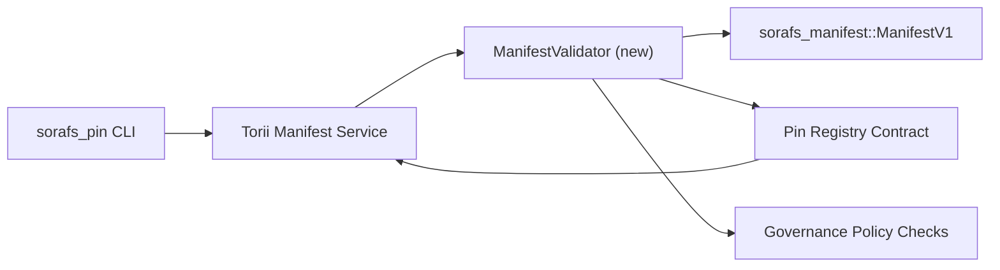

:::შენიშვნა კანონიკური წყარო
:::

# Pin Registry Manifest Validation Plan (SF-4 მოსამზადებელი)

ეს გეგმა ასახავს `sorafs_manifest::ManifestV1` ძაფისთვის საჭირო ნაბიჯებს
დადასტურება მომავალი პინის რეესტრის კონტრაქტში, რათა SF-4 მუშაობა შეძლოს
დაეყრდნონ არსებულ ინსტრუმენტებს კოდირების/გაშიფვრის ლოგიკის დუბლირების გარეშე.

## გოლები

1. მასპინძლის მხარის წარდგენის ბილიკები ამოწმებს მანიფესტის სტრუქტურას, ბლოკირების პროფილს და
   მმართველობის კონვერტები წინადადებების მიღებამდე.
2. Torii და კარიბჭის სერვისები ხელახლა იყენებენ ვალიდაციის იმავე რუტინას, რათა უზრუნველყონ
   დეტერმინისტული ქცევა მასპინძლებს შორის.
3. ინტეგრაციის ტესტები მოიცავს დადებით/უარყოფით შემთხვევებს აშკარა მიღებისთვის,
   პოლიტიკის აღსრულება და შეცდომების ტელემეტრია.

## არქიტექტურა

### კომპონენტები

- `ManifestValidator` (ახალი მოდული `sorafs_manifest` ან `sorafs_pin` ყუთში)
  აერთიანებს სტრუქტურულ შემოწმებებს და პოლიტიკის კარიბჭეებს.
- Torii ავლენს gRPC საბოლოო წერტილს `SubmitManifest`, რომელიც რეკავს
  `ManifestValidator` კონტრაქტზე გადაგზავნამდე.
- კარიბჭის გამოტანის გზა სურვილისამებრ მოიხმარს იმავე ვალიდატორს ახლის ქეშირებისას
  გამოიხატება რეესტრიდან.

## დავალების დაშლა

| ამოცანა | აღწერა | მფლობელი | სტატუსი |
|------|-------------|-------|--------|
| V1 API ჩონჩხი | დაამატეთ `validate_manifest(manifest: &ManifestV1, policy: &PinPolicyInputs) -> Result<(), ValidationError>` `sorafs_manifest`-ს. ჩართეთ BLAKE3 დაიჯესტის გადამოწმება და ბლოკის რეესტრის ძიება. | ძირითადი ინფრა | ✅ შესრულებულია | საერთო დამხმარეები (`validate_chunker_handle`, `validate_pin_policy`, `validate_manifest`) ახლა ცხოვრობენ `sorafs_manifest::validation`-ში. |
| პოლიტიკის გაყვანილობა | რუკის რეესტრის პოლიტიკის კონფიგურაცია (`min_replicas`, ვადის გასვლის ფანჯრები, ნებადართული chunker სახელურები) ვალიდაციის შეყვანებში. | მმართველობა / ძირითადი ინფრა | მომლოდინე — თვალყურის დევნება SORAFS-215 |
| Torii ინტეგრაცია | გამოძახების ვალიდატორი Torii მანიფესტის წარდგენის გზაზე; დააბრუნეთ სტრუქტურირებული Norito შეცდომები წარუმატებლობისას. | Torii გუნდი | დაგეგმილი — თვალყურის დევნება SORAFS-216 |
| მასპინძლის კონტრაქტის ნამუშევარი | დარწმუნდით, რომ ხელშეკრულების შესვლის წერტილი უარყოფს მანიფესტებს, რომლებიც ვერ ახერხებენ ვალიდაციის ჰეშს; მეტრიკის მრიცხველების გამოვლენა. | Smart Contract Team | ✅ შესრულებულია | `RegisterPinManifest` ახლა გამოიძახებს გაზიარებულ ვალიდატორს (`ensure_chunker_handle`/`ensure_pin_policy`) მანამ, სანამ მუტაციის მდგომარეობა და ერთეული ტესტები დაფარავს წარუმატებლობის შემთხვევებს. |
| ტესტები | დაამატეთ ერთეულების ტესტები ვალიდატორისთვის + trybuild შემთხვევები არასწორი მანიფესტებისთვის; ინტეგრაციის ტესტები `crates/iroha_core/tests/pin_registry.rs`-ში. | QA გილდია | 🟠 მიმდინარეობს | დამადასტურებელი ერთეულის ტესტები დაეშვა ჯაჭვზე უარყოფის ტესტებთან ერთად; სრული ინტეგრაციის კომპლექტი ჯერ კიდევ მოლოდინშია. |
| დოკუმენტები | განაახლეთ `docs/source/sorafs_architecture_rfc.md` და `migration_roadmap.md`, როგორც კი ვალიდიატორი დაეშვება; დოკუმენტი CLI გამოყენების `docs/source/sorafs/manifest_pipeline.md`. | Docs გუნდი | მომლოდინე — თვალყურის დევნება DOCS-489-ში |

## დამოკიდებულებები

- Pin Registry Norito სქემის დასრულება (რეფერატი: SF-4 პუნქტი საგზაო რუკაში).
- საბჭოს მიერ ხელმოწერილი chunker რეესტრის კონვერტები (უზრუნველყოფს ვალიდატორის რუკების არსებობას
  განმსაზღვრელი).
- Torii ავთენტიფიკაციის გადაწყვეტილებები მანიფესტის წარდგენისთვის.

## რისკები და შერბილებები

| რისკი | ზემოქმედება | შერბილება |
|------|--------|------------|
| განსხვავებული პოლიტიკის ინტერპრეტაცია Torii-სა და კონტრაქტს შორის | არადეტერმინისტული მიღება. | გააზიარეთ ვალიდაციის ყუთი + დაამატეთ ინტეგრაციის ტესტები, რომლებიც ადარებენ მასპინძელს და ჯაჭვურ გადაწყვეტილებებს. |
| შესრულების რეგრესია დიდი მანიფესტებისთვის | ნელი წარდგენა | საორიენტაციო კრიტერიუმი ტვირთის მეშვეობით; განიხილეთ მანიფესტის დაიჯესტის შედეგების ქეშირება. |
| შეცდომის შეტყობინებების drift | ოპერატორის დაბნეულობა | განსაზღვრეთ Norito შეცდომის კოდები; დააფიქსირეთ ისინი `manifest_pipeline.md`-ში. |

## ქრონოლოგიის მიზნები

- კვირა 1: მიწის `ManifestValidator` ჩონჩხი + ერთეული ტესტები.
- კვირა 2: მავთულის Torii წარდგენის გზა და განაახლეთ CLI ზედაპირული ვალიდაციის შეცდომებზე.
- კვირა 3: განახორციელეთ კონტრაქტის კაკვები, დაამატეთ ინტეგრაციის ტესტები, განაახლეთ დოკუმენტები.
- კვირა 4: გაიარეთ რეპეტიცია მიგრაციის წიგნის ჩანაწერთან ერთად, დაარეგისტრირეთ საბჭოს ხელმოწერა.

ეს გეგმა მითითებული იქნება საგზაო რუკაში, როგორც კი დაიწყება ვალიდატორის მუშაობა.