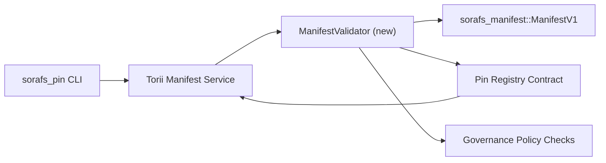

:::ескерту Канондық дереккөз
:::

# Pin тізілімінің манифестін тексеру жоспары (SF-4 дайындық)

Бұл жоспарда `sorafs_manifest::ManifestV1` ағыны үшін қажетті қадамдар көрсетілген
SF-4 жұмыс істей алуы үшін алдағы Pin Registry келісім-шартына растау
кодтау/декодтау логикасын қайталамай, бар құралды құрастырыңыз.

## Мақсаттар

1. Хост тарапынан жіберу жолдары манифест құрылымын, бөлшектеу профилін және
   ұсыныстарды қабылдағанға дейін басқару конверттері.
2. Torii және шлюз қызметтері қамтамасыз ету үшін бірдей тексеру процедураларын қайта пайдаланады.
   хосттар арасындағы детерминистік мінез-құлық.
3. Интеграциялық сынақтар айқын қабылдау үшін оң/теріс жағдайларды қамтиды,
   саясатты орындау және қате телеметрия.

## Архитектура

### Құрамдас бөліктер

- `ManifestValidator` (`sorafs_manifest` немесе `sorafs_pin` жәшігіндегі жаңа модуль)
  құрылымдық тексерулер мен саясат қақпаларын қамтиды.
- Torii шақыратын gRPC соңғы нүктесі `SubmitManifest` көрсетеді
  `ManifestValidator` келісім-шартқа жіберу алдында.
- Шлюзді алу жолы жаңа кэштеу кезінде бірдей валидаторды міндетті түрде тұтынады
  тізілімнен көрсетіледі.

## Тапсырмаларды бөлу

| Тапсырма | Сипаттама | Иесі | Күй |
|------|-------------|-------|--------|
| V1 API қаңқасы | `validate_manifest(manifest: &ManifestV1, policy: &PinPolicyInputs) -> Result<(), ValidationError>` `sorafs_manifest` ішіне қосыңыз. BLAKE3 дайджест тексеруін және chunker тізілімін іздеуді қосыңыз. | Core Infra | ✅ Орындалды | Ортақ көмекшілер (`validate_chunker_handle`, `validate_pin_policy`, `validate_manifest`) қазір `sorafs_manifest::validation` ішінде тұрады. |
| Саясат сымдары | Тіркеу саясаты конфигурациясын (`min_replicas`, жарамдылық терезелері, рұқсат етілген chunker дескрипторлары) тексеру кірістеріне салыңыз. | Басқару / Негізгі инфра | Күтуде — SORAFS-215 | ішінде бақыланады
| Torii интеграциясы | Torii манифест жіберу жолындағы валидаторға қоңырау шалыңыз; сәтсіздікке байланысты құрылымдық Norito қателерін қайтару. | Torii командасы | Жоспарланған — SORAFS-216 |
| Негізгі келісім-шарттар | Келісім-шарттың кіру нүктесінің валидация хэші орындалмаған манифесттерді қабылдамайтынына көз жеткізіңіз; метрикалық есептегіштерді көрсету. | Smart Contract Team | ✅ Орындалды | `RegisterPinManifest` енді мутация күйі мен бірлік сынақтары сәтсіздік жағдайларын қамтитынға дейін ортақ валидаторды (`ensure_chunker_handle`/`ensure_pin_policy`) шақырады. |
| Тесттер | Жарамсыз манифесттер үшін валидатор + trybuild жағдайлары үшін бірлік сынақтарын қосыңыз; `crates/iroha_core/tests/pin_registry.rs` ішіндегі интеграциялық сынақтар. | QA гильдиясы | 🟠 Орындалуда | Валидатор блогының сынақтары тізбектегі қабылдамау сынақтарымен қатар орнатылды; толық интеграциялық жинақ әлі күтілуде. |
| Құжаттар | Валидатор қонғаннан кейін `docs/source/sorafs_architecture_rfc.md` және `migration_roadmap.md` жаңартулары; `docs/source/sorafs/manifest_pipeline.md` ішінде CLI пайдалану құжаты. | Docs Team | Күтуде — DOCS-489 | ішінде бақыланады

## Тәуелділіктер

- Pin Registry Norito схемасын аяқтау (сілт: жол картасындағы SF-4 тармағы).
- Кеңес қол қойған chunker тізілімінің конверттері (валидаторды салыстыруды қамтамасыз етеді
  детерминистік).
- Манифест жіберу үшін Torii аутентификация шешімдері.

## Тәуекелдер және азайту шаралары

| Тәуекел | Әсері | Жеңілдету |
|------|--------|------------|
| Torii және келісім-шарт | арасындағы дивергентті саясатты түсіндіру Детерминирленген емес қабылдау. | Тексеру жәшігін бөлісіңіз + хост пен тізбектегі шешімдерді салыстыратын біріктіру сынақтарын қосыңыз. |
| Үлкен манифесттер үшін өнімділік регрессиясы | Баяу тапсыру | Жүк критериі арқылы салыстыру; манифест дайджест нәтижелерін кэштеуді қарастырыңыз. |
| Қате хабарларының дрейфі | Оператордың шатасуы | Norito қате кодтарын анықтаңыз; оларды `manifest_pipeline.md` құжаттаңыз. |

## Уақыт шкаласы мақсаттары

- 1-апта: Land `ManifestValidator` қаңқасы + бірлік сынақтары.
- 2-апта: Torii жіберу жолын жалғаңыз және CLI-ді тексеру қателеріне дейін жаңартыңыз.
- 3-апта: келісім-шарт ілмектерін іске қосыңыз, интеграция сынақтарын қосыңыз, құжаттарды жаңартыңыз.
- 4-апта: көші-қон кітабын енгізу, кеңеске қол қою арқылы репетицияны аяқтаңыз.

Бұл жоспар валидатор жұмысы басталғаннан кейін жол картасында сілтеме жасалады.