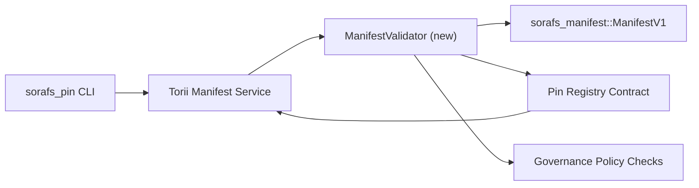

::: Каноник эх сурвалжийг анхаарна уу
:::

# Бүртгэлийн манифест баталгаажуулалтын төлөвлөгөө (SF-4 бэлтгэх)

Энэ төлөвлөгөөнд `sorafs_manifest::ManifestV1` урсгалд шаардлагатай алхмуудыг тодорхойлсон
SF-4 ажиллах боломжтой болохын тулд удахгүй гарах Pin бүртгэлийн гэрээг баталгаажуулах
кодчилол/декод тайлах логикийг хуулбарлахгүйгээр одоо байгаа багаж дээр бүтээгээрэй.

## Зорилго

1. Хост талын илгээх замууд нь манифестын бүтэц, хэсэгчилсэн профайл болон
   саналыг хүлээж авахаас өмнө засаглалын дугтуй.
2. Torii болон гарцын үйлчилгээ нь баталгаажуулахын тулд ижил баталгаажуулалтын горимуудыг дахин ашигладаг.
   хостууд дахь детерминист зан үйл.
3. Интеграцийн тест нь илт хүлээн зөвшөөрөгдөх эерэг/сөрөг тохиолдлыг хамардаг.
   бодлогын хэрэгжилт, алдааны телеметр.

## Архитектур

### Бүрэлдэхүүн хэсэг

- `ManifestValidator` (`sorafs_manifest` эсвэл `sorafs_pin` хайрцагт шинэ модуль)
  бүтцийн шалгалт, бодлогын хаалгыг багтаасан.
- Torii нь дараах руу залгадаг gRPC төгсгөлийн цэг `SubmitManifest`-г харуулж байна.
  Гэрээ рүү шилжүүлэхээс өмнө `ManifestValidator`.
- Гарц татах зам нь шинэ кэш хийх үед ижил баталгаажуулагчийг заавал хэрэглэдэг
  бүртгэлээс илэрдэг.

## Даалгаврын задаргаа

| Даалгавар | Тодорхойлолт | Эзэмшигч | Статус |
|------|-------------|-------|--------|
| V1 API араг яс | `validate_manifest(manifest: &ManifestV1, policy: &PinPolicyInputs) -> Result<(), ValidationError>`-г `sorafs_manifest` дээр нэмнэ. BLAKE3 дижест баталгаажуулалт болон chunker бүртгэлийн хайлтыг оруулаарай. | Core Infra | ✅ Дууслаа | Хуваалцсан туслагчид (`validate_chunker_handle`, `validate_pin_policy`, `validate_manifest`) одоо `sorafs_manifest::validation`-д амьдардаг. |
| Бодлогын утас | Газрын зургийн бүртгэлийн бодлогын тохиргоог (`min_replicas`, дуусах цонх, зөвшөөрөгдсөн chunker бариул) баталгаажуулалтын оролт руу оруулна. | Засаглал / Үндсэн Инфра | Хүлээгдэж буй — SORAFS-215 |-д хянагдсан
| Torii интеграци | Torii манифест илгээх зам доторх баталгаажуулагч руу залгах; бүтэлгүйтлийн үед бүтэцлэгдсэн Norito алдааг буцаана. | Torii баг | Төлөвлөсөн — SORAFS-216 |
| Хөтлөгч гэрээний stub | Гэрээний нэвтрэх цэгийн баталгаажуулалтын хэш амжилтгүй болсон манифестаас татгалзаж байгаа эсэхийг баталгаажуулах; хэмжүүрийн тоолуурыг харуулах. | Ухаалаг гэрээт баг | ✅ Дууслаа | `RegisterPinManifest` одоо мутаци хийхээс өмнө хуваалцсан баталгаажуулагчийг (`ensure_chunker_handle`/`ensure_pin_policy`) дууддаг ба нэгжийн туршилтууд бүтэлгүйтлийн тохиолдлыг хамардаг. |
| Туршилтууд | Баталгаажуулагчийн нэгжийн тестийг нэмэх + хүчингүй манифестийн оролдлого хийх; `crates/iroha_core/tests/pin_registry.rs` дахь интеграцийн туршилтууд. | QA Guild | 🟠 Явж байна | Баталгаажуулагчийн нэгжийн туршилтууд нь гинжин няцах туршилтын зэрэгцээ газардсан; бүрэн нэгтгэх иж бүрдэл хүлээгдэж байна. |
| Докс | Баталгаажуулагч газардсаны дараа `docs/source/sorafs_architecture_rfc.md` болон `migration_roadmap.md`-г шинэчлэх; `docs/source/sorafs/manifest_pipeline.md` дахь CLI ашиглалтыг баримтжуулах. | Docs Team | Хүлээгдэж буй — DOCS-489 |-д хянагдсан

## Хамаарал

- Pin Registry Norito схемийг эцэслэх (илгээ: Замын зураг дээрх SF-4 зүйл).
- Зөвлөлөөс гарын үсэг зурсан chunker бүртгэлийн дугтуйнууд (баталгаажуулагчийн зураглалыг баталгаажуулна
  детерминист).
- Манифест илгээх Torii баталгаажуулалтын шийдвэр.

## Эрсдэл ба бууруулах

| Эрсдэл | Нөлөөллийн | Хөнгөвчлөх |
|------|--------|------------|
| Torii болон гэрээний хоорондын зөрүүтэй бодлогын тайлбар | Тодорхой бус хүлээн зөвшөөрөх. | Баталгаажуулалтын хайрцгийг хуваалцах + хост болон сүлжээн дээрх шийдвэрийг харьцуулах интеграцийн тестийг нэмнэ үү. |
| Том манифестийн гүйцэтгэлийн регресс | Илүү удаан илгээх | Ачааны шалгуураар жишиг тогтоох; манифест дижестийн үр дүнг кэшлэхийг анхаарч үзээрэй. |
| Мессеж бичих алдаа | Операторын төөрөгдөл | Norito алдааны кодыг тодорхойлох; тэдгээрийг `manifest_pipeline.md`-д баримтжуулна. |

## Цагийн шугамын зорилтууд

- 1-р долоо хоног: Land `ManifestValidator` араг яс + нэгжийн туршилтууд.
- 2-р долоо хоног: Илгээх замыг Torii утсаар холбож, CLI-г баталгаажуулалтын алдаануудад шинэчилнэ үү.
- Гурав дахь долоо хоног: Гэрээний дэгээг хэрэгжүүлэх, нэгтгэх тест нэмэх, баримт бичгийг шинэчлэх.
- Дөрөв дэх долоо хоног: Шилжин суурьшилтын дэвтэрт оруулах, баривчлах зөвлөлд гарын үсэг зурах зэргээр төгсгөлийн давтлага явуулна.

Баталгаажуулагчийн ажил эхэлмэгц энэ төлөвлөгөөг замын зураглалд тусгасан болно.