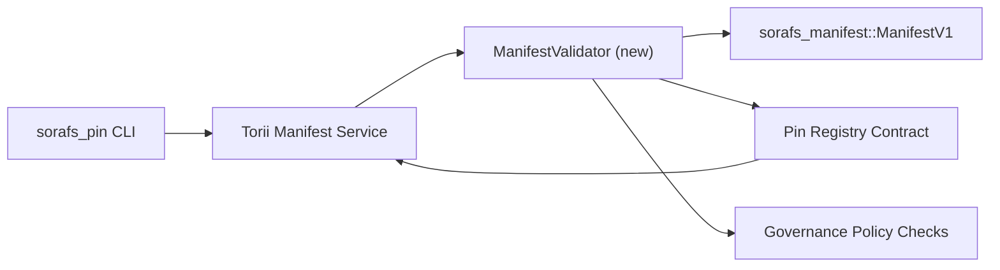

::: Canonical Source ကို သတိပြုပါ။
:::

# Pin Registry Manifest Validation Plan (SF-4 Prep)

ဤအစီအစဥ်တွင် `sorafs_manifest::ManifestV1` အတွက် လိုအပ်သော အဆင့်များကို အကြမ်းဖျင်းဖော်ပြထားသည်။
SF-4 အလုပ်လုပ်နိုင်စေရန်အတွက် လာမည့် Pin Registry စာချုပ်တွင် တရားဝင်အတည်ပြုခြင်း။
encode/decode logic ကို မပွားဘဲ ရှိပြီးသား tooling ကို တည်ဆောက်ပါ။

## ပန်းတိုင်

1. လက်ခံသူဖက်မှ တင်ပြမှုလမ်းကြောင်းများသည် ထင်ရှားသောဖွဲ့စည်းပုံ၊ အတုံးအခဲပရိုဖိုင်၊ နှင့်
   အဆိုပြုချက်များကို လက်ခံခြင်းမပြုမီ အုပ်ချုပ်မှုစာအိတ်များ။
2. Torii နှင့် ဂိတ်ဝေးဝန်ဆောင်မှုများသည် တူညီသော တရားဝင်မှုလုပ်ရိုးလုပ်စဉ်များကို သေချာစေရန်အတွက် ပြန်လည်အသုံးပြုသည်
   အိမ်ရှင်များအနှံ့ အဆုံးအဖြတ်ပေးသော အပြုအမူ။
3. ပေါင်းစပ်စစ်ဆေးမှုများသည် ထင်ရှားစွာလက်ခံမှုအတွက် အပြုသဘော/အနုတ်လက္ခဏာကိစ္စများကို အကျုံးဝင်သည်၊
   မူဝါဒ ပြဋ္ဌာန်းခြင်းနှင့် တယ်လီမီတာ အမှားအယွင်း။

## ဗိသုကာ

### ပါဝင်ပစ္စည်းများ

- `ManifestValidator` (`sorafs_manifest` သို့မဟုတ် `sorafs_pin` ဗူးတွင် မော်ဂျူးအသစ်)
  ဖွဲ့စည်းတည်ဆောက်ပုံဆိုင်ရာ စစ်ဆေးမှုများနှင့် မူဝါဒတံခါးများကို ဖုံးအုပ်ထားသည်။
- Torii သည် ခေါ်ဆိုသော gRPC အဆုံးမှတ် `SubmitManifest` ကို ဖော်ထုတ်သည်
  စာချုပ်သို့မပို့မီ `ManifestValidator`။
- Gateway fetch path သည် caching အသစ်လုပ်သောအခါ တူညီသော validator ကို ရွေးချယ်နိုင်သည်။
  မှတ်ပုံတင်ခြင်းမှထင်ရှားသည်။

## အလုပ်ပျက်ခြင်း။

| တာဝန် | ဖော်ပြချက် | ပိုင်ရှင် | အဆင့်အတန်း |
|--------|----------------|------|--------|
| V1 API အရိုးစု | `validate_manifest(manifest: &ManifestV1, policy: &PinPolicyInputs) -> Result<(), ValidationError>` ကို `sorafs_manifest` သို့ ထည့်ပါ။ BLAKE3 Digest အတည်ပြုခြင်းနှင့် chunker registry lookup ကို ထည့်သွင်းပါ။ | Core Infra | ✅ ပြီးပြီ | မျှဝေထားသော ကူညီသူများ (`validate_chunker_handle`၊ `validate_pin_policy`၊ `validate_manifest`) ယခု `sorafs_manifest::validation` တွင် နေထိုင်ပါသည်။ |
| မူဝါဒ ဝိုင်ယာကြိုး | မြေပုံစာရင်းသွင်းခြင်းမူဝါဒ config (`min_replicas`၊ သက်တမ်းကုန်ဝင်းဒိုးများ၊ ခွင့်ပြုထားသော chunker လက်ကိုင်များ) ကို တရားဝင်ထည့်သွင်းမှုများထဲသို့။ | အုပ်ချုပ်မှု / Core Infra | စောင့်ဆိုင်းနေသည် — SORAFS-215 | တွင် ခြေရာခံထားသည်။
| Torii ပေါင်းစပ်မှု | Torii မန်နီးဖက်စ်တင်ပြမှုလမ်းကြောင်းအတွင်း အတည်ပြုသူကို ခေါ်ဆိုပါ။ ရှုံးနိမ့်မှုတွင် တည်ဆောက်ထားသော Norito အမှားများကို ပြန်ပေးသည်။ | Torii အဖွဲ့ | စီစဉ်ထားသည် — SORAFS-216 | တွင် ခြေရာခံထားသည်။
| စာချုပ်စာတမ်းပုဒ်မ | စာချုပ်ဝင်ရောက်မှုအမှတ်သည် တရားဝင်အတည်ပြုခြင်း hash ပျက်ကွက်သည့်ဖော်ပြချက်များကို ငြင်းပယ်ကြောင်းသေချာစေပါ။ မက်ထရစ်ကောင်တာများကို ဖော်ထုတ်ပါ။ | စမတ်စာချုပ်အဖွဲ့ | ✅ ပြီးပြီ | `RegisterPinManifest` သည် ယခုအခါ မျှဝေထားသော တရားဝင်စနစ် (`ensure_chunker_handle`/`ensure_pin_policy`) သည် ပျက်ကွက်မှုများကို အကျုံးမဝင်မီ အခြေအနေနှင့် ယူနစ်စစ်ဆေးမှုများ မပြောင်းလဲမီ ခေါ်ဆိုပါသည်။ |
| စာမေးပွဲများ | မမှန်ကန်သောဖော်ပြချက်များအတွက် ယူနစ်စမ်းသပ်မှုများ + trybuild အမှုတွဲများ ၊ `crates/iroha_core/tests/pin_registry.rs` တွင် ပေါင်းစပ်စစ်ဆေးမှုများ။ | QA Guild | 🟠 လုပ်ဆောင်နေဆဲ | ကွင်းဆက်ဆိုင်ရာ ငြင်းပယ်ခြင်းဆိုင်ရာ စမ်းသပ်မှုများနှင့်အတူ မှန်ကန်သည့် ယူနစ်စမ်းသပ်မှုများ၊ ပေါင်းစပ်မှုအစုံအလင်ကို ဆိုင်းငံ့ထားဆဲဖြစ်သည်။ |
| Docs | `docs/source/sorafs_architecture_rfc.md` နှင့် `migration_roadmap.md` တစ်ကြိမ် validator lands ကို အပ်ဒိတ်လုပ်ပါ။ `docs/source/sorafs/manifest_pipeline.md` တွင် CLI အသုံးပြုမှုစာရွက်စာတမ်း။ | Docs အဖွဲ့ | စောင့်ဆိုင်းနေသည် — DOCS-489 | တွင် ခြေရာခံထားသည်။

## မှီခိုမှု

- Pin Registry Norito schema အပြီးသတ်ခြင်း (လမ်းပြမြေပုံရှိ SF-4 အကြောင်းအရာ)။
- ကောင်စီမှ လက်မှတ်ရေးထိုးထားသော chunker မှတ်ပုံတင်စာအိတ်များ (တရားဝင်စစ်ဆေးသည့် မြေပုံဆွဲခြင်းကို သေချာစေသည်။
  အဆုံးအဖြတ်)။
- ထင်ရှားစွာတင်ပြမှုအတွက် Torii စစ်မှန်ကြောင်းအထောက်အထားပြဆုံးဖြတ်ချက်များ။

## အန္တရာယ်များနှင့် လျော့ပါးရေး

| အန္တရာယ် | ထိခိုက်မှု | လျော့ပါးရေး |
|--------|--------|------------|
| Torii နှင့် စာချုပ် | အဆုံးအဖြတ်မရှိသော လက်ခံမှု။ | အတည်ပြုချက်သေတ္တာကို မျှဝေပါ + အိမ်ရှင်နှင့် ကွင်းဆက်ဆုံးဖြတ်ချက်များကို နှိုင်းယှဉ်သည့် ပေါင်းစပ်စမ်းသပ်မှုများကို ပေါင်းထည့်ပါ။ |
| ကြီးမားသော သရုပ်ပြပွဲများ | တင်ပြချက် | ကုန်တင်စံနှုန်းမှတစ်ဆင့် စံသတ်မှတ်ချက် caching manifest ၏ ရလဒ်များကို ထည့်သွင်းစဉ်းစားပါ။ |
| စာတိုပေးပို့မှု ပျံ့ | အော်ပရေတာ ဗြောင်းဆန် | Norito အမှားကုဒ်များကို သတ်မှတ်ပါ။ ၎င်းတို့ကို `manifest_pipeline.md` ဖြင့် မှတ်တမ်းတင်ပါ။ |

## အချိန်လိုင်းပစ်မှတ်များ

- ရက်သတ္တပတ် 1- Land `ManifestValidator` အရိုးစု + ယူနစ် စမ်းသပ်မှုများ။
- ရက်သတ္တပတ် 2- Wire Torii တင်သွင်းမှုလမ်းကြောင်းနှင့် အတည်ပြုချက်အမှားများကို ကျော်လွှားနိုင်ရန် CLI ကို အပ်ဒိတ်လုပ်ပါ။
- ရက်သတ္တပတ် 3- စာချုပ်ချိတ်များကို အကောင်အထည်ဖော်ပါ၊ ပေါင်းစပ်စစ်ဆေးမှုများထည့်ပါ၊ စာရွက်စာတမ်းများကို အပ်ဒိတ်လုပ်ပါ။
- ရက်သတ္တပတ် 4- ရွှေ့ပြောင်းစာရင်းဇယားထည့်သွင်းမှုဖြင့် အဆုံးမှ အဆုံး အစမ်းလေ့ကျင့်မှုကို လုပ်ဆောင်ပါ၊ ကောင်စီမှ အကောင့်ဖွင့်ခြင်းကို ရယူပါ။

အတည်ပြုခြင်းလုပ်ငန်းစတင်သည်နှင့် ဤအစီအစဉ်ကို လမ်းပြမြေပုံတွင် ကိုးကားပါမည်။