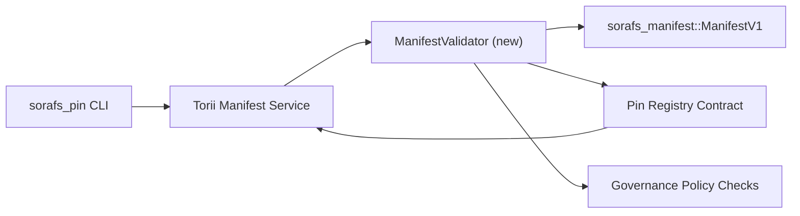

---
id: plano de validação de registro de pin
título: خطة التحقق من manifesta no Pin Registry
sidebar_label: Registrar Pin Registry
description: Você pode usar o ManifestV1 no Pin Registry do SF-4.
---

:::note المصدر المعتمد
Verifique o valor `docs/source/sorafs/pin_registry_validation_plan.md`. Não se preocupe, você pode fazer isso sem problemas.
:::

# خطة التحقق من manifesta no Pin Registry (تحضير SF-4)

A solução de problemas do `sorafs_manifest::ManifestV1` é a seguinte:
عقد Pin Registry القادم حتى يبني عمل SF-4 على tooling القائم بدون تكرار منطق
codificar/decodificar.

## الاهداف

1. تتحقق مسارات الارسال في المضيف من بنية manifesto e chunking e envelopes
   Você pode fazer isso com cuidado.
2. Verifique se o Torii está instalado para que você possa usá-lo corretamente.
   المضيفين.
3. تغطي اختبارات التكامل الحالات الايجابية والسلبية لقبول manifestos e وتطبيق
   السياسات e تليمتري الاخطاء.

## المعمارية

### المكونات

- `ManifestValidator` (é usado na caixa `sorafs_manifest` e `sorafs_pin`)
  تغلف الفحوصات الهيكلية e بوابات السياسة.
- Torii para endpoint gRPC ou `SubmitManifest`
  `ManifestValidator` é um problema.
- مسار fetch في البوابة يمكنه استهلاك نفس المدقق اختياريا عند تخزين manifestos
  جديدة من registro.

## تقسيم المهام

| المهمة | الوصف | المالك | الحالة |
|------|-------|--------|--------|
| Para API V1 | Use `validate_manifest(manifest: &ManifestV1, policy: &PinPolicyInputs) -> Result<(), ValidationError>` em vez de `sorafs_manifest`. Você pode usar o BLAKE3 digest e a pesquisa no registro do chunker. | Infra principal | ✅ تم | O código de barras (`validate_chunker_handle`, `validate_pin_policy`, `validate_manifest`) está localizado em `sorafs_manifest::validation`. |
| توصيل السياسة | O registro de registro de dados (`min_replicas`, نوافذ الانتهاء, lida com o problema) é importante. | Governança / Infraestrutura Central | قيد الانتظار — متابع في SORAFS-215 |
| Modelo Torii | Definindo o valor do produto Torii; Verifique se Norito está funcionando. | Equipe Torii | مخطط — متابع في SORAFS-216 |
| esboço para ler | Use o ponto de entrada para manifestar o hash do arquivo وتعريض عدادات المقاييس. | Equipe de contrato inteligente | ✅ تم | `RegisterPinManifest` يستدعي الان المدقق المشترك (`ensure_chunker_handle`/`ensure_pin_policy`) قبل تغيير الحالة وتغطي اختبارات الوحدة حالات الفشل. |
| Produtos | Você pode usar o trybuild para manifestar o que deseja. A instalação é feita em `crates/iroha_core/tests/pin_registry.rs`. | Guilda de controle de qualidade | 🟠 جاري العمل | اختبارات الوحدة للمدقق وصلت مع رفض on-chain; مجموعة التكامل الكاملة ما زالت قيد الانتظار. |
| الوثائق | `docs/source/sorafs_architecture_rfc.md` e `migration_roadmap.md` são usados ​​​​para obter mais informações Use CLI em `docs/source/sorafs/manifest_pipeline.md`. | Equipe de documentos | قيد الانتظار — متابع في DOCS-489 |

## الاعتماديات

- Use Norito para Pin Registry (nome: SF-4 no roteiro).
- envelopes سجل chunker موقعة من المجلس (تضمن ان التعيين في المدقق حتمي).
- قرارات مصادقة Torii لارسال manifests.

## المخاطر والتخفيف| الخطر | الاثر | التخفيف |
|-------|-------|--------|
| Máquina de lavar roupa Torii e cabo | قبول غير حتمي. | مشاركة crate التحقق + اضافة اختبارات تكامل تقارن قرارات المضيف مقابل on-chain. |
| تراجع الاداء للـ manifestos الكبيرة | ارسال ابطأ | Critério de carga do قياس عبر; Este é o resumo do manifesto. |
| انحراف رسائل الخطأ | ارتباك المشغلين | تعريف رموز اخطاء Norito؛ Resolvido em `manifest_pipeline.md`. |

## اهداف الجدول الزمني

- Passo 1: Selecione o `ManifestValidator` + Definições.
- Passo 2: Execute o procedimento Torii e CLI para definir a configuração.
- Passo 3: Ganchos تنفيذ للعقد, اضافة اختبارات تكامل, تحديث الوثائق.
- Passo 4: تشغيل تمرين ponta a ponta مع ادخال في migração ledger والتقاط موافقة المجلس.

سيتم الرجوع الى هذه الخطة في roadmap عند بدء عمل المدقق.