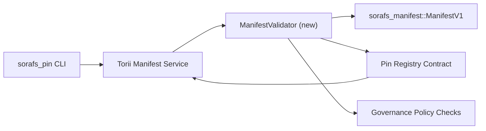

---
id: plano de validação de registro de pin
título: Plano de validação de manifestos do Pin Registry
sidebar_label: Validação do Registro Pin
descrição: Plano de validação para o gating do ManifestV1 anterior ao lançamento do Pin Registry SF-4.
---

:::nota Fonte canônica
Esta página reflete `docs/source/sorafs/pin_registry_validation_plan.md`. Mantenha ambas as localizações alinhadas enquanto a documentação herdada segue ativa.
:::

# Plano de validação de manifestos do Pin Registry (Preparação SF-4)

Este plano descreve os passos necessários para integrar a validação de
`sorafs_manifest::ManifestV1` no futuro contrato do Pin Registry para que o
O trabalho de SF-4 é aplicado nas ferramentas existentes sem duplicar a lógica de
codificar/decodificar.

## Objetivos

1. As rotas de envio do host verificam a estrutura do manifesto, o perfil de
   chunking y los envelopes de gobernanza antes de aceitar propostas.
2. Torii e os serviços de gateway reutilizam as mesmas rotinas de validação
   para garantir um comportamento determinista entre hosts.
3. As tentativas de integração incluem casos positivos/negativos para aceitação de
   manifestos, aplicação de política e telemetria de erros.

## Arquitetura

### Componentes

- `ManifestValidator` (novo módulo na caixa `sorafs_manifest` ou `sorafs_pin`)
  encapsula os cheques estruturais e as portas da política.
- Torii expõe um endpoint gRPC `SubmitManifest` que chama a
  `ManifestValidator` antes de reenviar o contrato.
- A rota de busca do gateway pode consumir opcionalmente o mesmo validador
  al cachear novos manifestos do registro.

## Desglose de tareias| Tara | Descrição | Responsável | Estado |
|------|---------|-------------|--------|
| Esqueleto de API V1 | Agregar `validate_manifest(manifest: &ManifestV1, policy: &PinPolicyInputs) -> Result<(), ValidationError>` a `sorafs_manifest`. Inclui verificação do resumo BLAKE3 e pesquisa do registro do chunker. | Infra principal | ✅ Hecho | Os ajudantes compartilhados (`validate_chunker_handle`, `validate_pin_policy`, `validate_manifest`) agora vivem em `sorafs_manifest::validation`. |
| Cabo de política | Mapeie a configuração da política do registro (`min_replicas`, janelas de expiração, identificadores de blocos permitidos) para as entradas de validação. | Governança / Infraestrutura Central | Pendiente — rastreado em SORAFS-215 |
| Integração Torii | Chamar o validador dentro do envio de manifestos em Torii; Devolva erros Norito estruturados antes de falhar. | Equipe Torii | Planificado — rastreado em SORAFS-216 |
| Esboço do contrato anfitrião | Certifique-se de que o ponto de entrada do contrato rechace manifesta que caiu o hash de validação; expositor contadores de métricas. | Equipe de contrato inteligente | ✅ Hecho | `RegisterPinManifest` agora chame o validador compartilhado (`ensure_chunker_handle`/`ensure_pin_policy`) antes de alterar o estado e os testes unitários cubrem os casos de falha. |
| Testes | Agregar testes unitários para o validador + casos trybuild para manifestos inválidos; testes de integração em `crates/iroha_core/tests/pin_registry.rs`. | Guilda de controle de qualidade | 🟠 Em progresso | Os testes unitários do validador foram aterrados junto com os rechazos on-chain; o conjunto completo de integração fica pendente. |
| Documentos | Atualizar `docs/source/sorafs_architecture_rfc.md` e `migration_roadmap.md` uma vez que o validador chega; documentar o uso de CLI em `docs/source/sorafs/manifest_pipeline.md`. | Equipe de documentos | Pendente — rastreado em DOCS-489 |

## Dependências

- Finalização do esquema Norito do Pin Registry (ref: item SF-4 no roteiro).
- Envelopes do registro chunker firmados pelo consejo (garantir que o mapeamento do validador seja determinista).
- Decisões de autenticação de Torii para envio de manifestos.

## Riesgos e mitigações

| Riesgo | Impacto | Mitigação |
|--------|---------|--------|
| Interpretação divergente da política entre Torii e o contrato | Aceitação não determinista. | Compartilhar caixa de validação + adicionar testes de integração que comparam decisões do host vs on-chain. |
| Regressão de desempenho para manifestos grandes | Envios mas lentos | Medir via critério carga; considere armazenar os resultados do resumo do manifesto. |
| Derivação de mensagens de erro | Confusão de operadores | Definir códigos de erro Norito; documentados em `manifest_pipeline.md`. |

## Objetivos de cronograma

- Semana 1: aterrizar o esqueleto `ManifestValidator` + testes unitários.
- Semana 2: enviar o envio em Torii e atualizar a CLI para mostrar erros de validação.
- Semana 3: implementar ganchos do contrato, adicionar testes de integração, atualizar documentos.
- Semana 4: execute o ensaio de ponta a ponta com entrada no registro de migração e capture a aprovação do conselho.Este plano será referenciado no roteiro assim que iniciar o trabalho do validador.