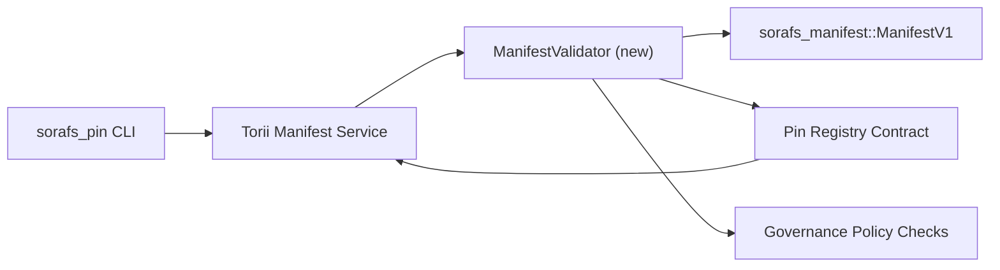

---
id: plano de validação de registro de pin
título: Plano de validação dos manifestos do Pin Registry
sidebar_label: Registro de PIN de validação
descrição: Plano de validação para o gating ManifestV1 antes do lançamento do Pin Registry SF-4.
---

:::nota Fonte canônica
Esta página reflete `docs/source/sorafs/pin_registry_validation_plan.md`. Certifique-se de que as duas posições estejam alinhadas para que a documentação herdada esteja ativa.
:::

# Plano de validação dos manifestos do Pin Registry (Preparação SF-4)

Este plano descreve as etapas necessárias para integrar a validação de
`sorafs_manifest::ManifestV1` no contrato Pin Registry para venir afin que le
O trabalho SF-4 é aplicado nas ferramentas existentes sem duplicar a lógica
codificar/decodificar.

## Objetivos

1. Les chemins de soumission côté hôte verifique a estrutura do manifesto, le
   perfil de chunking e envelopes de governo antes de aceitar
   proposições.
2. Torii e o gateway de serviços utilizam as mesmas rotinas de validação
   para garantir um comportamento determinado entre hotéis.
3. Os testes de integração cobrem os casos positivos/negativos para a aceitação
   dos manifestos, a aplicação da política e a telemetria de erros.

## Arquitetura

### Compostos

- `ManifestValidator` (novo módulo na caixa `sorafs_manifest` ou `sorafs_pin`)
  encapsular os controles estruturais e as portas da política.
- Torii expõe um endpoint gRPC `SubmitManifest` que chama
  `ManifestValidator` antes da transmissão no contrato.
- O caminho de busca do gateway pode ser a opção de usar o mesmo validador
  lors de la mise en cache de nouveaux manifesta-se a partir do registro.

## Découpage des tâches| Tache | Descrição | Proprietário | Estatuto |
|------|------------|-------|--------|
| API Squelette V1 | Adicionado `validate_manifest(manifest: &ManifestV1, policy: &PinPolicyInputs) -> Result<(), ValidationError>` a `sorafs_manifest`. Inclui a verificação do resumo BLAKE3 e a pesquisa do registro do chunker. | Infra principal | ✅ Terminé | Os ajudantes compartilhados (`validate_chunker_handle`, `validate_pin_policy`, `validate_manifest`) vivem desordenados em `sorafs_manifest::validation`. |
| Cabo de política | Mapeie a configuração da política de registro (`min_replicas`, janelas de expiração, identificadores de blocos autorizados) em relação às entradas de validação. | Governança / Infraestrutura Central | Na atenção — acompanhamos no SORAFS-215 |
| Integração Torii | Ligue para o validador no caminho de entrada Torii; retorne erros estruturais Norito em caso de cheque. | Equipe Torii | Planifié — suivi dans SORAFS-216 |
| Esboço de contrato de alojamento local | Certifique-se de que a entrada do contrato rejeite os manifestos que ecoaram no hash de validação; expor des compteurs de métricas. | Equipe de contrato inteligente | ✅ Terminé | `RegisterPinManifest` invoca o validador participante (`ensure_chunker_handle`/`ensure_pin_policy`) antes de silenciar o estado e realizar testes unitários para cobrir casos de cheque. |
| Testes | Adiciona testes unitários para validação + cas trybuild para manifestos inválidos ; testes de integração em `crates/iroha_core/tests/pin_registry.rs`. | Guilda de controle de qualidade | 🟠 Durante o curso | Os testes unitários de validação serão realizados com rejeitos on-chain; o conjunto de integração completo está descansado e atento. |
| Documentos | Insira no dia `docs/source/sorafs_architecture_rfc.md` e `migration_roadmap.md` um foi o validador livre ; documente o uso da CLI em `docs/source/sorafs/manifest_pipeline.md`. | Equipe de documentos | Na atenção — acompanhamos no DOCS-489 |

##Dependências

- Finalização do esquema Norito do Pin Registry (ref: item SF-4 no roadmap).
- Envelopes do registro do bloco assinados pelo conselho (garantir um mapeamento determinado pelo validador).
- Decisões de autenticação Torii para envio de manifestos.

## Riscos e mitigações

| Risco | Impacto | Mitigação |
|--------|--------|------------|
| Interpretação divergente da política entre Torii e o contrato | Aceitação não déterminista. | Compartilhe a caixa de validação + adicione os testes de integração comparando as decisões no local e na rede. |
| Regressão de desempenho para grandes manifestos | Soumissões mais lentes | Benchmarker via critério de carga; visualizar um cache de resultados do manifesto de resumo. |
| Derive de mensagens de erro | Operador de confusão | Definir códigos de erro Norito ; o documento em `manifest_pipeline.md`. |

## Cípulas de calendário

- Semaine 1: liberar o esquema `ManifestValidator` + testes unitários.
- Semaine 2: conecte o caminho de origem Torii e instale a CLI no dia para reparar os erros de validação.
- Semana 3: implemente os ganchos do contrato, adicione os testes de integração, envie os documentos diariamente.
- Semaine 4: execute uma repetição de ponta a ponta com uma entrada de registro de migração, capture a aprovação do conselho.Este plano será referenciado no roteiro para o trabalho de validação iniciado.